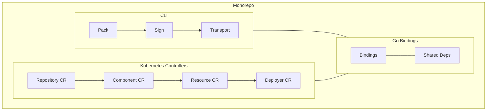
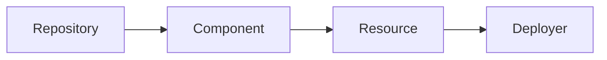

We are excited to announce **OCM v2** — a ground-up rebuild of the Open Component Model tooling stack. A new CLI, Kubernetes controllers, and Go library — designed from the start for modularity, security, and community contribution. The entire stack continues to implement the [OCM Specification v2](https://github.com/open-component-model/ocm-spec/blob/main/doc/04-extensions/00-component-descriptor/v2.md), ensuring full compatibility with the standard that defines how components, resources, and signatures are represented.


All of OCM v2 lives in a single repository: [github.com/open-component-model/open-component-model](https://github.com/open-component-model/open-component-model)


## Why a Reboot?

The original OCM libraries served the project well, but incremental fixes were not enough.



- **Supply chain exposure** — The monolithic architecture meant pulling in OCM pulled in everything, even parts you did not need
- **Contributability barriers** — The codebase was difficult for new contributors to navigate, understand, and extend
- **Extensibility limits** — Adding new features or maintaining existing ones risked regressions across unrelated areas



OCM v2 is the result: modular design, decoupled APIs, a smaller dependency footprint, and a codebase built for community contribution from day one. Learn more in our [Overview](/docs/overview/).

## What's in v2

OCM v2 ships three components — a CLI for interactive and CI/CD use, Kubernetes controllers for GitOps-native deployment, and a Go library that underpins both. All three are developed, versioned, and released together from a single monorepo, sharing one dependency tree and one test suite.



### A New CLI

The v2 CLI implements the full **Pack, Sign, Transport, Deploy** workflow:










```bash
# Create a component version from a constructor file
ocm add cv --file ./transport-archive component-constructor.yaml

# Sign it
ocm sign cv --signature release ghcr.io/acme.org/product:1.0.0

# Transfer to a CTF archive for air-gapped delivery
ocm transfer cv --copy-resources --recursive \
  ghcr.io/acme.org/product:1.0.0 \
  ctf::./airgap-transport.ctf

# Import into the target registry on the other side
ocm transfer cv --copy-resources --recursive \
  ctf::./airgap-transport.ctf//acme.org/product:1.0.0 \
  target-registry.internal

# Verify signatures survived the journey
ocm verify cv --signature release target-registry.internal//acme.org/product:1.0.0
```



Get started by [installing the CLI](/docs/getting-started/install-the-ocm-cli/).

### New Kubernetes Controllers

The new controllers bring GitOps-native deployment of OCM component versions to Kubernetes with three core custom resources:



- **Repository** — points to an OCM repository and verifies reachability
- **Component** — downloads and verifies the component version descriptor
- **Resource** — resolves individual resources, verifies signatures, publishes artifact locations
- **Deployer** — downloads the resource blob and applies manifests to the cluster using server-side apply

The Deployer takes an OCM Resource (containing Kubernetes manifests, a `ResourceGraphDefinition`, or other deployable content) and applies it directly to the cluster using ApplySet semantics.

For advanced deployment workflows, the recommended pattern is to package a [kro](https://kro.run) `ResourceGraphDefinition` inside an OCM component. The Deployer applies the RGD to the cluster, and kro reconciles it into a CRD that operators can instantiate — allowing you to ship complex, parameterised deployment instructions alongside the software itself. [FluxCD](https://fluxcd.io/) integrates naturally for GitOps-style delivery on top of this. We remain active upstream contributors to kro and are invested in its continued growth as a key part of the OCM deployment story.









### Interactive Reference Documentation

The reference docs for [component-constructor](/docs/reference/component-constructor/) and [component-descriptor](/docs/reference/component-descriptor/) now feature an **interactive schema renderer** — a TypeScript/Preact-based viewer that lets you explore the JSON schema inline. A new [Kubernetes API reference](/docs/reference/kubernetes-api/) section covers the CRD schemas for Repository, Component, Resource, and Deployer objects.

### New Go Library and Bindings

Clean, well-documented Go bindings for programmatic OCM interaction. Library, CLI, and controllers share a single set of dependencies and are versioned together — no more compatibility issues from separate release cycles.



- **[Gardener](https://github.com/gardener/gardener-landscape-kit)** — gitops tooling for component-based lifecycle management
- **[openMCP](https://github.com/open-component-model/service-provider-ocm)** — bootstrap and delivery across managed control planes
- **[Platform Mesh](https://github.com/search?q=org%3Aplatform-mesh%20ocm.software&type=code)** — cross-platform artifact distribution
- **[Konfidence](https://konfidence.cloud/)** — Image Vector concept with OCM resources (stay tuned for more)



We welcome everyone to adopt the bindings and contribute as the [Apeiro](https://apeirora.eu/) ecosystem grows.

## Native OCI Image Spec and Distribution Spec Support

OCM v2 is now **natively compliant** on resource level with both

- the [OCI Image Spec](https://github.com/opencontainers/image-spec) 
- the [OCI Distribution Spec](https://github.com/opencontainers/distribution-spec) 

This is not an afterthought, but as a first-class design constraint. 
Every component version is stored as a standard [OCI Image Index](https://github.com/opencontainers/image-spec/blob/main/image-index.md), pushable to and pullable from any spec-compliant registry without OCM-specific extensions. 
Tools that speak OCI speak can now speak natively with OCM resources.

This includes full support for the **OCI Referrers API**: component version descriptors are attached as referrers to their subject manifests, enabling efficient version listing and discovery directly through the Distribution Spec — no OCM-specific registry queries needed.

### Local Blob Compatibility

The most significant OCI compatibility improvement in v2 concerns **local blobs**: resources embedded directly inside a component version rather than referenced from an external location.

In the legacy stack, every local blob — including native OCI artifacts like container images and Helm charts — was wrapped in an OCM-specific `ArtifactSet` format, serialised as a tar archive, and stored as an opaque layer. This meant that even a fully valid OCI image inside an OCM component could not be pulled with `docker pull` or `helm pull`. OCI-native tooling had no way in.

OCM v2 solves this with a new [OCI-compatible storage mapping](https://github.com/open-component-model/open-component-model/blob/main/docs/adr/0012_oci_format_compatibility.md). The top-level [OCI Image Index](https://github.com/opencontainers/image-spec/blob/main/image-index.md) now distinguishes between two kinds of local blobs:

- **Native OCI artifacts** (images, Helm charts, OCI Image Layouts) — stored as separate OCI manifests referenced from the index, with a `globalAccess` pointer that allows direct access
- **Non-OCI blobs** (plain files, arbitrary binaries) — stored as layers in the descriptor manifest, as before

The result: a Helm chart packaged as an OCM local blob can be pulled natively with Helm's OCI support (`helm pull oci://...`) and a container image can be fetched with `docker pull` — without any OCM tooling in the path.

This layout is fully backwards-compatible: the new CLI reads and writes the index-based format, while the legacy CLI can read it by falling back to the descriptor manifest when no index is present.

The transport pipeline benefits too. Because native OCI manifests are stored as proper OCI objects, layer deduplication and concurrent uploads work at the registry level — no more tar-wrapping every artifact before transit.

## Conformance Testing

The CLI and controllers are validated through **conformance scenarios** that exercise the entire stack end-to-end.


The first [conformance scenario](https://github.com/open-component-model/open-component-model/tree/main/conformance/scenarios/sovereign) builds OCM components, signs them, transfers them through a simulated air gap via CTF archives, imports them into an isolated cluster registry, and deploys them using OCM controllers — validating that signatures, resources, and references survive the entire journey intact.


We plan to add more conformance scenarios covering additional delivery patterns, ensuring every release meets a growing baseline of real-world validation.

## A Community-First Project

OCM v2 is not just a technical reboot — it is a community reboot. Since the adoption of OCM by [NeoNephos](https://neonephos.org), we have established new governance structures and communication channels to make collaboration easier and more transparent.

### OCM Technical Steering Committee

The [OCM TSC](https://github.com/open-component-model/open-component-model/blob/main/docs/steering/CHARTER.md) operates as part of NeoNephos and provides strategic oversight for the OCM project. It sets the technical direction, coordinates across SIGs, and ensures that the project evolves in alignment with the needs of its growing community.

### SIG Runtime

The [SIG Runtime](https://github.com/open-component-model/open-component-model/blob/main/docs/community/SIGs/Runtime/SIG-Runtime-CHARTER.md) is the primary governance body for the OCM runtime implementation. It oversees the development of the CLI, controllers, and library, ensuring that technical decisions are made openly and aligned with the broader project direction. Technical decisions are centrally tracked and aligned with the TSC via ADRs.

### How to Get Involved

There are multiple ways to participate in the OCM community (see our [community engagement page](/community/engagement/) for the full overview):

- **Zulip Channel:** [neonephos-ocm-support](https://linuxfoundation.zulipchat.com/#narrow/channel/532975-neonephos-ocm-support) — primary communication channel
- **Mailing list:** [open-component-model-sig-runtime@lists.neonephos.org](mailto:open-component-model-sig-runtime@lists.neonephos.org)
- **Slack Channel** ([Kubernetes Slack](https://slack.k8s.io/), deprecated): `#open-component-model`
- **Docs:** under `docs/community/` in the [monorepo](https://github.com/open-component-model/open-component-model/tree/main/docs/community)

### SIG Spec and Community Specification License

Alongside the v2 release, we are planning the kickstart of **SIG Spec** — a dedicated special interest group for the OCM specification itself. SIG Spec will own the evolution of the specification, coordinate community input on proposals, and ensure the spec stays aligned with real-world implementation needs.

This goes hand in hand with the move to the [Community Specification License](https://github.com/open-component-model/ocm-project/issues/939), planned for Q2 2026. Together, SIG Spec and the license change make the specification a truly community-governed artifact — anyone can participate in its evolution under clear, fair terms.

## What's Coming Next

### Zero Trust Signing with Sigstore

We are working on [Sigstore integration](https://github.com/open-component-model/ocm-project/issues/556) for keyless signing and verification. This will complement the existing RSA-based PKI approach with a zero-trust model, removing the need to manage and distribute signing keys while providing the same level of provenance assurance.

### Expanding the Ecosystem

#### Integrations & Deployment

- **Apeiro integration:** Konfidence Image Vector System and openMCP Provider for enabling OCM APIs
- **Simpler deployment workflows** for Cloud Native Kubernetes environments
- **New library integrations:** OCI Artifact Input, GitHub Source Access, and many more! 

#### Developer Experience

- **Language bindings beyond Go:** We are exploring bindings for other languages such as Python, broadening OCM's accessibility to a wider developer audience
- **Terminal UIs:** Exploring richer terminal interfaces for interactive workflows
- **AI-native tooling:** Integrating OCM into AI-native development environments and assistants
- **Library usability:** Expanding examples, usage guides, and documentation to lower the barrier for programmatic OCM adoption

#### Compliance & Supply Chain

- **[ODG (Open Delivery Gear)](https://github.com/open-component-model/open-delivery-gear/):** Deeper integration to streamline compliance workflows — automating security scans, license checks, and policy enforcement as part of the OCM delivery pipeline
- **Software Bill of Delivery:** OCM already provides the foundation for a true [SBOD](https://documentation.apeirora.eu/docs/best-practices/lcm/sbod/) — a comprehensive, machine-readable record of everything that was delivered, how it was built, signed, transported, and deployed. We are building on this vision to make SBOD a first-class concern across the entire toolchain

These improvements will steadily close the feature gap with our previous implementation, and we want to achieve parity.

## Documentation and Migration


The legacy OCM stack will be supported until at least **the end of 2026**. Existing users can migrate at their own pace.


The documentation site now serves two versions:

- **v1 docs** (labeled "legacy") — documentation for the original OCM stack.
- **v2 docs** (currently labeled "latest") — documentation for the new stack 
  you are reading about here. This is now the default.


Both v1 and v2 implement the same [OCM Specification](https://github.com/open-component-model/ocm-spec/blob/main/doc/04-extensions/00-component-descriptor/v2.md), so component versions created with either stack are fully interoperable. Many CLI commands are cross-compatible and we made a deliberate effort to keep the `.ocmconfig` structure and command syntax consistent, so existing users and CI/CD pipelines should find the transition straightforward.


## Get Started

Ready to try OCM v2? Pick your path:






### Pack, Sign, Transport, Deploy



**Install the OCM CLI**

[Download or build from source](/docs/getting-started/install-the-ocm-cli/)


**Create Component Versions**

[Bundle your software artifacts](/docs/getting-started/create-component-versions/)


**Sign and Verify**

[Establish provenance with RSA signatures](/docs/tutorials/sign-and-verify-components/)


**Transfer across an Air Gap**

[Deliver to isolated environments](/docs/how-to/transfer-components-across-an-air-gap/)


**Set Up your Runtime**

[Prepare a kind cluster with kro and Flux](/docs/getting-started/set-up-controller-environments/)


**Deploy a Helm Chart**

- [Learn about OCM Controllers](/docs/concepts/kubernetes-controllers/)
- [Your first controller-based deployment](/docs/getting-started/deploy-helm-charts/)



**Deploy Raw Manifests with the Deployer**

- [Understand the Deployer CR](/docs/concepts/kubernetes-deployer/)
- [Deploy Kubernetes manifests directly](/docs/how-to/deploy-manifests-with-deployer/)





## Get Involved

OCM is open source and we welcome contributions of all kinds — code, documentation, bug reports, and feature requests.

- Browse the code and contribute: [github.com/open-component-model/open-component-model](https://github.com/open-component-model/open-component-model)
- Join the conversation on Zulip: [neonephos-ocm-support](https://linuxfoundation.zulipchat.com/#narrow/channel/532975-neonephos-ocm-support)
- Read the [SIG Runtime Charter](https://github.com/open-component-model/open-component-model/blob/main/docs/community/SIGs/Runtime/SIG-Runtime-CHARTER.md)
- Try the new CLI and [get started](/docs/getting-started/)

We are looking forward to building the future of sovereign cloud delivery together.
