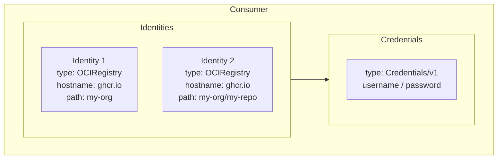
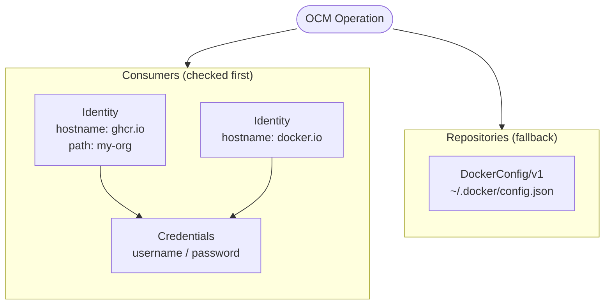

OCM operations frequently interact with protected services — OCI registries, private repositories, signing infrastructure. Rather than requiring credentials at every command invocation, OCM provides a central credential system that decouples *what needs authentication* from *how credentials are supplied*.

This separation matters because the same component version may be stored in different registries across environments (development, staging, production), each with its own authentication scheme. A central credential system lets you configure credentials once and have OCM resolve the right ones automatically, regardless of where an operation runs.

## Design Approach

OCM's credential system is built around three ideas:

### Consumer-Based Matching

Every service that requires authentication is modeled as a **consumer** — described by a set of identity attributes such as a type (e.g., `OCIRegistry`), a hostname, and optionally a path or port. When an OCM operation needs to authenticate, it constructs a consumer identity from the target it is accessing and asks the credential system for a match.

This design means credentials are tied to *what you are accessing*, not to *which command you are running*. A push and a pull to the same registry use the same consumer entry.

### Separation of Identity and Credentials

Consumer identities and credentials are configured independently. One set of credentials can serve multiple identities (e.g., a single token valid for several repositories on the same registry), and the same identity can be satisfied by different credential types depending on the environment.

This keeps configuration DRY and makes it straightforward to rotate credentials without touching identity definitions.

### Repositories as Fallback

Not all credential sources are static key-value pairs. Docker credential helpers, cloud IAM token endpoints, and external secret managers provide credentials dynamically. OCM models these as **repositories** — fallback sources consulted only when no direct consumer match is found. This lets you reuse existing credential infrastructure (e.g., a Docker `config.json`) without duplicating secrets into OCM's own configuration.

## Terminology

- **Consumer** — a service that requires authentication (e.g., an OCI registry)
- **Consumer Identity** — a set of key-value attributes that uniquely describe a consumer (type + attributes like `hostname`, `path`)
- **Credentials** — key-value pairs used to authenticate (e.g., `username` / `password`)
- **Credential Type** — defines how credentials are stored or retrieved (e.g., `Credentials/v1` for inline key-value pairs)
- **Repository** — a fallback credential source checked only when no consumer entry matches (e.g., `DockerConfig/v1`)

## How Resolution Works

When an OCM operation needs credentials, the system follows a simple precedence:

1. **Direct match** — look for a consumer entry whose identity attributes match the target
2. **Repository fallback** — if no direct match exists, consult configured repositories (e.g., Docker config)

This two-tier model gives you explicit control when you need it (direct consumers) while still integrating seamlessly with existing credential stores.


To see resolution in action, try the [Understand Credential Resolution]() tutorial.


## What's Next?

- [Tutorial: Credential Resolution]() — Learn how OCM picks the right credentials by experimenting with a config
- [How-To: Configure Credentials for Multiple Registries]() — Quick task-oriented setup
- [Tutorial: Credentials for OCM Controllers]() — How to provide credentials in Kubernetes environments

## Related Documentation

- [Reference: Consumer Identities]() — Complete list of identity types, attributes, and credential properties
