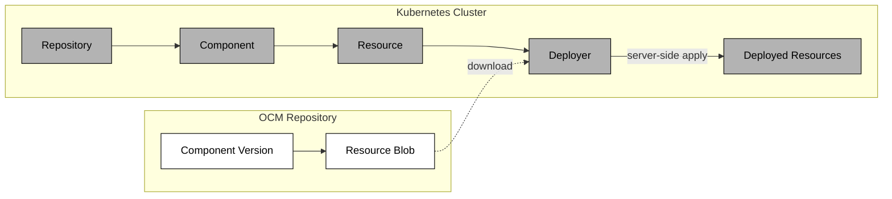

The Deployer is a Kubernetes controller that takes an OCM resource, typically containing Kubernetes manifests such as a `ResourceGraphDefinition`, plain YAML, or other deployable content, downloads it from a Resource, and applies it to the cluster using server-side apply.

## How It Works

The Deployer references an OCM `Resource` object. When that resource becomes ready, the Deployer downloads the referenced blob, decodes any YAML/JSON manifests it contains, and applies them to the cluster.

To reach the successful deployment status, the following chain of objects has to be reconciled. `Repository` -> `Component` -> `Resource` -> `Deployer`.

The `Repository` validates that the OCM repository is reachable. The `Component` downloads and verifies the component version descriptor from that repository. Once the component is `Ready`, the `Resource` will fetch the resource descriptor and store it in its status. The Deployer watches for this and when the Resource is `Ready`, it downloads the content and applies it to the cluster.

## ApplySet Semantics

The Deployer uses [ApplySet](https://kubernetes.io/docs/reference/labels-annotations-taints/#kubectl-applyset) (KEP-3659) for resource lifecycle management.

Every apply operation goes through Kubernetes server-side apply, which means updates are atomic and conflict-free. When a manifest no longer includes a resource that was previously applied, the `Deployer` automatically prunes it. Ownership is tracked through the `applyset.kubernetes.io/part-of` label, which ties each deployed resource back to the `Deployer` instance that created it.

The Deployer manages the full lifecycle of what it deploys: creation, updates, and cleanup.

## Drift Detection

The Deployer registers dynamic informers for every resource it deploys. If something modifies or deletes a deployed resource externally, the Deployer picks up the change and re-applies the desired state on the next reconciliation.

These informers are created at runtime and only for the specific resource types that are actually deployed.

## Deletion and Finalizers

When a Deployer object is deleted, cleanup happens in two phases. First, the `delivery.ocm.software/applyset-prune` finalizer removes all deployed resources through ApplySet pruning. Once that completes, the `delivery.ocm.software/watch` finalizer unregisters the dynamic informers.

The Deployer will not be fully removed until both phases finish, ensuring no orphaned resources are left behind.

## Caching

Downloaded resource blobs are cached by digest in an LRU cache. If the digest has not changed between reconciliations, the Deployer skips re-downloading and re-applying. This reduces both network traffic and unnecessary applies.

## Labels and Annotations

The Deployer stamps deployed resources with metadata for traceability:

**Labels:**

| Label | Value |
|-------|-------|
| `app.kubernetes.io/managed-by` | `deployer.delivery.ocm.software` |
| `app.kubernetes.io/name` | Resource name |
| `app.kubernetes.io/version` | Resource version |
| `app.kubernetes.io/part-of` | Deployer name |

**Annotations:**

| Annotation | Value |
|------------|-------|
| `digest.resource.delivery.ocm.software/value` | Resource digest |
| `component.delivery.ocm.software/name` | Component name |
| `component.delivery.ocm.software/version` | Component version |

## Common Use Case: Bootstrapping a ResourceGraphDefinition

A typical pattern is packaging a `ResourceGraphDefinition` ([RGD](https://kro.run/docs/concepts/rgd/overview)) inside an OCM component and using the Deployer to apply it to the cluster. This allows developers to ship deployment instructions alongside the software itself. Once the Deployer applies the RGD, [kro](https://kro.run/) reconciles it into a CRD that operators can instantiate.

For a full walkthrough, see [Deploy with Controllers]().

## Related Documentation

- [OCM Controllers](), overview of the controller ecosystem
- [Setup Controller Environment](), prerequisites for running the controllers
