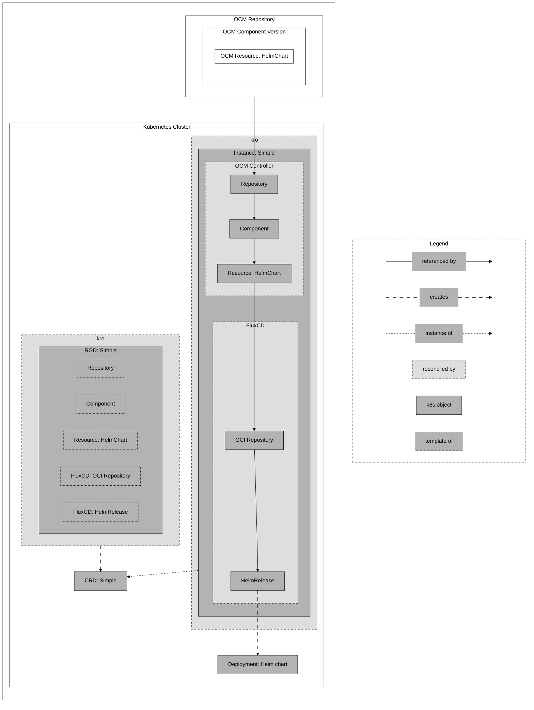

> [!CAUTION]
> This project is in early development and not yet ready for production use.

The OCM controllers

- support the deployment of an OCM component and its resources, like Helm charts or other manifests,
into a Kubernetes cluster with the help of kro and a deployer, e.g. FluxCD.
- provide a controller to transfer OCM components.

## What Should I Know Before I Start?

You should be familiar with the following concepts:

- [Open Component Model](https://ocm.software/)
- [Kubernetes](https://kubernetes.io/) ecosystem
- [kro](https://kro.run)
- Kubernetes resource deployer such as [FluxCD](https://fluxcd.io/)

## Concept

> [!NOTE]
> The following section provides a high-level overview of the OCM controllers and their components regarding the
> deployment of an OCM resource in a very basic scenario.

The primary purpose of the OCM controllers is simple: Deploy an OCM resource from an OCM component version into a Kubernetes
cluster.

The implementation, however, is a bit more complex as deployments must be secure and configurable. Additionally, an
OCM resource can, in theory, contain any form of deployable resource, for instance a Helm chart, a Kustomization, or
plain Kubernetes manifests. Each of these resources has its own way of being deployed or
configured. So, instead of creating a generic deployer that offers all these functionalities, we decided to use existing
tools that are already available in the Kubernetes ecosystem.

The following diagram describes a basic scenario in which an OCM resource containing a Helm chart is deployed into a
Kubernetes cluster using the OCM controllers as well as kro and FluxCD.
kro is used to orchestrate the deployment and to transport information about the location of the OCM resource to FluxCD.
FluxCD takes the location of the OCM resource, downloads the chart, configures it if necessary,
and deploys it into the Kubernetes cluster.

The above diagram shows an OCM resource of type `helmChart`. This resource is part of an OCM component version,
which is located in an OCM repository.

In the `Kubernetes Cluster` we can see several Kubernetes (custom) resources. The `ResourceGraphDefinition`
(`RGD: Simple`) contains the template of all the resources for deploying the Helm chart into the Kubernetes cluster.
kro creates a Custom Resource Definition (CRD) `Simple` based on that `ResourceGraphDefinition`. By creating an instance
of this CRD (`Instance: Simple`), the resources are created and reconciled by the respective controllers:

- `Repository`: Points to the OCM repository and checks if it is reachable by pinging it.
- `Component`: Refers to the `Repository` and downloads and verifies the OCM component version descriptor.
- `Resource`: Points to the `Component`, downloads the OCM component version descriptor from which it gets the location
of the OCM resource. It then downloads the resource to verify its signature (optional) and publishes the location of the
resource in its status.

> [!IMPORTANT]
> With FluxCD, this only works if the OCM resource has an access for which FluxCD has a corresponding Source type (e.g.
> an OCI or a GitHub repository)

As a result, FluxCD can now consume the information of the `Resource` and deploy the Helm chart:

- `OCIRepository`: Watches and downloads the resource from the location provided by the `Resource` status.
- `HelmRelease`: Refers to the `OCIRepository`, lets you configure the Helm chart, and creates the deployment into the
Kubernetes cluster.

> [!IMPORTANT]
> While the OCM controllers technically can be used standalone, they require kro and a deployer, e.g. FluxCD, to deploy
> an OCM resource into a Kubernetes cluster. The OCM controller deployment, however, does not contain kro or any
> deployer. Please refer to the respective installation guides for these tools:
>
> - [kro](https://kro.run/docs/getting-started/Installation/)
> - [FluxCD](https://fluxcd.io/docs/installation/)

## Getting Started

- [Setup your (test) environment with kind, kro, and FluxCD]()
- [Deploying a Helm chart using a `ResourceGraphDefinition` with FluxCD]()
- [Deploying a Helm chart using a `ResourceGraphDefinition` inside the OCM component version (bootstrap) with FluxCD]()
- [Configuring credentials for OCM controller resources to access private OCM repositories]()
