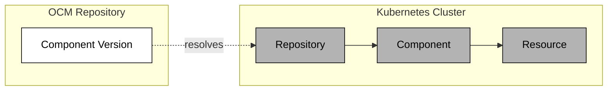
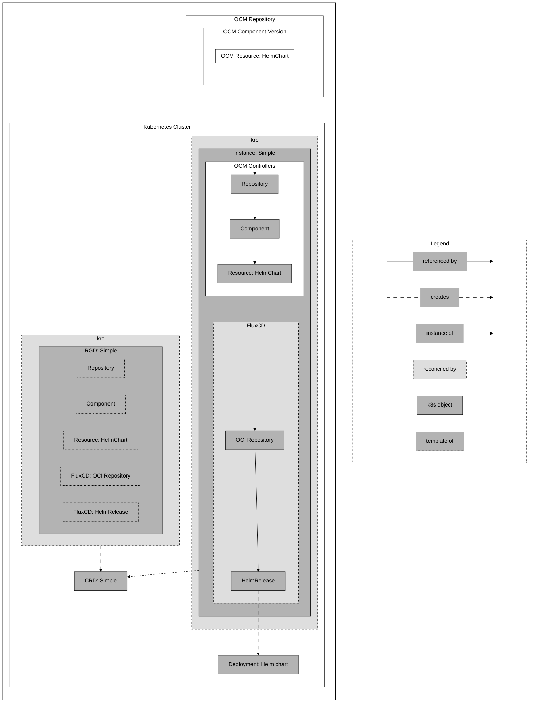


This project is in early development and not yet ready for production use.


The OCM controllers bridge the gap between OCM repositories and running Kubernetes clusters. They resolve OCM component versions, download resources, and hand them off to deployment tooling such as FluxCD or the built-in [Deployer]().

A separate controller handles the transfer of OCM components between registries. For details on that, see the [transfer architecture document](https://github.com/open-component-model/open-component-model/blob/main/kubernetes/controller/docs/adr/replication.md).

### Before You Begin

You should be familiar with the following concepts:

- [Open Component Model](https://ocm.software/)
- [Kubernetes](https://kubernetes.io/) ecosystem
- [kro](https://kro.run)
- Kubernetes resource deployer such as [FluxCD](https://fluxcd.io/)

## Architecture

Every deployment starts with the same chain of three controller resources:



The **Repository** validates that the OCM repository is reachable. The **Component** downloads and verifies the component version descriptor. The **Resource** resolves a specific artifact within that component and publishes its location in its status.

From here, what happens next depends on the deployment pattern.

## Deployment Patterns

### Using FluxCD (or other external deployers)

An OCM resource with an OCI-based access type can be consumed directly by FluxCD. A `ResourceGraphDefinition` (RGD) wires the OCM controller resources to FluxCD's `OCIRepository` and `HelmRelease`, letting kro orchestrate the full chain.



The RGD defines templates for all the resources needed. kro reconciles the RGD into a CRD, and creating an instance of that CRD spins up the actual resources: Repository, Component, and Resource on the OCM side, plus OCIRepository and HelmRelease on the FluxCD side.


With FluxCD, this only works if the OCM resource has an access type for which FluxCD has a corresponding Source (e.g. an OCI or GitHub repository).


### Using the Deployer

For resources that contain plain Kubernetes manifests, such as an RGD, a Kustomization, or raw YAML, the built-in [Deployer]() can apply them directly using server-side apply. No external deployment tooling is required.

A common pattern is packaging an RGD inside the OCM component itself and using the Deployer to bootstrap it into the cluster. This lets developers ship deployment instructions alongside the software.

For details on how the Deployer works, including ApplySet semantics, drift detection, and caching, see the [Deployer concept]().

## ResourceGraphDefinitions

A `ResourceGraphDefinition` (RGD) is a kro resource that defines templates for a set of Kubernetes resources and the dependencies between them. When applied to a cluster, kro creates a CRD from the RGD. Instances of that CRD trigger the actual resource creation.

RGDs are central to how the OCM controllers orchestrate deployments. They allow you to express the full dependency chain, from OCM repository access through to the final deployment, as a single declarative unit. Values can be passed from one resource's status into another resource's spec using kro's template expressions.

For more on kro and RGDs, see the [kro documentation](https://kro.run).

## Installation

Currently, the OCM controllers are available as [image][controller-image] and
[Kustomization](https://github.com/open-component-model/open-component-model/blob/main/kubernetes/controller/config/default/kustomization.yaml). A Helm chart is planned for the future.

To install the OCM controllers into your running Kubernetes cluster, you can use the following commands:

```console
# In the open-component-model repository, folder kubernetes/controller
task deploy
```

or

```console
kubectl apply -k https://github.com/open-component-model/open-component-model/kubernetes/controller/config/default?ref=main
```


If you plan to use FluxCD or another external deployer alongside the OCM controllers, you need to install them separately. The OCM controllers deployment does not include kro or any deployer.

- [kro](https://kro.run/docs/getting-started/Installation/)
- [FluxCD](https://fluxcd.io/docs/installation/)


## Getting Started

- [Setup your (test) environment with kind, kro, and FluxCD]()
- [Deploying a Helm chart using a `ResourceGraphDefinition` with FluxCD]()
- [Configuring credentials for OCM controller resources to access private OCM repositories]()

[controller-image]: https://github.com/open-component-model/open-component-model/pkgs/container/kubernetes%2Fcontroller
