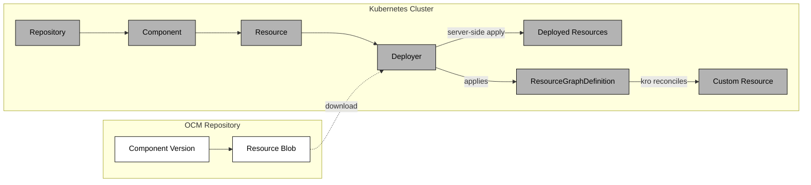


This project is in early development and not yet ready for production use.


The OCM controllers bridge the gap between OCM repositories and running Kubernetes clusters. They resolve OCM component versions, download resources, and deploy them using the built-in [Deployer]() and [kro](https://kro.run).

The controller chain — `Repository` → `Component` → `Resource` → `Deployer` — reconciles OCM content into a cluster. The Deployer applies Kubernetes manifests (including `ResourceGraphDefinitions`) using server-side apply, while kro turns those RGDs into concrete resources.

### Before You Begin

You should be familiar with the following concepts:

- [Open Component Model](https://ocm.software/)
- [Kubernetes](https://kubernetes.io/) ecosystem
- [kro](https://kro.run)

## Architecture

The primary purpose of the OCM controllers is to deploy OCM resources from component versions into a Kubernetes cluster.



## Installation

Currently, the OCM controllers are available as [image][controller-image] and
[Kustomization](https://github.com/open-component-model/open-component-model/blob/main/kubernetes/controller/config/default/kustomization.yaml). A Helm chart is planned for the future.

To install the OCM controllers into your running Kubernetes cluster, you can use the following commands:

```console
# In the open-component-model repository, folder kubernetes/controller
task deploy
```

or

```console
kubectl apply -k https://github.com/open-component-model/open-component-model/kubernetes/controller/config/default?ref=main
```


The OCM controllers deployment does not include kro. If you plan to use `ResourceGraphDefinitions`, install kro separately:

- [kro installation](https://kro.run/docs/getting-started/Installation/)


## Getting Started

- [Setup your (test) environment]()
- [Deploy with Controllers]()
- [Configuring credentials for OCM controller resources to access private OCM repositories]()

[controller-image]: https://github.com/open-component-model/open-component-model/pkgs/container/kubernetes%2Fcontroller
