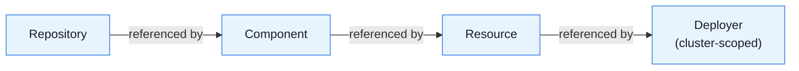

The OCM controllers reconcile OCM component versions into a Kubernetes cluster. They form a chain of four custom resources, each depending on the previous one becoming `Ready`:

- **Repository** validates that an OCM repository is reachable.
- **Component** resolves and verifies a component version from that repository.
- **Resource** fetches a specific resource from the component version.
- **[Deployer]()** downloads the resource content and applies it to the cluster.

## Architecture

The OCM controllers act as a bridge between an OCM repository and a Kubernetes cluster. Rather than pulling manifests from a Git repository or a plain OCI image, they consume structured OCM component versions — complete with provenance, signatures, and access metadata — and translate them into running workloads.

This separation means that the same component version can be deployed to multiple clusters, across air-gapped environments, or with different credential configurations, without changing what was published. The controllers handle resolution, verification, and delivery. The component author controls what gets shipped and how it is signed.

<details>
<summary>Show architecture diagram</summary>



</details>

## The Reconciliation Chain

Each custom resource in the chain depends on the previous one being `Ready`. A child object declares a reference to its parent by name, and will not proceed until the parent has been successfully reconciled. This gives each step a clear responsibility and a clear failure surface.



### Repository

A `Repository` validates that a given OCM repository is reachable and healthy. It is the entry point for the entire chain — without a `Ready` repository, nothing downstream can proceed. You configure it with the registry base URL and type, plus any credentials needed to reach it.

[API reference]()

### Component

A `Component` tracks a specific OCM component within a repository. You give it a component name and a semver constraint, and it continuously resolves the highest matching version. Once resolved, the controller verifies the component descriptor and optionally checks cryptographic signatures. The resolved version and digest are published in its status for downstream objects to consume.

You can control whether the controller is allowed to move to a lower version if the constraint is relaxed (`downgradePolicy`), and narrow the candidate set further with a regex filter on version strings.

[API reference]()

### Resource

A `Resource` selects a specific artifact from within a resolved component version. You identify the artifact by name (and optionally by a path through nested component references). Once the parent `Component` is `Ready`, the controller fetches the resource descriptor — access information, digest, type, labels — and stores it in its status.

You can attach CEL expressions via `additionalStatusFields` to extract values from the descriptor and surface them in `status.additional`. This is useful when downstream tools like [Kro](https://kro.run/) need to wire specific values — such as an image reference or chart version — into their own resources without parsing the full descriptor themselves.

[API reference]()

### Deployer

A `Deployer` is a cluster-scoped object that watches a `Resource` and, once it is `Ready`, downloads the resource blob and applies the contained Kubernetes manifests to the cluster using server-side apply. It manages the full lifecycle of what it deploys: *creating* resources on first apply, *updating* them when the component version changes, and *pruning* resources that are no longer part of the manifest set.

See [Kubernetes Deployer]() for a full description of its apply semantics, drift detection, and caching behavior.

[API reference]()

## Asynchronous Component Resolution

Component version resolution happens in a background worker pool. When a controller needs a component version, it submits a request and receives a sentinel error (`ErrResolutionInProgress`). The controller returns early without blocking. Once the worker finishes, it broadcasts an event that re-triggers reconciliation for all waiting objects.

Requests for the same component version are deduplicated across multiple subscribers.

## Configuration Propagation

OCM configuration such as credentials and resolvers flows through the reconciliation chain. Each object can declare its own config references and inherit configs from its parent:

```yaml
spec:
  ocmConfig:
    - kind: Secret
      name: registry-credentials
      policy: Propagate
```

`Propagate` makes the config available to child objects in the chain. `DoNotPropagate` scopes it to that object only. Supported sources are Kubernetes `Secrets`, `ConfigMaps`, and `OCMConfiguration` objects.

## Additional Status Fields

The `Resource` object supports `additionalStatusFields`, a map of field names to [CEL](https://github.com/google/cel-spec) expressions evaluated against the resource descriptor:

```yaml
spec:
  additionalStatusFields:
    registry: "resource.access.globalAccess.imageReference.split('/')[0]"
```

Results are stored under `status.additional.<fieldName>` and can be consumed by downstream tools like [Kro](https://kro.run/) to wire values between resources in a `ResourceGraphDefinition`.

## Installation

See [Install the OCM Controllers]() for a step-by-step guide including prerequisites and verification.


While the OCM controllers technically can be used standalone, it requires kro and a deployer, e.g. Flux, to deploy
an OCM resource into a Kubernetes cluster. The OCM controllers deployment, however, does not contain kro or any
deployer. Please refer to the respective installation guides for these tools:

- [kro](https://kro.run/docs/getting-started/Installation/)
- [Flux](https://fluxcd.io/docs/installation/)
  

## Related Documentation

- [Concept: Kubernetes Deployer](), how the Deployer applies and manages resources
- [Getting-Started: Setup Controller Environment](), prerequisites for running the controllers
- [How-To: Configuring Credentials for OCM Controllers](), setting up access to private OCM repositories
