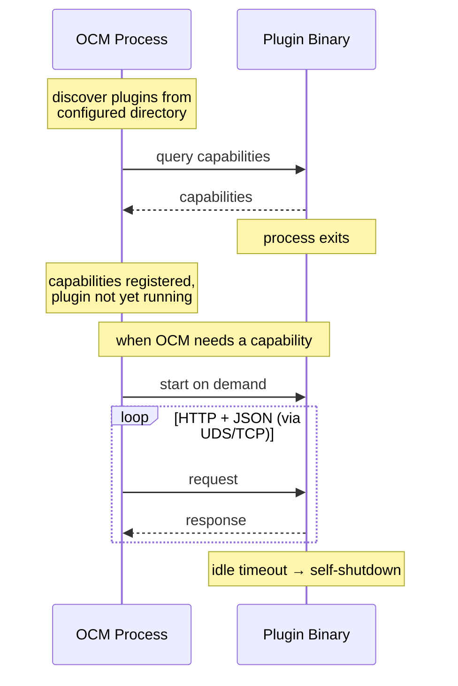

The Open Component Model (OCM) plugin system allows you to extend OCM's basic capabilities. 
Plugins add support for new repository types, credential providers,
signing mechanisms, input formats, and more, without modifying OCM itself.

## Architecture Overview

OCM uses a process based plugin architecture. Each plugin runs as a standalone binary,
separate from the main OCM process. When OCM needs a capability provided by a plugin, it
starts the plugin on demand, communicates with it over a local connection (either domain socket or TCP),
and shuts it down when it's no longer needed.

The benefits of this design are isolation, language independence (although Go is heavily preferred and supported by
an SDK) and lazy loading. But the main reason for a separate binary shows itself really
in OCM's dependency chain. With this solution, technology specific dependencies no longer
have to pollute OCM's own dependency chain. OCM's chain stays clean and lean so those who
would like to use it as a library, do not have to import the entire Go eco-system.

Plugins are discovered from a configured directory. OCM scans this directory, queries
each plugin for its capabilities, and makes them available to the system. From the user's
perspective, once a plugin is installed, its features are available transparently. No
additional configuration is required beyond installation.

This does not mean that configuration cannot be provided! Plugins can have their own
configuration requirements that are provided to them through the `ocmconfig` configuration
file using a specific `type`. For example:

```yaml
type: generic.config.ocm.software/v1
configurations:
  - type: my-plugin.config.ocm.software/v1
    apiEndpoint: https://internal.registry.example.com
    timeout: 30s
```

## Internal vs. External Plugins

OCM distinguishes between two kinds of plugins:

### Internal (Built in) Plugins

Internal plugins are compiled directly into the OCM binary. They provide core functionality
such as OCI registry support. These plugins are always available and require no installation
or setup.

Internal plugins exist because some capabilities are fundamental to OCM's operation. For
example, the ability to interact with OCI registries is so central that it would be
impractical to require users to install it separately.

You do not need to manage internal plugins. They are part of the OCM distribution.

### External Plugins

External plugins are standalone binaries that you install separately. They extend OCM with
additional capabilities such as new repository types, credential backends, signing providers, and
so on.

External plugins follow this lifecycle:

- install the plugin binary into OCM's plugin directory
- OCM discovers the plugin automatically on next use
- OCM lazy starts the plugin, queries its capabilities, and routes requests to it
- after idle timeout (the plugin isn't doing anything), it shuts itself down to free resources
- if a new request comes in, the cycle starts again from the beginning



## Plugin Types

OCM supports several categories of plugins, each extending a different part of the system:

### Component Version Repository

Adds support for storing and retrieving component versions from new repository backends.
For example, a plugin could add support for a proprietary artifact store or a cloud specific
registry.

### Credential Repository

Integrates with external credential stores. Instead of managing credentials directly in OCM
configuration, a credential plugin can resolve them from systems like Vault, AWS Secrets
Manager, or other secret backends.

### Signing Handler

Adds new signing and verification mechanisms. OCM ships with standard signing support, but
if your organization uses a specific signing infrastructure (e.g., Sigstore or a custom
PKI), a signing plugin integrates it into OCM's verification workflow.

### Input Transformation

Transforms input data during component construction. When building component versions, input
plugins can process resources and sources before they are added, for example, packaging a
Helm chart or transforming configuration files.

### Blob Transformer

Transforms blob data as it flows through the system. This can be useful for format
conversions, compression, or other processing steps.

### Digest Processor

Customizes how resource digests are calculated. If a resource type requires a specific
normalization or hashing strategy, a digest plugin handles it.

### Component Lister

Extends the ability to list components in repositories that require custom enumeration logic.

## Plugin Registry

Finding and installing plugins manually, by knowing exact component names and resource
identifiers, is impractical at scale. The OCM plugin registry solves this.

The plugin registry works like a package manager for OCM plugins. It is itself an OCM
component version that contains references to all available plugins. This means it benefits
from all of OCM's existing infrastructure: authentication, signing, verification, and
distribution.

The official public registry is hosted at:

```text
ghcr.io/open-component-model/plugins/component-descriptors/ocm.software/plugin-registry
```

Organizations can host their own private registries alongside the public one. Each registry
is just an OCM component version containing references to a plugin binary with certain annotations
and extra identity information.

Since plugins are OCM component versions, they can be signed and verified, giving you the
same supply chain guarantees as any other OCM artifact. OCM automatically selects the
correct binary for your platform and architecture during installation.

## Use Cases

### Supporting a Private Artifact Registry

Your organization stores artifacts in a proprietary registry that OCM does not support out
of the box. A **component version repository plugin** teaches OCM how to read from and write
to that registry, making it a first-class citizen in your OCM workflows.

### Integrating Enterprise Credential Management

Your team uses HashiCorp Vault for secrets. Rather than duplicating credentials in OCM
configuration, a **credential repository plugin** resolves them directly from Vault at
runtime.

### Custom Signing Policies

Your security team requires all component versions to be signed with a specific internal
PKI. A **signing handler plugin** integrates that PKI into OCM's sign and verify commands,
enforcing your organization's policies without manual steps.

### Specialized Build Inputs

Your CI pipeline produces Helm charts that need to be packaged into component versions. An
**input plugin** handles the Helm specific packaging during `ocm add resources`, so the
chart is correctly processed before being stored.

### Multi Registry Plugin Management

Your organization maintains a private plugin registry for internal tools alongside the
public OCM registry. Both are configured in your OCM config, and `ocm plugin registry list`
shows plugins from all registries in one view. Teams install what they need without worrying
about where it comes from.
