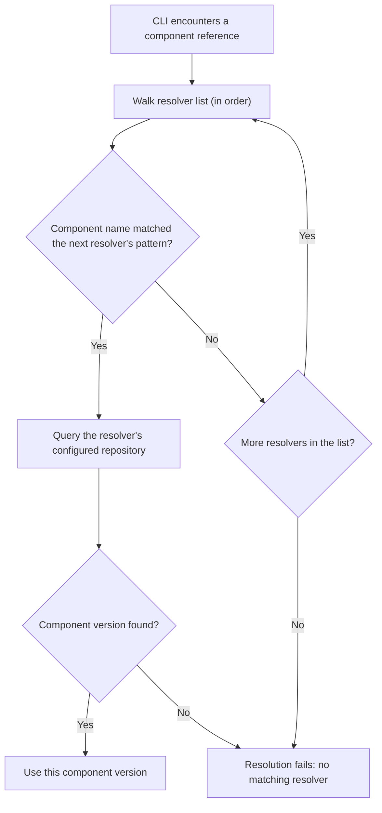

## Why Resolvers?

In OCM, a component can **reference** other components. For example, an `app` component might reference a `backend` and
a `frontend` component. These referenced components don't have to live in the same repository as the app — and in
practice, they often don't. Teams publish components independently, to different registries or repository paths.

This creates a problem: when you ask the CLI to recursively resolve a component graph, it needs to know **where** to
find each referenced component. The repository you pass on the command line only tells the CLI where to find the
**root** component. For everything else, the CLI needs a mapping from component names to repositories.

That's what resolvers provide.

## What Are Resolvers?

A resolver maps a **component name pattern** (glob) to an
**[OCM repository](https://github.com/open-component-model/ocm-spec/blob/main/doc/01-model/01-model.md#component-repositories)**.
When the CLI encounters a component reference during recursive operations, it walks the list of configured resolvers,
finds the first pattern that matches the referenced component name, and queries the associated repository.

## Configuration

Resolvers are configured in the OCM configuration file (by default `$HOME/.ocmconfig`). Each resolver entry maps a
component name pattern to a repository. Resolvers are evaluated in order — the first matching entry wins.

The repository field supports different repository types, including OCI registries and file-based CTF archives.
Component name patterns use common glob syntax (e.g., `*` for single-level, `**` for multi-level matching).


For the full configuration schema, supported repository types, and pattern syntax details, see the
[Resolver Configuration Reference]().


## Recursive Resolution

When a component version has references to other component versions (via `componentReferences`), the CLI can follow
these references recursively using the `--recursive` flag. The CLI uses resolvers to locate each referenced component
in its respective repository — without them, recursive resolution across multiple repositories is not possible.

## OCM Transfer

Resolvers play an important role in transferring component versions across registries. When transferring a component
graph with `--recursive`, the CLI uses resolvers to locate each referenced component so it can copy the entire graph
to the target repository. Combined with `--copy-resources`, this enables full transfers of component graphs —
including all referenced resources — across registry boundaries or even air-gapped environments.

For more information about OCM transfer, see the [Transfer and Transport]() concept.

## Related Documentation

- [Resolver Configuration Reference]() — Full schema, repository types, and pattern syntax
- [Components]() — Core concepts behind component versions, identities, and references
- [Working with Resolvers Tutorial]() — Hands-on walkthrough for setting up resolvers
- [How to Resolve Components Across Multiple Registries]() — Recipe for
  multi-registry resolution
- [Understand Credential Resolution]() — Configure credentials for OCI registries
- [How to Transfer Components Across an Air Gap]() — Use OCM Transfer to move components between
  air-gapped environments
- [Migrate from Deprecated Resolvers]() — Replace deprecated fallback
  resolvers with glob-based resolvers
