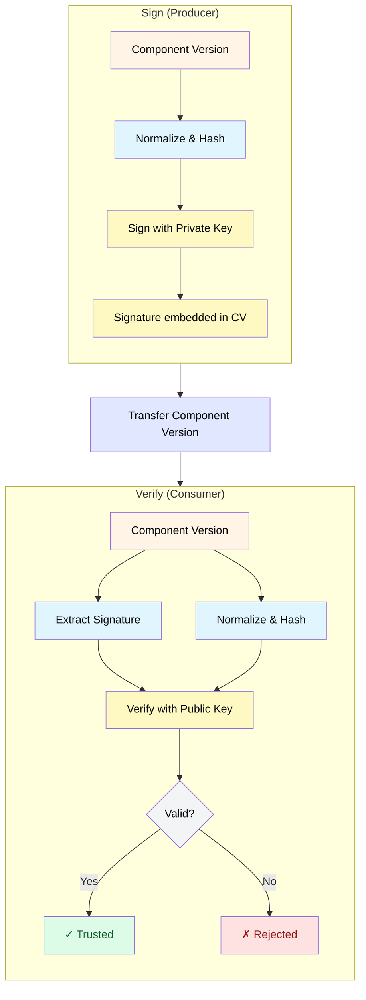

OCM uses cryptographic signatures to guarantee that component versions are authentic (created by a trusted party) and have not been tampered with during storage or transfer.

## Why Sign Components?

Software supply chains involve multiple stages: development, build, packaging, distribution, and deployment. At each stage, components could potentially be:

- **Modified** — malicious actors could inject code or alter resources
- **Replaced** — components could be swapped for compromised versions
- **Misattributed** — components could falsely claim to come from a trusted source

Signing addresses these risks by creating a cryptographic proof that:

1. **Integrity**: The component has not changed since it was signed
2. **Authenticity**: The signature was created by someone with access to the private key
3. **Non-repudiation**: The signer cannot deny having signed the component

## How OCM Signing Works



### Normalization and Digest Calculation

OCM uses a two-layer approach to ensure consistent and reproducible digests:

#### Component Descriptor Normalization

Before hashing, the component descriptor is normalized to produce consistent digests regardless of:

- Field ordering in YAML/JSON
- Whitespace variations
- Optional fields with default values

The default algorithm (`jsonNormalisation/v2`) produces a canonical JSON representation that ensures identical component descriptors always yield the same digest.

#### Artifact Digest Normalization

Each artifact's digest is calculated using a type-specific normalization algorithm:

| Artifact Type | Algorithm | Description |
|---------------|-----------|-------------|
| Generic blob | `genericBlobDigest/v1` | Direct hash of blob content |
| OCI artifact | `ociArtifactDigest/v1` | Uses OCI manifest digest |

This allows OCM to use the most appropriate digest mechanism for each artifact type. For example, OCI artifacts use their manifest digest rather than re-hashing the blob, ensuring consistency with OCI registry behavior.

#### Recursive Component References

When a component references other components, their digests are calculated recursively and embedded:

```yaml
references:
  - componentName: ocm.software/helper
    name: helper
    version: 1.0.0
    digest:
      hashAlgorithm: SHA-256
      normalisationAlgorithm: jsonNormalisation/v2
      value: 01c211f5c9cfd7c40e5b84d66a2fb7d19cb0...
```

This creates a **complete integrity chain** — verifying the root component automatically verifies all transitive dependencies.

### What Gets Signed?

OCM signs a **digest** of the component descriptor, which includes:

- Component metadata (name, version, provider)
- Resource declarations with their digests
- Source references
- Component references

The signature does **not** cover the raw resource content directly—instead, it covers the **digests** of those resources as recorded in the component descriptor. This means:

- ✓ Any change to resource content changes its digest, invalidating the signature
- ✓ Signature verification is fast (no need to re-hash large binaries)
- ✓ Resources can be stored separately while still being integrity-protected

### Signature Storage

Signatures are stored as part of the component version:

```yaml
signatures:
  - name: acme-release-signing
    digest:
      hashAlgorithm: SHA-256
      normalisationAlgorithm: jsonNormalisation/v1
      value: abc123...
    signature:
      algorithm: RSASSA-PKCS1-V1_5
      mediaType: application/vnd.ocm.signature.rsa
      value: <base64-encoded-signature>
```

A component version can have **multiple signatures** from different parties, enabling:

- Separation of build and release signing
- Multiple approval workflows
- Cross-organizational trust chains

## Supported Algorithms

OCM supports RSA-based signature algorithms:

| Algorithm | Type | Use Case |
|-----------|------|----------|
| RSA-PKCS#1 v1.5 | Asymmetric | Traditional PKI, widely supported |
| RSASSA-PSS | Asymmetric | Modern RSA with better security properties |

For key management, OCM uses PEM-encoded key files:

- **Private keys**: Used by producers to sign component versions
- **Public keys**: Distributed to consumers for verification

See [How-to: Generate Signing Keys]() for creating RSA key pairs.

## Best Practices

1. **Protect private keys** — Use hardware security modules (HSMs) or secrets managers for production signing keys
2. **Rotate keys periodically** — Have a key rotation strategy; OCM supports multiple signatures to ease transitions
3. **Sign at the right time** — Sign after all resources are finalized; re-signing is possible but creates audit complexity
4. **Distribute public keys securely** — Document how consumers should obtain and verify public keys
5. **Verify before deployment** — Make signature verification a mandatory step in your deployment pipeline

## Next Steps

- [How-to: Generate Signing Keys]() - Step-by-step creating RSA key pairs.
- [How-to: Configure Signing Credentials]() - Set up OCM to use your keys for signing and verification
- [How-to: Sign a Component Version]() - Step-by-step signing instructions
- [How-to: Verify a Component Version]() - Step-by-step verification instructions

## Related Documentation

- [Concept: Component Versions]() - Understanding component structure