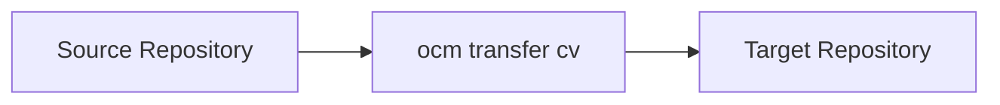
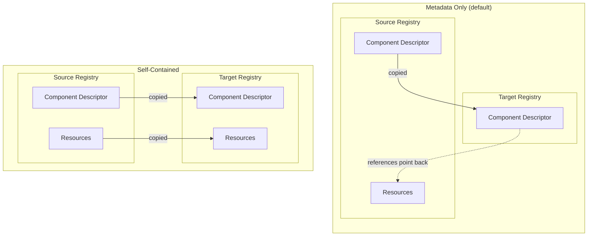
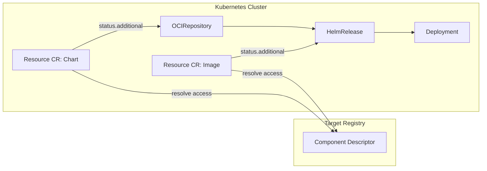
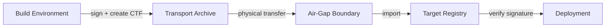

Transfer is the mechanism that moves component versions from one OCM repository to another. During transfer, the component's identity, integrity, and signatures are preserved so that consumers can verify provenance at every stage of the delivery pipeline.

## Why Transfer Matters

Software moves through environments: from development registries to staging, from staging to production, and sometimes across network boundaries where no direct connection exists. At every boundary, artifacts must remain verifiable. Transfer solves this by providing a consistent, auditable way to move component versions while keeping all metadata intact.

For a high-level view of how this enables air-gapped and multi-environment delivery, see [Deploy Anywhere, Even Air-Gapped](#deploy-anywhere-even-air-gapped).

## The Transfer Model

Transfer operates on a simple source/target concept. Any OCM repository can serve as a source or target, whether it is an OCI registry or a filesystem-based CTF archive. The `ocm transfer` command reads component versions from the source and writes them to the target.

Because both OCI registries and CTF archives implement the OCM repository interface, any combination of source and target is valid.

## Common Transport Format (CTF)

The Common Transport Format (CTF) is a filesystem-based OCM repository. It stores component versions as OCI-compatible artifacts in a directory structure, making them portable via any file transfer mechanism: USB drives, `scp`, shared storage, or even physical media.

A CTF archive is a full OCM repository. You can create component versions directly into a CTF, transfer between CTFs, or use a CTF as a staging area between registries.

For details on CTF structure and how to create component versions in a CTF archive, see [Create and Examine Component Versions]().

## Resource Handling: References vs. Copies

By default, `ocm transfer` copies only the component descriptor (metadata). Resource artifacts such as container images or Helm charts stay in their original location, and the component descriptor references them by their original access coordinates.

With the `--copy-resources` flag, transfer creates a self-contained copy: all resource artifacts are downloaded from the source and uploaded to the target. This is essential for air-gapped scenarios where the target environment cannot reach the original artifact locations.

Use `--copy-resources` when:

- The target environment has no network access to the source
- You want a fully independent copy of all artifacts
- You are preparing a CTF archive for offline transport

## Localization

When resources are copied with `--copy-resources`, the component descriptor access coordinates are updated to point to the target registry. However, deployment instructions **embedded inside** resources are not modified. For example, a Helm chart's `values.yaml` may still reference `registry-a.example.com/app:1.0` even after the image has been copied to the target registry. Resources are transferred byte-for-byte to preserve digest integrity, so these internal references remain unchanged.

**Localization** solves this at deploy time, not at transfer time. In a Kubernetes environment, the OCM controller's Resource CR resolves the actual artifact location from the component descriptor and publishes it in its status. Deployment tools like kro or Flux then consume that published location instead of the stale reference embedded in the deployment manifest.

This separation is intentional: transfer preserves artifact integrity, while localization adapts references for the target environment at the point of consumption.

## Transfer Patterns

OCM supports several transfer patterns, depending on your infrastructure:

- **Registry to Registry** -- Direct transfer between two OCI registries. Useful for mirroring between environments that have network connectivity.
- **Registry to CTF** -- Export component versions from a registry into a portable archive. Use this to prepare artifacts for offline transport.
- **CTF to Registry** -- Import component versions from an archive into a registry. This is the final step when bringing artifacts into an air-gapped environment.
- **CTF to CTF** -- Copy component versions between archives. Useful for filtering or reorganizing artifacts before transport.

## Signatures Across Boundaries

Signatures are stored within the component descriptor and travel with it during transfer. This means you can sign a component version in one environment and verify the signature in a different environment, even across an air gap.

A typical sovereign delivery flow:

1. The build environment signs the component version and exports it to a CTF archive with `--copy-resources`
2. The archive is physically moved across the air-gap boundary
3. The archive is imported into the target registry
4. Before deployment, the signature is verified using the public key

At no point does the signature leave the component descriptor. The verification in the target environment uses the same public key and produces the same result as if verified against the original source.

## Real-World Example

The [sovereign conformance scenario](https://github.com/open-component-model/open-component-model/tree/main/conformance/scenarios/sovereign) demonstrates this complete flow end-to-end. It builds a product as OCM components, signs them, transfers them through a simulated air gap using CTF archives, imports them into an isolated cluster registry, and deploys them using OCM controllers. This scenario validates that signatures, resources, and references survive the entire journey intact.

## Next Steps

- [Create and Examine Component Versions]() - Create component versions and store them in CTF archives
- [How-To: Transfer Components Across an Air Gap]() - Step-by-step guide for air-gapped transfer workflows

## Related Documentation

- [Tutorial: Signing and Verification]() - Sign and verify component versions
- [Concept: OCM Controllers]() - Kubernetes controllers for deploying and transferring OCM components
