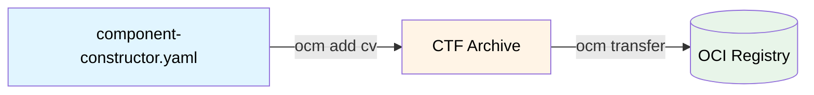

Component versions bundle your software artifacts with metadata, making them portable and verifiable. This guide walks you through creating your first component version.

## What You'll Learn

By the end of this tutorial, you will:

- Create a component constructor file that defines your component and its resources
- Build a component version into a transportable CTF archive
- Explore component versions in both local archives and remote registries

## How It Works



Component versions are created using a `component-constructor.yaml` file that describes components and their artifacts. The OCM CLI builds these into a [Common Transport Format (CTF)](https://github.com/open-component-model/ocm-spec/blob/main/doc/04-extensions/03-storage-backends/ctf.md) archive, which can then be transferred to any OCI registry
with `ocm transfer`.

## Prerequisites

- [Install the OCM CLI]()
- Install [jq](https://jqlang.org/) (optional, for inspecting archives)

## Create Your First Component





### Set up a working directory

Create and enter a directory for this tutorial:

```shell
mkdir /tmp/helloworld && cd /tmp/helloworld
```




### Create a local resource file

Create a simple text file that will become part of your component:

```shell
echo "My first local Resource for an OCM component" > my-local-resource.txt
```




### Define the component

Create a `component-constructor.yaml` file that describes your component and its resources:

```yaml
# yaml-language-server: $schema=https://ocm.software/schemas/configuration-schema.yaml
components:
- name: github.com/acme.org/helloworld # Must at least be a DNS domain as per RFC 1123.
  version: 1.0.0 # Version conforming to SemVer 2.0.
  provider:
    name: acme.org # You must declare a provider, who serves as the owner of the component.
  resources:
    - name: mylocalfile
      type: blob
      input: # Embed by value
        type: file
        path: ./my-local-resource.txt
    - name: image
      type: ociImage
      version: 1.0.0
      access: # Reference externally
        type: ociArtifact
        imageReference: ghcr.io/stefanprodan/podinfo:6.9.1
```

### Referencing Artifacts

OCM supports various ways to include resource artifacts in your components via `resources`.

Use **`input`** to embed content directly, or **`access`** to reference external artifacts.

|              | `resource.input` (by value)               | `resource.access` (by reference)             |
|--------------|-------------------------------------------|----------------------------------------------|
| **Storage**  | Content embedded in Component Version     | Only reference stored                        |
| **Use case** | Local files, directories, co-located data | Remote images, charts, resolution at runtime |
| **Transfer** | Content travels with component            | Must be accessible at destination            |

For a complete list of supported types, see [Input and Access Types]().




Embed a file from your local filesystem:

```yaml
resources:
  - name: config
    type: blob
    input:
      type: file
      path: ./config.yaml
```

The file content is stored directly in the CTF archive.



Reference a container image from an OCI registry:

```yaml
resources:
  - name: backend
    type: ociImage
    version: 1.0.0
    access:
      type: ociArtifact
      imageReference: ghcr.io/myorg/backend:v1.0.0
```

Only the reference is stored; the image remains in its registry.



Include a Helm chart from a registry:

```yaml
resources:
  - name: chart
    type: helmChart
    version: 1.0.0
    access:
      type: ociArtifact
      imageReference: ghcr.io/myorg/charts/myapp:1.0.0
```

Or embed a local Helm chart:

```yaml
resources:
  - name: chart
    type: helmChart
    input:
      type: helm
      path: ./charts/myapp
```



Embed an entire directory as a compressed tarball:

```yaml
resources:
  - name: manifests
    type: blob
    input:
      type: dir
      path: ./kubernetes/
      compress: true
```

All files in the directory are archived together.








### Build the component version

Run the OCM CLI to create a CTF archive:

```shell
ocm add cv
```

Output:
```text
component github.com/acme.org/helloworld/1.0.0 constructed ... done!
```

This creates a `transport-archive` directory containing your component version.


The CTF archive is a Content Addressable Storage (CAS) archive that maps descriptors and resources to digests:

```text
transport-archive/
├── artifact-index.json
└── blobs/
    ├── sha256.096322a7...  # Component config
    ├── sha256.70a2577d...  # Local resource content
    ├── sha256.74db1326...  # Component descriptor
    └── sha256.c8359dfa...  # OCI manifest
```

View the artifact index:

```shell
jq . transport-archive/artifact-index.json
```

```json
{
  "schemaVersion": 1,
  "artifacts": [
    {
      "repository": "component-descriptors/github.com/acme.org/helloworld",
      "tag": "1.0.0",
      "digest": "sha256:c8359dfaa6353b1b3166449f7ff3a8ef6f1d3a6c6f837cca9cd2ad7e8ef8546e"
    }
  ]
}
```

The content of the transport archive is stored as OCI artifacts. Notice that the repository name of component version artifacts (found at `artifacts.respository`) are prefixed by `component-descriptors/`.

The component version is described as an OCI manifest, including OCM specific annotations.

```shell
jq . transport-archive/blobs/sha256.c8359dfaa6353b1b3166449f7ff3a8ef6f1d3a6c6f837cca9cd2ad7e8ef8546e
```

```json
{
  "schemaVersion": 2,
  "mediaType": "application/vnd.oci.image.manifest.v1+json",
  "artifactType": "application/vnd.ocm.software.component-descriptor.v2",
  "config": {
    "mediaType": "application/vnd.ocm.software/ocm.component.config.v1+json",
    "digest": "sha256:096322a7affa6a26a4549e347399f835b2350454946b4967ffdc570dbed78066",
    "size": 201
  },
  "layers": [
    {
      "mediaType": "application/vnd.ocm.software.component-descriptor.v2+yaml+tar",
      "digest": "sha256:74db132670ec370396ec10160c4e761591d0e9e6c5960c72d2e26c0f9d6f6a76",
      "size": 3072
    },
    {
      "mediaType": "text/plain; charset=utf-8",
      "digest": "sha256:70a2577d7b649574cbbba99a2f2ebdf27904a4abf80c9729923ee67ea8d2d9d8",
      "size": 45,
      "annotations": {
        "software.ocm.artifact": "[{\"identity\":{\"name\":\"mylocalfile\",\"version\":\"1.0.0\"},\"kind\":\"resource\"}]"
      }
    }
  ],
  "annotations": {
    "org.opencontainers.image.authors": "CTF Repository",
    "org.opencontainers.image.description": "\nThis is an OCM OCI Artifact Manifest that contains the component descriptor for the component github.com/acme.org/helloworld.\nIt is used to store the component descriptor in an OCI registry and can be referrenced by the official OCM Binding Library.\n",
    "org.opencontainers.image.documentation": "https://ocm.software",
    "org.opencontainers.image.source": "https://github.com/open-component-model/open-component-model",
    "org.opencontainers.image.title": "OCM Component Descriptor OCI Artifact Manifest for github.com/acme.org/helloworld in version 1.0.0",
    "org.opencontainers.image.url": "https://ocm.software",
    "org.opencontainers.image.version": "1.0.0",
    "software.ocm.componentversion": "component-descriptors/github.com/acme.org/helloworld:1.0.0",
    "software.ocm.creator": "CTF Repository"
  }
}
```

Notice that the output of the component version above contains the component descriptor as one of the `layers`. It can be identified by its media type, which is `application/vnd.ocm.software.component-descriptor.v2+yaml+tar`. Since it is saved in `tar` format, it can be displayed using the following command:

```shell
tar xvf transport-archive/blobs/sha256.74db132670ec370396ec10160c4e761591d0e9e6c5960c72d2e26c0f9d6f6a76 -O
```

component-descriptor.yaml
```yaml
component:
  componentReferences: null
  name: github.com/acme.org/helloworld
  provider: acme.org
  repositoryContexts: null
  resources:
  - access:
      localReference: sha256:70a2577d7b649574cbbba99a2f2ebdf27904a4abf80c9729923ee67ea8d2d9d8
      mediaType: text/plain; charset=utf-8
      type: localBlob/v1
    digest:
      hashAlgorithm: SHA-256
      normalisationAlgorithm: genericBlobDigest/v1
      value: 70a2577d7b649574cbbba99a2f2ebdf27904a4abf80c9729923ee67ea8d2d9d8
    name: mylocalfile
    relation: local
    type: blob
    version: 1.0.0
  - access:
      imageReference: ghcr.io/stefanprodan/podinfo:6.9.1@sha256:262578cde928d5c9eba3bce079976444f624c13ed0afb741d90d5423877496cb
      type: ociArtifact
    digest:
      hashAlgorithm: SHA-256
      normalisationAlgorithm: genericBlobDigest/v1
      value: 262578cde928d5c9eba3bce079976444f624c13ed0afb741d90d5423877496cb
    name: image
    relation: external
    type: ociImage
    version: 1.0.0
  sources: null
  version: 1.0.0
meta:
  schemaVersion: v2
```

The other elements listed as `layers` describe the blobs for the local resources stored along with the component version. The digests can be seen in the `localReference` attributes of the component descriptor.







### Verify the result

List the component version in the archive:

```shell
ocm get cv ./transport-archive//github.com/acme.org/helloworld
```

Output:

```text
COMPONENT                      │ VERSION │ PROVIDER
───────────────────────────────┼─────────┼──────────
github.com/acme.org/helloworld │ 1.0.0   │ acme.org
```




## Explore Repositories

Component versions can be inspected in both local CTF archives and remote OCI registries.

```shell
ocm get cv <repository>//<component>:<version>
```

OCM uses a double-slash (`//`) notation to separate the repository from the component path:

- Local Archive (CTF): `./transport-archive//github.com/acme.org/helloworld:1.0.0`
- Remote Registry (OCI): `ghcr.io/open-component-model/ocm//ocm.software/ocmcli:0.17.0`





### List available versions in a CTF

```shell
ocm get cv ./transport-archive
```

Output:

```text
COMPONENT                      │ VERSION │ PROVIDER
───────────────────────────────┼─────────┼──────────
github.com/acme.org/helloworld │ 1.0.0   │ acme.org
```

#### View the component descriptor

```shell
ocm get cv ./transport-archive//github.com/acme.org/helloworld:1.0.0 -o yaml
```

Output:

```yaml
component:
  name: github.com/acme.org/helloworld
  provider: acme.org
  resources:
  - access:
      localReference: sha256:70a2577d7b649574cbbba99a2f2ebdf27904a4abf80c9729923ee67ea8d2d9d8
      mediaType: text/plain; charset=utf-8
      type: localBlob/v1
    name: mylocalfile
    relation: local
    type: blob
    version: 1.0.0
  - access:
      imageReference: ghcr.io/stefanprodan/podinfo:6.9.1@sha256:262578cde928d5c9eba3bce079976444f624c13ed0afb741d90d5423877496cb
      type: ociArtifact
    name: image
    relation: external
    type: ociImage
    version: 1.0.0
  version: 1.0.0
meta:
  schemaVersion: v2
```





### List available versions in an OCI Registry

```shell
ocm get cv ghcr.io/open-component-model/ocm//ocm.software/ocmcli
```

Output:

```text
 COMPONENT           │ VERSION       │ PROVIDER     
─────────────────────┼───────────────┼──────────────
 ocm.software/ocmcli │ 0.36.0-rc.1   │ ocm.software 
                     │ 0.35.0        │              
                     │ 0.35.0-rc.3   │              
                     │ 0.35.0-rc.2   │              
                     │ 0.35.0-rc.1   │
...
```

#### Get a specific version

```shell
ocm get cv ghcr.io/open-component-model/ocm//ocm.software/ocmcli:0.35.0
```

Output:

```text
COMPONENT            │ VERSION │ PROVIDER     
─────────────────────┼─────────┼──────────────
 ocm.software/ocmcli │ 0.35.0  │ ocm.software
```

#### View the full component descriptor

```shell
ocm get cv ghcr.io/open-component-model/ocm//ocm.software/ocmcli:0.35.0 -o yaml
```

#### Explore nested components recursively

Components can reference other components. Use `--recursive` to see the full tree:

```shell
ocm get cv ghcr.io/open-component-model/ocm//ocm.software/ocmcli:0.35.0 --recursive -o tree
```





## CLI Reference

| Command                                                            | Description                                    |
|--------------------------------------------------------------------|------------------------------------------------|
| [`ocm add cv`](../../reference/ocm-cli/ocm-add-component-version/) | Create component version from constructor file |
| [`ocm get cv`](../../reference/ocm-cli/ocm-get-component-version/) | List and inspect component versions            |

## Next Steps
- [Sign Component Versions]() - Ensure authenticity and integrity of your components with cryptographic signatures
- [Download Resources]()  - How to extract resources from component versions
