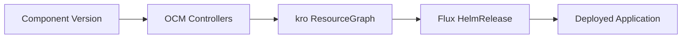

This tutorial walks you through deploying a Helm chart from an OCM component version to a Kubernetes cluster,
using the OCM Controllers with kro and Flux.

## What You'll Learn

By the end of this tutorial, you will:

- Create and publish an OCM component version that references a Helm chart
- Define a ResourceGraphDefinition to orchestrate OCM and Flux resources
- Deploy the Helm chart to your cluster using the OCM Controllers

## How It Works



The OCM Controllers fetch component versions from an OCI registry. kro orchestrates the resources, and Flux deploys the Helm chart to your cluster.

## Prerequisites

- [Controller environment set up]() (OCM Controllers, kro and Flux in a kind cluster)
- [OCM CLI installed]()
- Access to an OCI registry (e.g., ghcr.io)

## Create and Publish a Component Version




**Create a working directory**

```shell
mkdir /tmp/helm-deploy && cd /tmp/helm-deploy
```



**Define the component**

Create a `component-constructor.yaml` file that includes a Helm chart resource:

```yaml
components:
  - name: ocm.software/ocm-k8s-toolkit/simple
    provider:
      name: ocm.software
    version: "1.0.0"
    resources:
      - name: helm-resource
        type: helmChart
        version: 1.0.0
        access:
          type: ociArtifact
          imageReference: "ghcr.io/stefanprodan/charts/podinfo:6.9.1@sha256:565d310746f1fa4be7f93ba7965bb393153a2d57a15cfe5befc909b790a73f8a"
```

This component references the `podinfo` Helm chart, a simple web application that displays pod information.



**Build the component version**

```shell
ocm add cv --create --file ./ctf component-constructor.yaml
```

Output:

```text
component ocm.software/ocm-k8s-toolkit/simple/1.0.0 constructed ... done!
```



**Transfer to your registry**

Replace `<your-namespace>` with your registry namespace:

```shell
ocm transfer ctf ./ctf ghcr.io/<your-namespace>
```

> **Note:** If your registry requires authentication, configure OCM credentials first.
> See [Configure Credentials]().




**Verify the upload**

```shell
ocm get cv ghcr.io/<your-namespace>//ocm.software/ocm-k8s-toolkit/simple:1.0.0
```

Output:

```text
COMPONENT                           VERSION PROVIDER
ocm.software/ocm-k8s-toolkit/simple 1.0.0   ocm.software
```




## Deploy Helm chart with OCM Controllers




**Create ResourceGraphDefinition**

The ResourceGraphDefinition tells kro how to orchestrate the OCM and Flux resources. Create `rgd.yaml`:

```yaml
apiVersion: kro.run/v1alpha1
kind: ResourceGraphDefinition
metadata:
  name: simple
spec:
  schema:
    apiVersion: v1alpha1
    # The name of the CRD that is created by this ResourceGraphDefinition when applied
    kind: Simple
    spec:
      # This spec defines values that can be referenced in the ResourceGraphDefinition and that can be set in the
      # instances of this ResourceGraphDefinition.
      # We will use it to pass a value to the Helm chart and configure the message the application shows
      # (see resource HelmRelease).
      message: string | default="foo"
  resources:
    # Repository points to the OCM repository in which the OCM component version is stored and checks if it is
    # reachable by pinging it.
    - id: repository
      template:
        apiVersion: delivery.ocm.software/v1alpha1
        kind: Repository
        metadata:
          name: simple-repository
        spec:
          repositorySpec:
              baseUrl: ghcr.io/<your-namespace>
              type: OCIRegistry
          interval: 1m
          # ocmConfig is required, if the OCM repository requires credentials to access it.
          # ocmConfig:
    # Component refers to the Repository, downloads and verifies the OCM component version descriptor.
    - id: component
      template:
        apiVersion: delivery.ocm.software/v1alpha1
        kind: Component
        metadata:
          name: simple-component
        spec:
          repositoryRef:
            name: ${repository.metadata.name}
          component: ocm.software/ocm-k8s-toolkit/simple
          semver: 1.0.0
          interval: 1m
          # ocmConfig is required, if the OCM repository requires credentials to access it.
          # ocmConfig:
    # Resource points to the Component, downloads the resource passed by reference-name and verifies it. It then
    # publishes the location of the resource in its status.
    - id: resourceChart
      template:
        apiVersion: delivery.ocm.software/v1alpha1
        kind: Resource
        metadata:
          name: simple-resource
        spec:
          componentRef:
            name: ${component.metadata.name}
          resource:
            byReference:
              resource:
                name: helm-resource # This must match the resource name set in the OCM component version (see above)
          additionalStatusFields:
            # The additional status fields are useful for splitting the imageReference into its components, so that
            # they can be used in depending deployers
            # Example: ghcr.io/stefanprodan/charts/podinfo:6.7.1 would be
            # registry: ghcr.io
            # repository: stefanprodan/charts/podinfo
            # reference/tag: 6.7.1
            registry: resource.access.imageReference.toOCI().registry
            repository: resource.access.imageReference.toOCI().repository
            tag: resource.access.imageReference.toOCI().tag
          interval: 1m
          # ocmConfig is required, if the OCM repository requires credentials to access it.
          # ocmConfig:
    # OCIRepository watches and downloads the resource from the location provided by the Resource status.
    # The Helm chart location (url) refers to the status of the above resource.
    - id: ocirepository
      template:
        apiVersion: source.toolkit.fluxcd.io/v1beta2
        kind: OCIRepository
        metadata:
          name: simple-ocirepository
        spec:
          interval: 1m0s
          layerSelector:
            mediaType: "application/vnd.cncf.helm.chart.content.v1.tar+gzip"
            operation: copy
          url: oci://${resourceChart.status.additional.registry}/${resourceChart.status.additional.repository}
          ref:
            tag: ${resourceChart.status.additional.tag}
          # secretRef is required, if the OCI repository requires credentials to access it.
          # secretRef:
    # HelmRelease refers to the OCIRepository, lets you configure the Helm chart and deploys the Helm chart into the
    # Kubernetes cluster.
    - id: helmrelease
      template:
        apiVersion: helm.toolkit.fluxcd.io/v2
        kind: HelmRelease
        metadata:
          name: simple-helmrelease
        spec:
          releaseName: simple
          interval: 1m
          timeout: 5m
          chartRef:
            kind: OCIRepository
            name: ${ocirepository.metadata.name}
            namespace: default
          values:
            # We configure the Helm chart using Fluxs HelmRelease 'values' field. We pass the value that we set in
            # the instance of the CRD created by the ResourceGraphDefinition (see below).
            ui:
              message: ${schema.spec.message}
```

Replace `<your-namespace>` with your registry namespace.



**Apply the ResourceGraphDefinition**

```shell
kubectl apply -f rgd.yaml
```

Verify it's active:

```shell
kubectl get rgd
```

Output:

```text
NAME     APIVERSION   KIND     STATE    AGE
simple   v1alpha1     Simple   Active   19s
```

A new Custom Resource Definition called `Simple` that you can now instantiate has been created.



**Create an instance**

Create `instance.yaml` to deploy the application:

```yaml
apiVersion: kro.run/v1alpha1
kind: Simple
metadata:
  name: simple
spec:
  message: "Deployed with OCM!"
```



**Deploy the application**

```shell
kubectl apply -f instance.yaml
```

Wait for the deployment to complete:

```shell
kubectl get simple
```

Output:

```text
NAME     STATE    SYNCED   AGE
simple   ACTIVE   True     2m
```



**Verify the deployment**

Check that the pod is running:

```shell
kubectl get deployments
```

Output:

```text
NAME             READY   UP-TO-DATE   AVAILABLE   AGE
simple-podinfo   1/1     1            1           3m
```

Verify the custom message you configured in the HelmRelease values is showing up in the application:

```shell
kubectl get pods -l app.kubernetes.io/name=simple-podinfo \
  -o jsonpath='{.items[0].spec.containers[0].env[?(@.name=="PODINFO_UI_MESSAGE")].value}'
```

Output:

```text
Deployed with OCM!
```



## Troubleshooting

### Authentication Errors

If you see errors like:

```text
failed to list versions: response status code 401: unauthorized
```

Your registry package may be private. Either:

- Make the package public in your registry settings
- Configure credentials for the OCM Controller resources

### Resource Not Found

If the component isn't found, verify:

- The component was transferred successfully: `ocm get cv ghcr.io/<your-namespace>//ocm.software/ocm-k8s-toolkit/simple:1.0.0`
- The `baseUrl` in the ResourceGraphDefinition matches your registry

## Cleanup

Remove the deployed resources:

```shell
kubectl delete -f instance.yaml
kubectl delete -f rgd.yaml
```

## Next Steps

- [Tutorial: Structure Software Products with OCM]() - Learn how to structure complex applications with multiple components and resources
- [Tutorial: Deploy a Helm Chart (with Bootstrap)]() - Use the OCM Controllers to deploy a Helm chart without manual bootstrapping, using a GitOps
