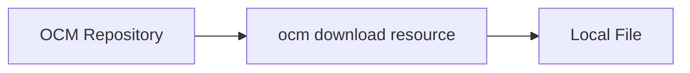

## Goal

## You'll end up with

- A resource file downloaded from a component version
- Optionally transformed to its native format (e.g., Helm chart `.tgz`)

**Estimated time:** ~5 minutes

## Workflow



The OCM CLI fetches a specific resource from a component version and saves it to your local filesystem.

## Prerequisites

- [OCM CLI installed]()
- [jq](https://jqlang.org) installed for JSON parsing (optional)
- A component version with resources to download (see [Create Component Versions]())

## Steps

1. **List available resources**

   First, check which resources are available in the component version:

   ```shell
   ocm get resources ghcr.io/open-component-model//ocm.software/demos/podinfo:6.8.0
   ```

   You should see a list of resources with their names and types:

   ```text
   NAME   VERSION TYPE      RELATION
   chart  6.8.0   helmChart external
   image  6.8.0   ociImage  external
   ```

2. **Download the resource**

   Use the `ocm download resource` command with the `--identity` flag to specify which resource to download:

   

   
   Download from an OCI registry:

   ```shell
   ocm download resource ghcr.io/open-component-model//ocm.software/demos/podinfo:6.8.0 \
     --identity name=chart \
     --output helmchart.tgz
   ```

   You should see:

   ```text
   time=2025-08-14T13:03:54.372+02:00 level=INFO msg="resource downloaded successfully" output=helmchart.tgz
   ```
   

   
   Download from a local Common Transport Format archive:

   ```shell
   ocm download resource ./transport-archive//github.com/acme.org/helloworld:1.0.0 \
     --identity name=mylocalfile \
     --output myfile.txt
   ```

   You should see confirmation that the file was written.
   

   

3. **Verify the download**

   Check that the file exists and has content:

   ```shell
   ls -la helmchart.tgz
   ```

   You should see the file with a non-zero size. This confirms the download was successful.

   
   The downloaded file is in OCI blob format. Extract and inspect it:

   ```shell
   tar xvf helmchart.tgz
   ```

   ```text
   blobs/sha256/ea8e5b44cd1aff1f3d9377d169ad795be20fbfcd58475a62341ed8fb74d4788c
   blobs/sha256/8702d8d550075e410f3aae545d1191df9e5ab8747e5c5a8eda5ed834fd135366
   blobs/sha256/8ab41f82c9a28535f1add8ffbcd6d625a19ece63c4e921f9c8358820019d1ec2
   index.json
   oci-layout
   ```

   
   File permissions may need adjustment after extraction: `chmod +r index.json`
   

   ```shell
   jq . index.json
   ```

   ```json
   {
     "schemaVersion": 2,
     "manifests": [
       {
         "mediaType": "application/vnd.oci.image.manifest.v1+json",
         "digest": "sha256:8ab41f82c9a28535f1add8ffbcd6d625a19ece63c4e921f9c8358820019d1ec2",
         "size": 410
       }
     ]
   }
   ```
   

## Using Transformers


Transformers are in active development. See the [Transformer ADR](https://github.com/open-component-model/open-component-model/blob/main/docs/adr/0005_transformation.md) for design details.


To download resources in their native format instead of OCI blob format, use the `--transformer` flag:

```shell
ocm download resource ghcr.io/open-component-model//ocm.software/demos/podinfo:6.8.0 \
  --identity name=chart \
  --output helmchart.tgz \
  --transformer helm
```

You should see:

```text
helmchart.tgz: 3763 byte(s) written
```


The downloaded archive is now a regular Helm chart archive:

```shell
tar tvf helmchart.tgz
```

```text
-rw-r--r--  0 0      0         136 Jul 19 16:32 echoserver/Chart.yaml
-rw-r--r--  0 0      0        1842 Jul 19 16:32 echoserver/values.yaml
-rw-r--r--  0 0      0        1755 Jul 19 16:32 echoserver/templates/NOTES.txt
-rw-r--r--  0 0      0        1802 Jul 19 16:32 echoserver/templates/_helpers.tpl
-rw-r--r--  0 0      0        1848 Jul 19 16:32 echoserver/templates/deployment.yaml
-rw-r--r--  0 0      0         922 Jul 19 16:32 echoserver/templates/hpa.yaml
-rw-r--r--  0 0      0        2083 Jul 19 16:32 echoserver/templates/ingress.yaml
-rw-r--r--  0 0      0         367 Jul 19 16:32 echoserver/templates/service.yaml
-rw-r--r--  0 0      0         324 Jul 19 16:32 echoserver/templates/serviceaccount.yaml
-rw-r--r--  0 0      0         385 Jul 19 16:32 echoserver/templates/tests/test-connection.yaml
-rw-r--r--  0 0      0         349 Jul 19 16:32 echoserver/.helmignore
```


## Specifying Resource Identity

If multiple resources share the same name, use additional identity attributes:

```shell
ocm download resource <repo>//<component>:<version> \
  --identity name=image,version=1.0.0 \
  --output image.tar
```

## Troubleshooting

### Symptom: Resource not found

**Cause:** The resource name or identity attributes don't match exactly.

**Fix:** List available resources and verify the exact name:

```shell
ocm get resources <repo>//<component>:<version>
```

### Symptom: Permission denied on extracted files

**Cause:** OCI artifacts may have restrictive permissions after extraction.

**Fix:** Add read permissions:

```shell
chmod +r <downloaded-file>
```

### Symptom: Downloaded file is in OCI blob format

**Cause:** Without a transformer, resources are downloaded in their storage format.

**Fix:** Use the `--transformer` flag for native format:

```shell
ocm download resource <repo>//<component>:<version> \
  --identity name=chart \
  --output chart.tgz \
  --transformer helm
```

### Getting help

If these solutions don't work:

- [OCM GitHub Issues](https://github.com/open-component-model/ocm/issues)
- [Community Support]()

## CLI Reference

| Command | Description |
|---------|-------------|
| [`ocm download resource`]() | Download a specific resource |
| [`ocm get cv`]() | Get component versions and resources |

## Next Steps

- [How-to: Sign Component Versions]() - Ensure authenticity and integrity

## Related Documentation

- [Concept: Component Versions]() -  Understanding component structure
- [Tutorial: Create Component Versions]() - Learn how to create components
