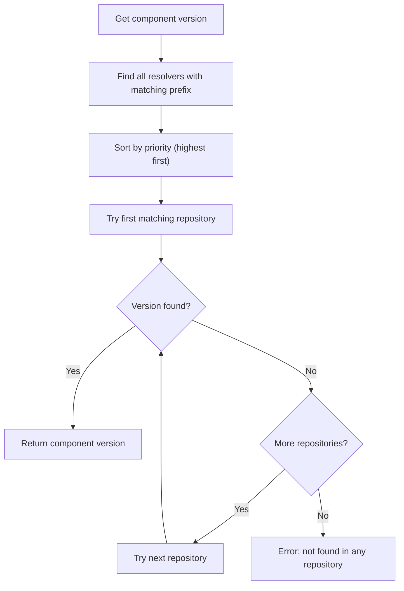
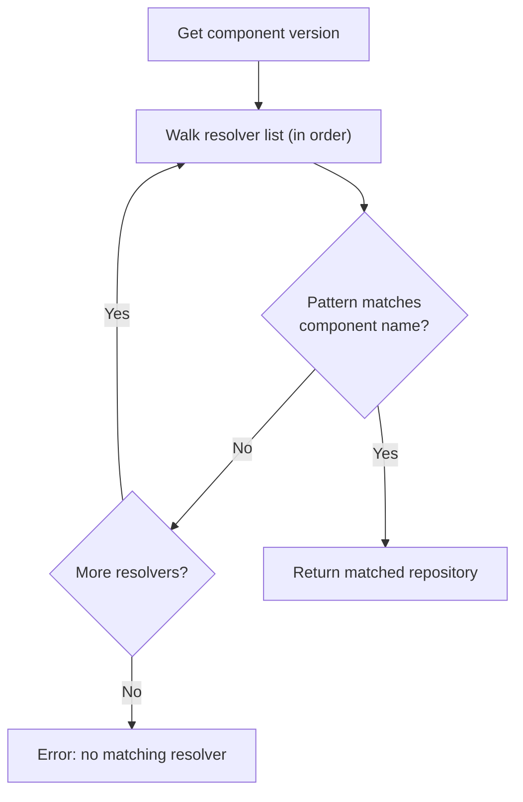

## Goal

Replace the deprecated `ocm.config.ocm.software` fallback resolver configuration with the new `resolvers.config.ocm.software/v1alpha1` glob-based
resolvers.


The fallback resolver (`ocm.config.ocm.software`) is deprecated. It uses priority-based ordering with prefix matching,
which can produce non-deterministic results when multiple repositories match.
The glob-based resolver (`resolvers.config.ocm.software/v1alpha1`) replaces it with deterministic glob-based matching against component names.


## Prerequisites

- [OCM CLI]() installed
- An existing `.ocmconfig` file that uses `ocm.config.ocm.software` resolver entries

## Steps

Suppose you have the following legacy resolver config in `~/.ocmconfig`:

```yaml
type: generic.config.ocm.software/v1
configurations:
  - type: ocm.config.ocm.software
    resolvers:
      - repository:
          type: OCIRepository/v1
          baseUrl: ghcr.io
          subPath: my-org/team-a
        prefix: my-org.example/services
        priority: 10
      - repository:
          type: OCIRepository/v1
          baseUrl: ghcr.io
          subPath: my-org/team-b
        prefix: my-org.example/libraries
        priority: 10
      - repository:
          type: CommonTransportFormat/v1
          filePath: ./local-archive
        priority: 1
```

The following steps walk you through each change needed to migrate to glob-based resolvers.




**Change the config type from `ocm.config.ocm.software` to `resolvers.config.ocm.software/v1alpha1`**

Replace the configuration type:

```yaml
configurations:
  - type: resolvers.config.ocm.software/v1alpha1  # was: ocm.config.ocm.software
    resolvers:
      ...
```




**Replace `prefix` with `componentNamePattern`**

The fallback resolver uses `prefix` to match component names by string prefix. The glob-based resolver uses `componentNamePattern`,
which supports [glob patterns]().
Append `/*` to your old prefix to get the same matching behaviour, or use more specific patterns.

```yaml
    resolvers:
      - repository:
          type: OCIRepository/v1
          baseUrl: ghcr.io
          subPath: my-org/team-a
        componentNamePattern: "my-org.example/services/*"  # was: prefix: my-org.example/services
```

If a resolver had an empty prefix (matching all components), use `*` as the pattern:

```yaml
        componentNamePattern: "*"  # was: prefix: "" (or no prefix)
```




**Remove the `priority` field**

Glob-based resolvers do not use priorities. Instead, resolvers are evaluated in the order they appear in the list, and the **first match wins**.
That's one of the key differences from the fallback resolver, which tries all matching resolvers in priority order until one succeeds.
Place more specific patterns before broader ones:

```yaml
    resolvers:
      # specific patterns first
      - repository:
          type: OCIRepository/v1
          baseUrl: ghcr.io
          subPath: my-org/team-a
        componentNamePattern: "my-org.example/services/*"
      # broader patterns last
      - repository:
          type: CommonTransportFormat/v1
          filePath: ./local-archive
        componentNamePattern: "*"
```




**Review the final config**

Your migrated config should now look like this:

```yaml
type: generic.config.ocm.software/v1
configurations:
  - type: resolvers.config.ocm.software/v1alpha1
    resolvers:
      - repository:
          type: OCIRepository/v1
          baseUrl: ghcr.io
          subPath: my-org/team-a
        componentNamePattern: "my-org.example/services/*"
      - repository:
          type: OCIRepository/v1
          baseUrl: ghcr.io
          subPath: my-org/team-b
        componentNamePattern: "my-org.example/libraries/*"
      - repository:
          type: CommonTransportFormat/v1
          filePath: ./local-archive
        componentNamePattern: "*"
```




**Verify**

Run any OCM command that resolves components:

```bash
ocm get cv ghcr.io/my-org/team-a//my-org.example/services/my-service:1.0.0 \
  --recursive=-1 --config .ocmconfig
```

If you still see the warning `using deprecated fallback resolvers, consider switching to glob-based resolvers`, check that you removed all
`ocm.config.ocm.software` configuration blocks.
Both resolver types can coexist in the same config file during migration — the fallback resolvers will still work but will emit the deprecation
warning.





## When You Cannot Migrate Yet

The fallback resolver has a **probe-and-retry** behaviour that the glob-based resolver does not replicate.

Consider a registry migration where the same component has versions spread across multiple repositories:

| Version                              | Repository                     |
|--------------------------------------|--------------------------------|
| `my-org.example/my-component:1.0.0` | `old-registry.example/legacy`  |
| `my-org.example/my-component:1.5.0` | `old-registry.example/legacy`  |
| `my-org.example/my-component:2.0.0` | `new-registry.example/current` |




The fallback resolver tries all prefix-matching repositories in priority order until one succeeds:



Both registries share the same prefix and both are probed automatically. A request for `my-component:2.0.0` finds it in the new registry. A request
for `my-component:1.0.0` misses in the new registry, falls back to the old one, and succeeds.

```yaml
  - type: ocm.config.ocm.software
    resolvers:
      - repository:
          type: OCIRepository/v1
          baseUrl: new-registry.example
          subPath: current
        prefix: my-org.example
        priority: 10
      - repository:
          type: OCIRepository/v1
          baseUrl: old-registry.example
          subPath: legacy
        prefix: my-org.example
        priority: 1
```




The glob-based resolver returns the first pattern match deterministically, with no retry:



`componentNamePattern: "my-org.example/*"` can only point to **one** repository — whichever you choose, the versions in the other become unreachable.

```yaml
  - type: resolvers.config.ocm.software/v1alpha1
    resolvers:
      # Only new-registry is queried — old versions are unreachable
      - repository:
          type: OCIRepository/v1
          baseUrl: new-registry.example
          subPath: current
        componentNamePattern: "my-org.example/*"
```




The same applies to **listing component versions**: the fallback resolver accumulates versions from all matching repositories, while the glob-based
resolver only queries the first match.

If either case applies, consolidate all versions of the affected components into a single repository before migrating your resolver config.

## Key Differences

|                      | Fallback (`ocm.config.ocm.software`)                              | Glob-based (`resolvers.config.ocm.software/v1alpha1`)   |
|----------------------|-------------------------------------------------------------------|---------------------------------------------------------|
| **Matching**         | String prefix on component name                                   | Glob pattern (`*`, `?`, `[...]`) on component name      |
| **Resolution order** | Priority-based (highest first), then fallback through all matches | First match wins (list order)                           |
| **Get behaviour**    | Tries all matching repos until one succeeds                       | Returns the first matching repo deterministically       |
| **Add behaviour**    | Adds to the first matching repo by priority                       | Adds to the first matching repo by list order           |
| **Status**           | Deprecated                                                        | Active                                                  |

## What's Next?

- [How-To: Resolving Components Across Multiple Registries]() — Configure resolver
  entries for multi-registry setups
- [Resolver Configuration Reference]() — Full configuration schema and pattern syntax
- [Resolvers]() — High-level introduction to resolvers
