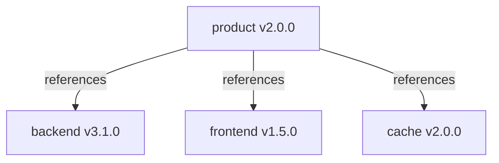

This guide shows you how to model a software product made up of multiple independently versioned components using OCM component references.

## You'll end up with

- A `component-constructor.yaml` that defines service components and a product aggregator
- Component references that pin compatible version combinations
- A CTF archive containing all component versions, ready for transfer

## Estimated time

~15 minutes

## How it works



A product component uses [`componentReferences`](https://github.com/open-component-model/ocm-spec/blob/main/doc/02-processing/01-references.md) to declare which sub-component versions belong together in a release. The product component itself may carry no resources — it acts as a bill of materials (BOM) that pins a tested combination of versions.

## Prerequisites

- [OCM CLI]() installed
- Familiarity with [the component constructor]()

## Define the Components




### Create a component per service

Each independently versioned service gets its own component. Create a `component-constructor.yaml`:

```yaml
# yaml-language-server: $schema=https://ocm.software/schemas/configuration-schema.yaml
components:

# -- Backend service
- name: github.com/acme.org/backend
  version: 3.1.0
  provider:
    name: acme.org
  resources:
    - name: image
      type: ociImage
      version: 3.1.0
      relation: external
      access:
        type: ociArtifact
        imageReference: ghcr.io/acme/backend:3.1.0

# -- Frontend service
- name: github.com/acme.org/frontend
  version: 1.5.0
  provider:
    name: acme.org
  resources:
    - name: image
      type: ociImage
      version: 1.5.0
      relation: external
      access:
        type: ociArtifact
        imageReference: ghcr.io/acme/frontend:1.5.0
```




### Add a product component with references

Add a top-level product component that aggregates the service components via `componentReferences`. This component pins a specific, tested combination of versions:

```yaml
# -- Product component (aggregator)
- name: github.com/acme.org/product
  version: 2.0.0
  provider:
    name: acme.org
  componentReferences:
    - name: backend
      componentName: github.com/acme.org/backend
      version: 3.1.0
    - name: frontend
      componentName: github.com/acme.org/frontend
      version: 1.5.0
```

Each reference entry requires:

| Field | Description |
| --- | --- |
| `name` | Local [element identity](https://github.com/open-component-model/ocm-spec/blob/main/doc/01-model/03-elements-sub.md#element-identity) within this component version |
| `componentName` | Globally unique [component identity](https://github.com/open-component-model/ocm-spec/blob/main/doc/01-model/02-elements-toplevel.md#component-identity) of the referenced component |
| `version` | Exact version to pin |




### Nest references for multi-level hierarchies (optional)

References can be nested. A platform component can reference product components, which in turn reference service components:

```text
platform v1.0.0
├── product-a v2.0.0
│   ├── frontend v1.5.0
│   └── backend v3.1.0
└── product-b v1.0.0
    ├── api v4.0.0
    └── worker v2.3.0
```

Add a `componentReferences` entry at each level pointing to the next.




## Build and Transfer




### Build all component versions

Run from the directory containing your `component-constructor.yaml`:

```shell
ocm add cv --repository ./transport-archive
```




### Verify the result

```shell
ocm get cv ./transport-archive
```

You should see all three components plus the aggregator:

```text
 COMPONENT                      │ VERSION │ PROVIDER
────────────────────────────────┼─────────┼──────────
 github.com/acme.org/backend    │ 3.1.0   │ acme.org
 github.com/acme.org/frontend   │ 1.5.0   │ acme.org
 github.com/acme.org/product    │ 2.0.0   │ acme.org
```




### Transfer to an OCI registry

Pushing to a remote registry requires valid credentials. For example, authenticate with GitHub Container Registry before transferring:

```shell
echo "${GITHUB_TOKEN}" | docker login ghcr.io -u <username> --password-stdin
```

Transfer the product component version:

```shell
ocm transfer cv ctf::./transport-archive//github.com/acme.org/product:2.0.0 ghcr.io/acme/ocm
```

To include all referenced sub-components, add `--recursive` (`-r`). See [Transport](https://github.com/open-component-model/ocm-spec/blob/main/doc/05-guidelines/01-transport.md) in the OCM specification for details on recursive and by-value transfer:

```shell
ocm transfer cv -r ctf::./transport-archive//github.com/acme.org/product:2.0.0 ghcr.io/acme/ocm
```




## Version a New Release

When a sub-component changes, update the product to reflect the new combination:




### Bump the changed sub-component

Update the sub-component's version and artifacts. For example, bump the backend from `3.1.0` to `3.2.0`:

```yaml
- name: github.com/acme.org/backend
  version: 3.2.0
  provider:
    name: acme.org
  resources:
    - name: image
      type: ociImage
      version: 3.2.0
      relation: external
      access:
        type: ociArtifact
        imageReference: ghcr.io/acme/backend:3.2.0
```




### Update the product references and version

Point the product component to the new backend version and bump the product version:

```yaml
- name: github.com/acme.org/product
  version: 2.1.0  # bumped
  provider:
    name: acme.org
  componentReferences:
    - name: backend
      componentName: github.com/acme.org/backend
      version: 3.2.0  # updated
    - name: frontend
      componentName: github.com/acme.org/frontend
      version: 1.5.0  # unchanged
```




### Rebuild and transfer

```shell
ocm add cv --repository ./transport-archive
ocm transfer cv -r ctf::./transport-archive//github.com/acme.org/product:2.1.0 ghcr.io/acme/ocm
```




## Complete Constructor

<details>
<summary>Show full component-constructor.yaml</summary>

```yaml
# yaml-language-server: $schema=https://ocm.software/schemas/configuration-schema.yaml
components:

# -- Product component (aggregator)
- name: github.com/acme.org/product
  version: 2.0.0
  provider:
    name: acme.org
  componentReferences:
    - name: backend
      componentName: github.com/acme.org/backend
      version: 3.1.0
    - name: frontend
      componentName: github.com/acme.org/frontend
      version: 1.5.0
    - name: cache
      componentName: github.com/acme.org/cache
      version: 2.0.0

# -- Backend service
- name: github.com/acme.org/backend
  version: 3.1.0
  provider:
    name: acme.org
  resources:
    - name: image
      type: ociImage
      version: 3.1.0
      relation: external
      access:
        type: ociArtifact
        imageReference: ghcr.io/acme/backend:3.1.0

# -- Frontend service
- name: github.com/acme.org/frontend
  version: 1.5.0
  provider:
    name: acme.org
  resources:
    - name: image
      type: ociImage
      version: 1.5.0
      relation: external
      access:
        type: ociArtifact
        imageReference: ghcr.io/acme/frontend:1.5.0

# -- Cache (Redis)
- name: github.com/acme.org/cache
  version: 2.0.0
  provider:
    name: acme.org
  resources:
    - name: image
      type: ociImage
      version: 7.2.4
      relation: external
      access:
        type: ociArtifact
        imageReference: docker.io/library/redis:7.2.4
```

</details>

## Related Documentation

- [Use the Component Constructor]() — constructor file reference
- [Inspect a Component Descriptor]() — understand what the built descriptor contains
- [OCM Specification: References](https://github.com/open-component-model/ocm-spec/blob/main/doc/02-processing/01-references.md) — how component references are resolved
