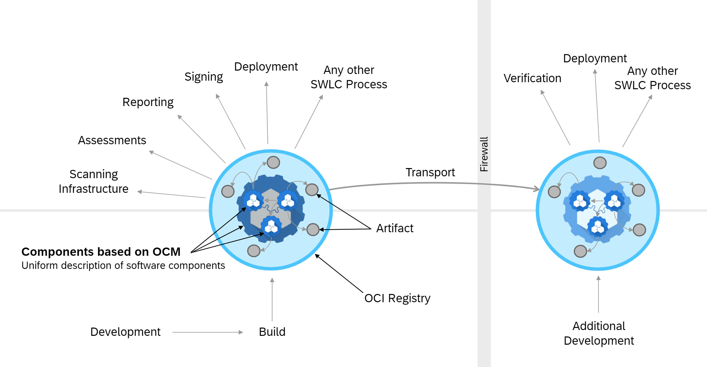

The Open Component Model (OCM) is an open standard that enables teams to describe software artifacts and their lifecycle metadata in a consistent, technology-agnostic way. It’s built to support secure, reliable delivery and deployment of software—across cloud, on-prem, hybrid, and even air-gapped environments. By decoupling and streamlining lifecycle processes like compliance checks, security scans, and deployments, OCM helps teams collaborate more effectively and build trust into every step of the software supply chain.

Below are the main projects, but please also check out the others in our [Github org](https://github.com/open-component-model).

- [OCM Specification](https://github.com/open-component-model/ocm-spec/blob/main/README.md) - The `ocm-spec` repository contains the OCM specification, which provides a formal description of OCM and its format to describe software artifacts and a storage layer to persist those and make them accessible from remote.
- [OCM Core Library](https://github.com/open-component-model/ocm#ocm-library) - The `ocm` core library contains an API for interacting with OCM elements. A guided tour on how to work with the library can be found [here](https://github.com/open-component-model/ocm/tree/main/examples/lib/tour#readme).
- [OCM CLI](https://github.com/open-component-model/ocm#ocm-cli) - With the `ocm` command line interface end users can interact with OCM elements, helping them create component versions and embed them in CI and CD processes. Examples can be found in [this Makefile](https://github.com/open-component-model/ocm/blob/main/examples/make/Makefile).
- [OCM Controller](https://github.com/open-component-model/ocm-controller) - The `ocm-controllers` are designed to enable the automated deployment of software using the [Open Component Model](https://ocm.software) and Flux.
- [OCM Website](https://github.com/open-component-model/ocm-website) - The `ocm-website` you are currently visiting. It is built using Hugo and hosted on Github Pages.
