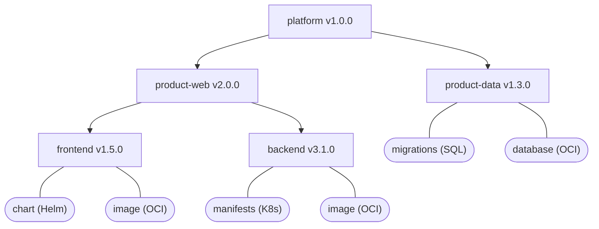

## Overview

Real-world software products rarely consist of a single component. A web platform, for example, might combine a frontend, a backend, shared configuration, and deployment manifests — each versioned independently. The OCM component constructor lets you model this entire hierarchy in a single file, wiring components together with references, attaching provenance metadata, and injecting versions through environment variables.

In this tutorial, you will create a small but realistic product. By the end, you will have a three-level component tree, complete with labels, multiple input types, and component references.

**Estimated time:** ~25 minutes

## What You'll Learn

- Define multiple components with `helm/v1`, `utf8/v1`, and `dir/v1` input types
- Wire components together with `componentReferences`
- Nest references into a multi-level product hierarchy
- Attach labels to components and control which ones are included in the signature digest
- Create and inspecting component versions in a local archive
- Use environment variables to parameterize the constructor

## Prerequisites

- [OCM CLI]() installed
- Completed [Create Component Versions]() and comfortable with `ocm add cv`

## How It Works



Each box is an independent component version. Arrows represent `componentReferences`. Components at the bottom carry the actual resources; components above aggregate them.

## Scenario

Imagine you are shipping a web platform made up of several pieces: a **frontend** (with a Helm chart and an OCI image), a **backend** (with Kubernetes manifests and an OCI image), and a **data layer** (with SQL migration scripts and a PostgreSQL image). Each piece is versioned independently.

On top of these three resource-carrying components you create two grouping layers:

1. **product-web** — references the frontend and backend
2. **platform** — references product-web and product-data

The result is a three-level component tree that you can transfer, sign, and deploy as a single unit.

## Tutorial Steps





### Set up a working directory

Create and enter a directory for this tutorial:

```shell
mkdir /tmp/ocm-multi-component && cd /tmp/ocm-multi-component
```





### Create product-web

We start by creating the **product-web** part of the tree: a **frontend** component, a **backend** component, and a **product-web** component that references both.

Each resource in a component is provided in one of two ways:

- **`input`** — the content is resolved at creation time and embedded **by value** into the archive (e.g. fetched from a remote Helm repository, read from a local file, or taken from an inline value)
- **`access`** — the content stays in an external location (e.g. an OCI registry) and the component descriptor stores only a **reference** to it

Create `component-constructor.yaml`:

```shell
cat > component-constructor.yaml << 'EOF'
# yaml-language-server: $schema=https://ocm.software/latest/schemas/bindings/go/constructor/schema-2020-12.json
components:

# ── Frontend ────────────────────────────────────────────────────
- name: ocm.software/tutorials/frontend
  version: 1.5.0
  provider:
    name: ocm.software
  resources:
    - name: chart
      type: helmChart
      input:
        type: helm/v1
        helmRepository: https://github.com/kubernetes/ingress-nginx/releases/download/helm-chart-4.14.0/ingress-nginx-4.14.0.tgz
    - name: image
      type: ociImage
      version: 1.5.0
      access:
        type: OCIImage/v1
        imageReference: ghcr.io/stefanprodan/podinfo:6.9.1

# ── Backend ─────────────────────────────────────────────────────
- name: ocm.software/tutorials/backend
  version: 3.1.0
  provider:
    name: ocm.software
  resources:
    - name: manifests
      type: blob
      input:
        type: utf8/v1
        yaml:
          apiVersion: v1
          kind: Service
          metadata:
            name: backend
          spec:
            selector:
              app: backend
            ports:
              - port: 8080
                targetPort: 8080
    - name: image
      type: ociImage
      version: 3.1.0
      access:
        type: OCIImage/v1
        imageReference: ghcr.io/stefanprodan/podinfo:6.9.1

# ── Product: Web ────────────────────────────────────────────────
- name: ocm.software/tutorials/product-web
  version: 2.0.0
  provider:
    name: ocm.software
  labels:
    - name: purpose
      value: tutorial
  componentReferences:
    - name: frontend
      componentName: ocm.software/tutorials/frontend
      version: 1.5.0
    - name: backend
      componentName: ocm.software/tutorials/backend
      version: 3.1.0
EOF
```

A few things to notice:

- [**`helm/v1`**]() input type fetches a Helm chart from a remote repository and embeds it into the archive at creation time.
- [**`utf8/v1`**]() input type lets you embed small inline configuration directly in the constructor file.
- [**`componentReferences`**]() creates a directed edge in the component graph. The product-web component itself has no resources — it is purely an aggregator.
- **Labels** attach arbitrary key-value metadata to a component version. Any tooling or automation working with the component can read these labels — for example to filter components by team, environment, or purpose. Labels are purely informational by default and can be changed freely after creation. You will see in the next step how to mark a label as part of the signature digest.





### Add the data layer

Most products include a persistence tier alongside their web tier. In this step you add a **product-data** component that bundles SQL migration scripts and a PostgreSQL image. This component will later be referenced by the top-level platform aggregator, keeping the data layer independently versionable while still part of the overall product.

Create the migration files:

```shell
mkdir -p db
cat > db/init.sql << 'EOF'
CREATE TABLE IF NOT EXISTS users (
  id   SERIAL PRIMARY KEY,
  name TEXT NOT NULL,
  email TEXT UNIQUE NOT NULL
);
EOF
```

Append the product-data component to the constructor:

```shell
cat >> component-constructor.yaml << 'EOF'

# ── Product Data ────────────────────────────────────────────────
- name: ocm.software/tutorials/product-data
  version: 1.3.0
  provider:
    name: ocm.software
  resources:
    - name: migrations
      type: blob
      input:
        type: dir/v1
        path: ./db
        compress: true
    - name: database
      type: ociImage
      version: "16.8"
      access:
        type: OCIImage/v1
        imageReference: docker.io/library/postgres:16.8
EOF
```

The [**`dir/v1`**]() input type embeds an entire directory as a compressed archive — here used for SQL migration scripts.





### Add the platform component (top-level aggregator)

Finally, add a **platform** component that references both `product-web` and `product-data`. A top-level aggregator like this has no resources of its own — it exists purely to pin a set of sub-components at specific versions. This gives you a single entry point that you can sign, transfer, or deploy as one unit, while each sub-component remains independently versionable.

```shell
cat >> component-constructor.yaml << 'EOF'

# ── Platform (top-level) ────────────────────────────────────────
- name: ocm.software/tutorials/platform
  version: 1.0.0
  provider:
    name: ocm.software
  labels:
    - name: org
      value: ocm.software
    - name: release
      value: "2025-Q1"
      signing: true
  componentReferences:
    - name: product-web
      componentName: ocm.software/tutorials/product-web
      version: 2.0.0
    - name: product-data
      componentName: ocm.software/tutorials/product-data
      version: 1.3.0
EOF
```

Notice the `signing: true` field on the `release` label. Labels marked with `signing: true` are included in the component descriptor's signature digest — changing their value after signing invalidates the signature. Labels without this field are excluded from signing and can be modified freely. For more details, see [Signing and Verification]().

You already used `componentReferences` in the product-web component to wire together the frontend and backend components. Here the same mechanism links the platform to its sub-products. Each reference points to another component by its full name and version.





### Create the component versions

With all five components defined in a single constructor file, you can now create them in a local OCM archive. The `ocm add cv` command reads the constructor, fetches any `input` resources (like the Helm chart and the `db/` directory), and writes the resulting component versions into a Common Transport Format (CTF) on disk.

<details>
  <summary>Complete <code>component-constructor.yaml</code></summary>

```yaml
# yaml-language-server: $schema=https://ocm.software/latest/schemas/bindings/go/constructor/schema-2020-12.json
components:

# ── Frontend ────────────────────────────────────────────────────
- name: ocm.software/tutorials/frontend
  version: 1.5.0
  provider:
    name: ocm.software
  resources:
    - name: chart
      type: helmChart
      input:
        type: helm/v1
        helmRepository: https://github.com/kubernetes/ingress-nginx/releases/download/helm-chart-4.14.0/ingress-nginx-4.14.0.tgz
    - name: image
      type: ociImage
      version: 1.5.0
      access:
        type: OCIImage/v1
        imageReference: ghcr.io/stefanprodan/podinfo:6.9.1

# ── Backend ─────────────────────────────────────────────────────
- name: ocm.software/tutorials/backend
  version: 3.1.0
  provider:
    name: ocm.software
  resources:
    - name: manifests
      type: blob
      input:
        type: utf8/v1
        yaml:
          apiVersion: v1
          kind: Service
          metadata:
            name: backend
          spec:
            selector:
              app: backend
            ports:
              - port: 8080
                targetPort: 8080
    - name: image
      type: ociImage
      version: 3.1.0
      access:
        type: OCIImage/v1
        imageReference: ghcr.io/stefanprodan/podinfo:6.9.1

# ── Product: Web ────────────────────────────────────────────────
- name: ocm.software/tutorials/product-web
  version: 2.0.0
  provider:
    name: ocm.software
  labels:
    - name: purpose
      value: tutorial
  componentReferences:
    - name: frontend
      componentName: ocm.software/tutorials/frontend
      version: 1.5.0
    - name: backend
      componentName: ocm.software/tutorials/backend
      version: 3.1.0

# ── Product Data ────────────────────────────────────────────────
- name: ocm.software/tutorials/product-data
  version: 1.3.0
  provider:
    name: ocm.software
  resources:
    - name: migrations
      type: blob
      input:
        type: dir/v1
        path: ./db
        compress: true
    - name: database
      type: ociImage
      version: "16.8"
      access:
        type: OCIImage/v1
        imageReference: docker.io/library/postgres:16.8

# ── Platform (top-level) ────────────────────────────────────────
- name: ocm.software/tutorials/platform
  version: 1.0.0
  provider:
    name: ocm.software
  labels:
    - name: org
      value: ocm.software
    - name: release
      value: "2025-Q1"
      signing: true
  componentReferences:
    - name: product-web
      componentName: ocm.software/tutorials/product-web
      version: 2.0.0
    - name: product-data
      componentName: ocm.software/tutorials/product-data
      version: 1.3.0
```
</details>

> **Note:** We don't need to pass `--constructor component-constructor.yaml` because the CLI looks for a file named `component-constructor.yaml` in the current directory by default.

```shell
ocm add cv --repository my-product
```

<details>
  <summary>Expected output</summary>

```text
 COMPONENT                           │ VERSION │ PROVIDER     
─────────────────────────────────────┼─────────┼──────────────
 ocm.software/tutorials/platform     │ 1.0.0   │ ocm.software 
 ocm.software/tutorials/product-web  │ 2.0.0   │              
 ocm.software/tutorials/frontend     │ 1.5.0   │              
 ocm.software/tutorials/backend      │ 3.1.0   │              
 ocm.software/tutorials/product-data │ 1.3.0   │              
```
</details>





### Explore the component tree

After creating the archive, it is useful to verify that the component graph looks the way you expect. The CLI can render the full dependency tree and dump individual component descriptors, letting you confirm that references resolve correctly and resources were embedded with the right types and digests.

> **Tip:** The `--recursive` flag controls how many levels of component references to resolve: `0` means none, `-1` means unlimited. If no value is provided, it defaults to `-1`.

```shell
ocm get cv my-product//ocm.software/tutorials/platform:1.0.0 --recursive=-1 -o tree
```

<details>
  <summary>Expected output</summary>

```text
 NESTING   COMPONENT                            VERSION  PROVIDER      IDENTITY                                               
 └─ ●      ocm.software/tutorials/platform      1.0.0    ocm.software  name=ocm.software/tutorials/platform,version=1.0.0     
    ├─ ●   ocm.software/tutorials/product-web   2.0.0    ocm.software  name=ocm.software/tutorials/product-web,version=2.0.0  
    │  ├─  ocm.software/tutorials/frontend      1.5.0    ocm.software  name=ocm.software/tutorials/frontend,version=1.5.0     
    │  └─  ocm.software/tutorials/backend       3.1.0    ocm.software  name=ocm.software/tutorials/backend,version=3.1.0      
    └─     ocm.software/tutorials/product-data  1.3.0    ocm.software  name=ocm.software/tutorials/product-data,version=1.3.0 
```
</details>

This confirms the platform references both products, and product-web in turn references the frontend and backend.

Inspect the component descriptor of the frontend to verify resources:

```shell
ocm get cv my-product//ocm.software/tutorials/frontend:1.5.0 -o yaml
```

<details>
  <summary>Expected output</summary>

```yaml
- component:
    componentReferences: null
    name: ocm.software/tutorials/frontend
    provider: ocm.software
    repositoryContexts: null
    resources:
    - access:
        localReference: sha256:...
        mediaType: application/vnd.oci.image.manifest.v1+json
        type: localBlob/v1
      digest:
        hashAlgorithm: SHA-256
        normalisationAlgorithm: genericBlobDigest/v1
        value: ...
      name: chart
      relation: local
      type: helmChart
      version: 1.5.0
    - access:
        imageReference: ghcr.io/stefanprodan/podinfo:6.9.1@sha256:...
        type: OCIImage/v1
      digest:
        hashAlgorithm: SHA-256
        normalisationAlgorithm: genericBlobDigest/v1
        value: ...
      name: image
      relation: external
      type: ociImage
      version: 1.5.0
    sources: null
    version: 1.5.0
  meta:
    schemaVersion: v2
```

</details>





### Use environment variables

In practice you rarely hard-code version numbers — they are typically provided as environment variables. The OCM constructor supports `${VARIABLE}` substitution so you can keep a single constructor file and inject versions when creating component versions. In this step you replace the static versions with environment variable placeholders and recreate the archive.

```shell
cat > component-constructor.yaml << 'EOF'
# yaml-language-server: $schema=https://ocm.software/latest/schemas/bindings/go/constructor/schema-2020-12.json
components:

- name: ocm.software/tutorials/frontend
  version: ${FRONTEND_VERSION}
  provider:
    name: ocm.software
  labels:
    - name: org
      value: ocm.software
    - name: purpose
      value: tutorial
      signing: true
  resources:
    - name: chart
      type: helmChart
      input:
        type: helm/v1
        helmRepository: https://github.com/kubernetes/ingress-nginx/releases/download/helm-chart-4.14.0/ingress-nginx-4.14.0.tgz
    - name: image
      type: ociImage
      version: ${FRONTEND_VERSION}
      access:
        type: OCIImage/v1
        imageReference: ghcr.io/stefanprodan/podinfo:6.9.1

- name: ocm.software/tutorials/backend
  version: ${BACKEND_VERSION}
  provider:
    name: ocm.software
  labels:
    - name: org
      value: ocm.software
  resources:
    - name: manifests
      type: blob
      input:
        type: utf8/v1
        yaml:
          apiVersion: v1
          kind: Service
          metadata:
            name: backend
          spec:
            selector:
              app: backend
            ports:
              - port: 8080
                targetPort: 8080
    - name: image
      type: ociImage
      version: ${BACKEND_VERSION}
      access:
        type: OCIImage/v1
        imageReference: ghcr.io/stefanprodan/podinfo:6.9.1

- name: ocm.software/tutorials/product-data
  version: ${DATA_VERSION}
  provider:
    name: ocm.software
  labels:
    - name: org
      value: ocm.software
  resources:
    - name: migrations
      type: blob
      input:
        type: dir/v1
        path: ./db
        compress: true
    - name: database
      type: ociImage
      version: "16.8"
      access:
        type: OCIImage/v1
        imageReference: docker.io/library/postgres:16.8

- name: ocm.software/tutorials/product-web
  version: ${PRODUCT_VERSION}
  provider:
    name: ocm.software
  componentReferences:
    - name: frontend
      componentName: ocm.software/tutorials/frontend
      version: ${FRONTEND_VERSION}
    - name: backend
      componentName: ocm.software/tutorials/backend
      version: ${BACKEND_VERSION}

- name: ocm.software/tutorials/platform
  version: ${PLATFORM_VERSION}
  provider:
    name: ocm.software
  labels:
    - name: org
      value: ocm.software
    - name: release
      value: "2025-Q1"
      signing: true
  componentReferences:
    - name: product-web
      componentName: ocm.software/tutorials/product-web
      version: ${PRODUCT_VERSION}
    - name: product-data
      componentName: ocm.software/tutorials/product-data
      version: ${DATA_VERSION}
EOF
```

Create the component versions with environment variables:

```shell
rm -rf my-product
FRONTEND_VERSION=1.5.0 \
BACKEND_VERSION=3.1.0 \
DATA_VERSION=1.3.0 \
PRODUCT_VERSION=2.0.0 \
PLATFORM_VERSION=1.0.0 \
ocm add cv --repository my-product
```

<details>
  <summary>Expected output</summary>

```text
 COMPONENT                           │ VERSION │ PROVIDER     
─────────────────────────────────────┼─────────┼──────────────
 ocm.software/tutorials/platform     │ 1.0.0   │ ocm.software 
 ocm.software/tutorials/product-web  │ 2.0.0   │              
 ocm.software/tutorials/frontend     │ 1.5.0   │              
 ocm.software/tutorials/backend      │ 3.1.0   │              
 ocm.software/tutorials/product-data │ 1.3.0   │              
```
</details>

Undefined variables expand to empty strings, which will fail schema validation — so always set them before running the command.





## What you've learned

- **Multiple input types** — `dir/v1` for directories, `utf8/v1` for inline content, and `helm/v1` for remote Helm charts
- **Component references** — directed edges that compose products from independently versioned parts
- **Multi-level nesting** — platform → product → component hierarchies, all in one constructor file
- **Labels** — attaching metadata to components, optionally included in signing
- **Inspecting archives** — using `ocm get cv` with `--recursive` to verify the component graph
- **Environment variables** — `${VARIABLE}` substitution to parameterize the constructor

## Cleanup

Remove everything created in this tutorial:

```shell
rm -rf /tmp/ocm-multi-component
```

## Next Steps

- [Tutorial: Plain Signatures]() - add signing to your components
- [How-to: Transfer Helm Charts]() - transfer components to a remote registry

## Related documentation

- [Concept: Component Identity]() - understand how OCM identifies components
- [Reference: Component Constructor]() - Documented JSON Schema for the component constructor
- [OCM Specification](https://github.com/open-component-model/ocm-spec/blob/main/README.md) - formal specification of the component model
