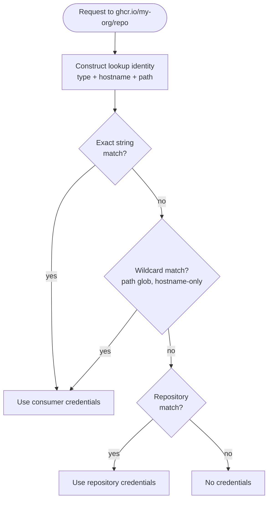

## Overview

Every time OCM accesses a registry, it resolves credentials automatically. This tutorial walks you through how that resolution works — given a config, which credentials does OCM pick for each request, and why?

For the full concept, see [Credential System]().

**Estimated time:** ~10 minutes

## What you'll learn

- How OCM constructs a lookup identity from a request
- How consumers are matched — exact path, glob, hostname-only
- How the fallback from consumers to repositories works
- Why specificity matters when multiple consumers could match

## Prerequisites

- You have the [OCM CLI]() installed
- You are comfortable reading YAML

## How Resolution Works

When resolving credentials, OCM checks the two config sections in this order:

1. **`consumers`** — explicit consumer-to-credential mappings
2. **`repositories`** — fallback providers like Docker config files

Consumer entries always take priority over repository lookups. This means you can rely on Docker config for most registries while overriding specific ones with explicit credentials — without touching your Docker setup.

### Identity Matching

When OCM needs credentials for an operation (e.g., pushing to `ghcr.io/my-org/my-repo`), it constructs a **lookup identity** — a map of attributes like `type`, `hostname`, `scheme`, `port`, and `path`. It then tries to find a matching consumer entry in the credential graph.



Matching runs three chained matchers **in order** — all three must pass:

1. **Path matcher** — compares `path` using Go's `path.Match` (glob). If the configured entry has no `path`, any request path is accepted. `*` matches exactly one segment (not across `/`).
2. **URL matcher** — compares `scheme`, `hostname`, and `port`. Applies default ports: `https` → `443`, `http` → `80`. Schemes must be equal (if neither side specifies one, they match).
3. **Equality matcher** — all remaining attributes (like `type`) must be exactly equal.

If any matcher fails, the entry is skipped. **First match wins** — OCM returns the first matching entry it finds.

Quick reference:

| Configured identity | Request | Result | Why |
| --- | --- | --- | --- |
| `type: OCIRepository`<br>`hostname: ghcr.io`<br>`path: my-org/my-repo` | `ghcr.io/my-org/my-repo` | ✅ | Exact path match |
| `type: OCIRepository`<br>`hostname: ghcr.io`<br>`path: my-org/*` | `ghcr.io/my-org/my-repo` | ✅ | `*` matches `my-repo` |
| `type: OCIRepository`<br>`hostname: ghcr.io` | `ghcr.io/my-org/my-repo` | ✅ | No path — accepts any |
| `type: OCIRepository`<br>`hostname: ghcr.io`<br>`path: my-org` | `ghcr.io/my-org/my-repo` | ❌ | `my-org` ≠ `my-org/my-repo` |
| `type: OCIRepository`<br>`hostname: ghcr.io`<br>`path: my-org/*` | `ghcr.io/other-org/foo` | ❌ | `other-org` ≠ `my-org` |
| `type: OCIRepository`<br>`hostname: ghcr.io`<br>`scheme: https` | `https://ghcr.io:443/repo` | ✅ | Port defaults to `443` |
| `type: OCIRepository`<br>`hostname: ghcr.io`<br>`scheme: http` | `https://ghcr.io/repo` | ❌ | `http` ≠ `https` |
| `type: OCIRepository`<br>`hostname: ghcr.io`<br>`port: 5000` | `https://ghcr.io:443/repo` | ❌ | `5000` ≠ `443` |


`*` matches exactly one path segment. It does **not** match across `/` separators. Use `my-org/*/*` to match two-level paths like `my-org/team/repo`.


### Example A: Simple Hostname Match

The simplest case: a single consumer entry with just a `hostname`. Because no `path` is configured, it acts as a **catch-all** for that host.

```yaml
type: generic.config.ocm.software/v1
configurations:
  - type: credentials.config.ocm.software
    consumers:
      - identities:
          - type: OCIRepository
            hostname: ghcr.io
        credentials:
          - type: Credentials/v1
            properties:
              username: ghcr-user
              password: ghp_token
```

| Request | Result | Why |
| --- | --- | --- |
| `ghcr.io/my-org/my-repo` | ✅ `ghcr-user` | No `path` in config → accepts any path |
| `ghcr.io/other-org/thing` | ✅ `ghcr-user` | Same — hostname matches, path is unrestricted |
| `docker.io/library/nginx` | ❌ No credentials | `docker.io` ≠ `ghcr.io` |

**Takeaway:** A hostname-only entry is the broadest match. It catches every request to that host regardless of path, scheme, or port.

### Example B: Glob Path Matching with Multiple Consumers

Three consumers for the same host, with decreasing specificity:

```yaml
type: generic.config.ocm.software/v1
configurations:
  - type: credentials.config.ocm.software
    consumers:
      # Consumer A: exact path
      - identities:
          - type: OCIRepository
            hostname: ghcr.io
            path: my-org/production
        credentials:
          - type: Credentials/v1
            properties:
              username: prod-user
              password: ghp_prod
      # Consumer B: glob path
      - identities:
          - type: OCIRepository
            hostname: ghcr.io
            path: my-org/*
        credentials:
          - type: Credentials/v1
            properties:
              username: org-user
              password: ghp_org
      # Consumer C: hostname only (catch-all)
      - identities:
          - type: OCIRepository
            hostname: ghcr.io
        credentials:
          - type: Credentials/v1
            properties:
              username: catchall-user
              password: ghp_catchall
```

| Request | Matches A? | Matches B? | Matches C? | Why |
| --- | --- | --- | --- | --- |
| `ghcr.io/my-org/production` | ✅ | ✅ | ✅ | Exact path match on A; `*` also matches `production`; C has no path |
| `ghcr.io/my-org/staging` | ❌ | ✅ | ✅ | `staging` ≠ `production`, but `*` matches `staging` |
| `ghcr.io/my-org/team/repo` | ❌ | ❌ | ✅ | `*` matches **one** segment — `team/repo` has two. Only C matches |
| `ghcr.io/other-org/repo` | ❌ | ❌ | ✅ | `other-org` ≠ `my-org`; only the hostname catch-all matches |


`*` matches exactly one path segment. It does **not** match across `/` separators. To match two levels like `my-org/team/repo`, use `my-org/*/*`.


**Takeaway:** OCM first tries an exact string match on the full identity. If that fails, it iterates all configured entries and returns the first wildcard match.

### Example B2: Two-Level Wildcard Matching (`*/*`)

What if you want to match exactly two path segments? Use `*/*` to match any organization/repository combination.

```yaml
type: generic.config.ocm.software/v1
configurations:
  - type: credentials.config.ocm.software
    consumers:
      # Consumer A: two-level wildcard for any org/repo
      - identities:
          - type: OCIRepository
            hostname: ghcr.io
            path: "*/*"
        credentials:
          - type: Credentials/v1
            properties:
              username: org-user
              password: ghp_org_token
      # Consumer B: single-level wildcard (more specific)
      - identities:
          - type: OCIRepository
            hostname: ghcr.io
            path: "my-org/*"
        credentials:
          - type: Credentials/v1
            properties:
              username: my-org-user
              password: ghp_my_org_token
```

| Request | Consumer A (`*/*`) | Consumer B (`my-org/*`) | Result | Why |
| --- | --- | --- | --- | --- |
| `ghcr.io/my-org/repo` | ✅ | ✅ | ✅ `my-org-user` | B matches first (more specific) |
| `ghcr.io/other-org/project` | ✅ | ❌ | ✅ `org-user` | Only A matches (two-level wildcard) |
| `ghcr.io/my-org/team/subteam/repo` | ❌ | ❌ | ❌ No credentials | Path has 4 segments, `*/*` only matches 2 |
| `ghcr.io/singlelevel` | ❌ | ❌ | ❌ No credentials | Path has 1 segment, `*/*` requires exactly 2 |


`*/*` matches **exactly** two path segments. For three levels, use `*/*/*`, and so on. Each `*` matches one segment between `/` separators.


**Takeaway:** Use `*/*` when you want to match any two-segment path structure (like organization/repository) while still being more specific than a hostname-only catch-all.

### Example C: URL Normalization — Scheme and Port Defaults

When `scheme` is specified, OCM applies default port mapping:

- `https` without port → defaults to `443`
- `http` without port → defaults to `80`

This means `https://ghcr.io` and `https://ghcr.io:443` are **equivalent**.

```yaml
type: generic.config.ocm.software/v1
configurations:
  - type: credentials.config.ocm.software
    consumers:
      # HTTPS-only entry
      - identities:
          - type: OCIRepository
            hostname: ghcr.io
            scheme: https
        credentials:
          - type: Credentials/v1
            properties:
              username: secure-user
              password: ghp_secure
      # Custom port registry (no scheme)
      - identities:
          - type: OCIRepository
            hostname: myregistry.local
            port: "5000"
        credentials:
          - type: Credentials/v1
            properties:
              username: local-user
              password: local_pass
```

| Request | Result | Why |
| --- | --- | --- |
| `https://ghcr.io/my-org/repo` | ✅ `secure-user` | Scheme matches; no port defaults to `443` on both sides |
| `https://ghcr.io:443/repo` | ✅ `secure-user` | Explicit `443` equals the default `443` for `https` |
| `https://ghcr.io:8443/repo` | ❌ No credentials | Port `8443` ≠ default `443` |
| `http://ghcr.io/repo` | ❌ No credentials | Scheme `http` ≠ `https` |
| `ghcr.io/repo` (no scheme) | ❌ No credentials | Empty scheme ≠ `https` — schemes must match |
| `myregistry.local:5000/repo` | ✅ `local-user` | Port `5000` matches; no scheme on either side |
| `myregistry.local/repo` (no port) | ❌ No credentials | No scheme means no default port — empty ≠ `5000` |

**Takeaway:** Port defaults only apply when a `scheme` is present. If you omit `scheme` from both the config and the request, ports are compared literally.

### Example D: The `oci` Scheme

Some OCI tools use `oci://` URLs instead of `https://`. When OCM builds a lookup identity from an `oci://` URL, it treats `oci` like `https` and explicitly sets **port 443**. However, the identity matcher only has built-in port defaults for `https` → `443` and `http` → `80` — the `oci` scheme has **no default port**.

In practice this works because OCM sets port `443` explicitly on both sides for `oci://` URLs, so they match via literal comparison.

```yaml
type: generic.config.ocm.software/v1
configurations:
  - type: credentials.config.ocm.software
    consumers:
      - identities:
          - type: OCIRepository
            hostname: registry.example.com
            scheme: oci
            port: "443"
        credentials:
          - type: Credentials/v1
            properties:
              username: oci-user
              password: oci_token
```

| Request | Result | Why |
| --- | --- | --- |
| `oci://registry.example.com:443/repo` | ✅ `oci-user` | Same scheme, same explicit port |
| `oci://registry.example.com/repo` (no port) | ❌ No credentials | `oci` has no default port in the matcher — empty ≠ `443` |
| `https://registry.example.com:443/repo` | ❌ No credentials | Scheme `https` ≠ `oci` |
| `oci://registry.example.com:5000/repo` | ❌ No credentials | Port `5000` ≠ `443` |


`oci` and `https` are **different schemes** — they are never interchangeable. If your config uses `scheme: oci`, only `oci://` requests will match. Always include an explicit `port` when using the `oci` scheme.


**Takeaway:** When using the `oci` scheme, always specify `port: "443"` explicitly in your config. Unlike `https`, the matcher does not infer a default port for `oci`.

### Example E: When Nothing Matches

This example shows common reasons why credential resolution fails. Given a single specific consumer:

```yaml
type: generic.config.ocm.software/v1
configurations:
  - type: credentials.config.ocm.software
    consumers:
      - identities:
          - type: OCIRepository
            hostname: ghcr.io
            scheme: https
            path: my-org/*
        credentials:
          - type: Credentials/v1
            properties:
              username: org-user
              password: ghp_org
```

Every request below fails to match:

| Request | Why it fails |
| --- | --- |
| `https://quay.io/my-org/repo` | **Wrong hostname** — `quay.io` ≠ `ghcr.io` |
| `https://ghcr.io/my-org/team/repo` | **Path too deep** — `*` matches one segment, `team/repo` has two |
| `https://ghcr.io/my-org` | **Path too short** — `my-org` does not match `my-org/*` (glob requires a segment after `/`) |
| `http://ghcr.io/my-org/repo` | **Scheme mismatch** — `http` ≠ `https` |


There is **no prefix matching** — `path: my-org` does not match `my-org/production`. And `path: my-org/*` does not match `my-org` either. The glob pattern must match the full path.


**Takeaway:** If you get `401 Unauthorized` unexpectedly, check each attribute: `type`, `hostname`, `scheme`, `port`, and `path`. Every attribute present on the configured entry must match the request exactly (with glob support for `path` and port defaults for `https`/`http`).

## Troubleshooting

### Problem: `401 Unauthorized` despite having a consumer entry

**Cause:** The lookup identity doesn't match. Common issues: `path` mismatch or wrong `hostname`.

**Fix:** Check that `hostname` and `path` match the request. Remember, `path: my-org` does **not** match `my-org/production` — there is no prefix matching. See [Identity Matching](#identity-matching) above.

### Problem: `401 Unauthorized` when Docker fallback should work

**Cause:** Docker config doesn't have credentials for that registry.

**Fix:**

```bash
docker login <registry-hostname>
```

Then retry the OCM command.

## Next Steps

- [How-To: Configure Credentials for multiple Repositories ]() - Configure OCM to authenticate against multiple OCI registries
- [How-To: Migrate v1 Credentials to v2]() - Migrate an existing OCM v1 `.ocmconfig` file so it works with OCM v2

## Related Documentation

- [Concept: Credential System]() - Learn how the credential system automatically finds the right credentials for each operation
