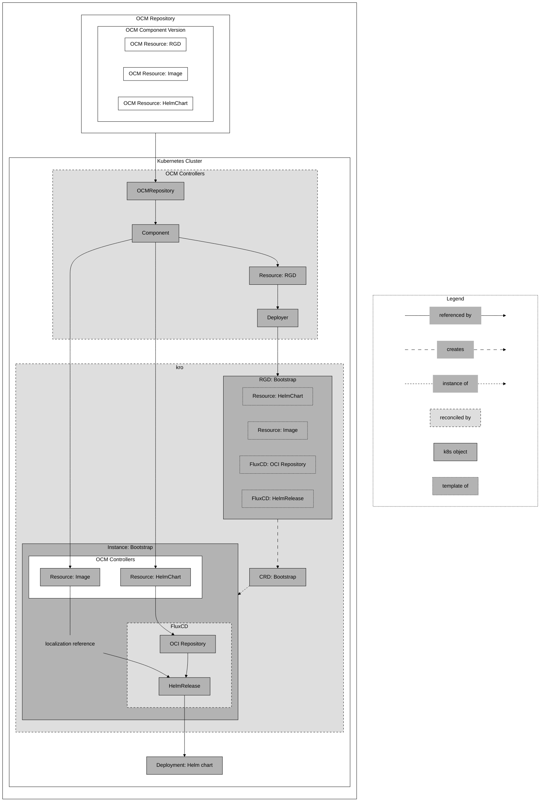

The [OCM Components]() page and the [Deploy a Helm Chart]() guide showed a basic example of how to deploy a Helm chart from an OCM component.
By defining a `ResourceGraphDefinition` that contains all the required resources to deploy the Helm chart into a
Kubernetes cluster.

However, there are scenarios, where the developer already knows how the deployment instructions for the Helm chart
should look like and what should be configured.
Accordingly, the developer can create a `ResourceGraphDefinition` that contains all the required resources to deploy and
configure the Helm chart, and deliver it with the OCM component version itself. This way, the deployment instructions
can also be delivered securely through OCM and the operator does not need to know which resources are required.

In such a case, we need to bootstrap the `ResourceGraphDefinition` from the OCM component and apply it to the cluster.

To do so, we use the OCM controller resource `Deployer`. By referencing the `Resource` containing the
`ResourceGraphDefinition` by name, the deployer will download the content from the OCM component and apply it to the
cluster.

The following guide demonstrates how to deploy a Helm chart using a `ResourceGraphDefinition` that is also delivered
with the same OCM component. Additionally, it shows how to **localize** a Helm chart.


**Localization** describes the process of inserting a new image reference into the deployment instructions, e.g. a
Helm chart. It is a two-step process:

1. When an OCM component and its resources are transferred to another registry, **referential resources** can
potentially update their reference to the new location. For instance, a resource with an access type `ociArtifact`
will update its image reference in the component descriptor to the new registry location, if the OCM transfer is done
with the flag `--copy-resources`.
1. However, the deployment using the image is not aware of this change. Accordingly, we need to insert the new image
reference into the deployment instruction. This can be done using deployment tools like FluxCDs
[HelmRelease](https://fluxcd.io/flux/components/helm/helmreleases/#values) and
[Kustomization](https://fluxcd.io/flux/components/kustomize/kustomizations/#patches) or ArgoCDs
[Helm](https://argo-cd.readthedocs.io/en/stable/user-guide/helm/#values) and
[Kustomize](https://argo-cd.readthedocs.io/en/stable/user-guide/kustomize/#patches).


The following diagram shows an overview of the resources and their relationships of this guide:



As the diagram shows, we will start by creating an OCM component that contains three resources:

- An OCM Resource containing the "HelmChart" we want to deploy.
- An OCM Resource containing an access specification to an "Image" we want to use for the deployment and localization.
- An OCM Resource containing the `ResourceGraphDefinition` (RGD) that will deploy the Helm chart and configure the
localization.

To enable the bootstrap of the `ResourceGraphDefinition`, we will create the respective OCM controller resources that
point to the OCM repository ("Repository"), the OCM component version ("Component"), and the OCM Resource
("Resource: RGD") that contains the `ResourceGraphDefinition`. The OCM controller resource "Deployer" will refer to the
aforementioned "Resource: RGD", download the `ResourceGraphDefinition`, and apply it to the cluster.

After applying the `ResourceGraphDefinition`, kro will reconcile it and create a Custom Resource Definition
("CRD: Bootstrap"). By creating an instance of that CRD, we will deploy the resources as defined in the
`ResourceGraphDefinition`:

- An OCM controller resource "HelmChart" of type `Resource` that contains the location of the Helm chart in its status.
- An OCM controller resource "Image" of type `Resource` that contains the localized image reference in its status.
- A FluxCD resource of type `OCIRepository` that points to the location of the Helm chart retrieved from the status of
  the resource "HelmChart".
- A FluxCD resource of type `HelmRelease` that points to FluxCDs `OCIRepository`, gets the Helm chart, and replaces
  the image location in the deployment using its `spec.values`-field and the status of the resource "Image" that
  contains the localized image reference.

Finally, we will check if the deployment was successful and if the localization was applied correctly.


Before starting, make sure you have set up your environment as described in the [setup guide]().


## Create the OCM Component Version

First, we will create an OCM component version containing a Helm chart, the application image that is used in the Helm
chart, and the `ResourceGraphDefinition` that contains all required resource to deploy the Helm chart and configure the
localization. For this example, we will use the `podinfo` Helm chart and image, which is a simple web application that
serves a pod information page. For more details on how to create an OCM component version, please refer to the
[OCM documentation][ocm-doc].

To create the OCM component version, we will use the following `component-constructor.yaml` file:

```yaml
components:
  - name: ocm.software/ocm-k8s-toolkit/bootstrap
    version: "1.0.0"
    provider:
      name: ocm.software
    resources:
      - name: helm-resource
        type: helmChart
        version: "1.0.0"
        access:
          type: ociArtifact
          imageReference: "ghcr.io/stefanprodan/charts/podinfo:6.9.1@sha256:565d310746f1fa4be7f93ba7965bb393153a2d57a15cfe5befc909b790a73f8a"
      - name: image-resource
        type: ociArtifact
        version: "1.0.0"
        access:
          type: ociRegistry
          imageReference: "ghcr.io/stefanprodan/podinfo:6.9.1@sha256:262578cde928d5c9eba3bce079976444f624c13ed0afb741d90d5423877496cb"
      - name: resource-graph-definition
        type: blob
        version: "1.0.0"
        input:
          type: file
          path: ./resourceGraphDefinition.yaml
```

As you can see, the resource `resource-graph-definition` is of type `blob` and contains the path to a file
`resourceGraphDefinition.yaml`. Before we can create the OCM component version, we need to create this file, with the
following content:

```yaml
apiVersion: kro.run/v1alpha1
kind: ResourceGraphDefinition
metadata:
  name: bootstrap
spec:
  schema:
    apiVersion: v1alpha1
    kind: Bootstrap
  resources:
    # In this guide, we will not create a "Repository" and "Component" resource in this ResourceGraphDefinition. Those
    # resources will be created to bootstrap the ResourceGraphDefinition itself and will be present in the Kubernetes
    # cluster to be referenced by the following resources (see the bootstrap resource in one of the following sections).

    # This resource refers to the resource "helm-resource" defined in the OCM component version. It will be downloaded,
    # verified, and its location is made available in the status of the resource.
    - id: resourceChart
      template:
        apiVersion: delivery.ocm.software/v1alpha1
        kind: Resource
        metadata:
          name: bootstrap-helm-resource
        spec:
          # This component will be part of the bootstrap resources that will be created later.
          componentRef:
            name: bootstrap-component
          resource:
            byReference:
              resource:
                name: helm-resource
          interval: 1m
          # ocmConfig is required, if the OCM repository requires credentials to access it.
          # ocmConfig:
    # This resource refers to the resource "image-resource" defined in the OCM component version. It will be downloaded,
    # verified, and its location is made available in the status of the resource.
    - id: resourceImage
      template:
        apiVersion: delivery.ocm.software/v1alpha1
        kind: Resource
        metadata:
          name: bootstrap-image-resource
        spec:
          # This component will be part of the bootstrap resources that will be created later.
          componentRef:
            name: bootstrap-component
          resource:
            byReference:
              resource:
                name: image-resource
          interval: 1m
          # ocmConfig is required, if the OCM repository requires credentials to access it.
          # ocmConfig:
    # OCIRepository watches and downloads the resource from the location provided by the Resource status.
    # The Helm chart location (url) refers to the status of the resource helm-resource.
    - id: ocirepository
      template:
        apiVersion: source.toolkit.fluxcd.io/v1beta2
        kind: OCIRepository
        metadata:
          name: bootstrap-ocirepository
        spec:
          interval: 1m0s
          insecure: true
          layerSelector:
            mediaType: "application/vnd.cncf.helm.chart.content.v1.tar+gzip"
            operation: copy
          url: oci://${resourceChart.status.reference.registry}/${resourceChart.status.reference.repository}
          ref:
            tag: ${resourceChart.status.reference.tag}
          # secretRef is required, if the OCI repository requires credentials to access it.
          # secretRef:
    # HelmRelease refers to the OCIRepository, lets you configure the helm chart and deploys the Helm Chart into the
    # Kubernetes cluster.
    - id: helmrelease
      template:
        apiVersion: helm.toolkit.fluxcd.io/v2
        kind: HelmRelease
        metadata:
          name: bootstrap-helmrelease
        spec:
          releaseName: bootstrap-release
          interval: 1m
          timeout: 5m
          chartRef:
            kind: OCIRepository
            name: ${ocirepository.metadata.name}
            namespace: default
          values:
            # This is the second step of the localization. We use the image reference from the resource "image-resource"
            # and insert it into the Helm chart values.
            image:
              repository: ${resourceImage.status.reference.registry}/${resourceImage.status.reference.repository}
              tag: ${resourceImage.status.reference.tag}
```


If you plan to push your OCM component version to a private registry, you need to provide credentials for the OCM
controllers and FluxCDs `OCIRepository` (if the Helm chart is also stored in a private registry). Accordingly, you
have to specify the `ocmConfig` field in the `Resource` resources and the `secretRef` field in the `OCIRepository`.

If you want to use the same credentials for FluxCD and for the OCM controller resources, create a
[Kubernetes secret of type `dockerconfigjson`]()
and keep all the resources in the same namespace.


After creating both files, we can create the OCM component version using the following command:

```bash
ocm add componentversion --create --file ./ctf component-constructor.yaml
```

This will create a local CTF (Component Transfer Format) directory `./ctf` containing the OCM component version. Since
the OCM component version must be accessible for the OCM controllers, we will transfer the CTF to a
registry. For this example, we will use GitHub's container registry, but you can use any OCI registry. Additionally,
we will use the flag `--copy-resources` to make sure that all referential resources, for instance the Helm chart, will
be localized in the first step - so, the image reference is updated to the new registry location:

```bash
ocm transfer ctf --copy-resources ./ctf ghcr.io/<your-namespace>
```


If you are using a registry that requires authentication, you need to provide credentials for ocm. Please refer to
the [OCM CLI credentials documentation][ocm-credentials] for more information on how to set up and use credentials.


If everything went well, you should see the following output:

```bash
ocm get componentversion ghcr.io/<your-namespace>//ocm.software/ocm-k8s-toolkit/bootstrap:1.0.0 -o yaml | yq .component.resources
```

```text
# Output is truncated for brevity
- access:
    imageReference: ghcr.io/<your-namespace>/stefanprodan/charts/podinfo:6.9.1@sha256:565d310746f1fa4be7f93ba7965bb393153a2d57a15cfe5befc909b790a73f8a
    type: ociArtifact
  digest:
    ...
  name: helm-resource
  relation: external
  type: helmChart
  version: 1.0.0
- access:
    imageReference: ghcr.io/<your-namespace>/stefanprodan/podinfo:6.9.1@sha256:262578cde928d5c9eba3bce079976444f624c13ed0afb741d90d5423877496cb
    type: ociArtifact
  digest:
    ...
  name: image-resource
  relation: external
  type: ociArtifact
  version: 1.0.0
- access:
    localReference: sha256:ed5252ff70bfe93e763ff6afeafe8dafd14c128981e4ae1472e35afc3ebe7a63
    mediaType: application/octet-stream
    type: localBlob
  digest:
     ...
  name: resource-graph-definition
  relation: local
  type: blob
  version: 1.0.0
```

## Deploy the Helm Chart

To deploy the Helm chart from the OCM component, we first need to create all resources that are required to bootstrap
the `ResourceGraphDefinition` from the OCM component. Afterwards, we will create an instance of the resulting Custom
Resource Definition (CRD) which will deploy the Helm chart and configure the localization.

### Bootstrapping

The bootstrap process consists of creating the OCM controller resources that will download and apply the
`ResourceGraphDefinition`.
First, we will create a `Repository` and `Component` resource that point to the OCM component in the registry
(the `Component` resource is reused in the `ResourceGraphDefinition` (see above) as reference for the `Resource`
resources).
Then, we create the `Resource` resource that references by name to the OCM resource containing the
`ResourceGraphDefinition`.
Finally, we will create a `Deployer` resource that will download the `ResourceGraphDefinition` and apply it to the
cluster.

To proceed, create the following file named `bootstrap.yaml` containing the above-mentioned resources:

```yaml
apiVersion: delivery.ocm.software/v1alpha1
kind: Repository
metadata:
  name: bootstrap-repository
spec:
  repositorySpec:
    # Adjust to your OCM repository
    baseUrl: ghcr.io/<your-namespace>
    type: OCIRegistry
  interval: 1m
  # ocmConfig is required, if the OCM repository requires credentials to access it.
  # ocmConfig:
---
apiVersion: delivery.ocm.software/v1alpha1
kind: Component
metadata:
  name: bootstrap-component
spec:
  component: ocm.software/ocm-k8s-toolkit/bootstrap
  repositoryRef:
    name: bootstrap-repository
  semver: 1.0.0
  interval: 1m
  # ocmConfig is required, if the OCM repository requires credentials to access it.
  # ocmConfig:
---
apiVersion: delivery.ocm.software/v1alpha1
kind: Resource
metadata:
  name: bootstrap-rgd
  namespace: default
spec:
  componentRef:
    name: bootstrap-component
  resource:
    byReference:
      resource:
        name: resource-graph-definition
  interval: 1m
  # ocmConfig is required, if the OCM repository requires credentials to access it.
  # ocmConfig:
---
apiVersion: delivery.ocm.software/v1alpha1
kind: Deployer
metadata:
  name: bootstrap-deployer
spec:
  resourceRef:
    # Reference to the Kubernetes resource OCM resource that contains the ResourceGraphDefinition.
    name: bootstrap-rgd
    # As kro processes resources in cluster-scope*, the deployer must also be cluster-scoped. Accordingly, we have to
    # set the namespace of the resource here (usually, when the namespace is not specified, it is derived from the
    # referencing Kubernetes resource).
    # Check out the kro documentation for more details:
    # https://github.com/kro-run/kro/blob/8f53372bfde232db7ddd6809eebb6a1d69b34f2e/website/docs/docs/concepts/20-access-control.md
    namespace: default
  # ocmConfig is required, if the OCM repository requires credentials to access it.
  # (You also need to specify the namespace of the reference as the 'deployer' is cluster-scoped.)
  # ocmConfig:
```


Again, if your OCM component version is stored in a private registry, you need to provide credentials for the OCM controller resources to access the OCM repository. You can do so by specifying the `ocmConfig` field in the `Repository`,
`Component`, `Resource`, and `Deployer` resources. For more information on how to set up credentials, please refer to
the [OCM controller credentials guide]().


Afterwards, apply the `bootstrap.yaml` to the cluster:

```bash
kubectl apply -f bootstrap.yaml
```

This will create all the defined resources in the cluster and reconcile them. This can take a few seconds. As a result,
you should see the `ResourceGraphDefinition` being created in the cluster:

```bash
kubectl get rgd
```

```console
NAME        APIVERSION   KIND        STATE    AGE
bootstrap   v1alpha1     Bootstrap   Active   2m56s
```

By applying the `ResourceGraphDefinition` successfully, a Custom Resource Definition (CRD) named `Bootstrap` is
created in the cluster. Check if the CRD is available by using the following command:

```bash
kubectl get crd bootstraps.kro.run
```

```console
NAME                 CREATED AT
bootstraps.kro.run   2025-05-28T11:40:38Z
```

#### Troubleshooting

You can check the status of the `ResourceGraphDefinition` by investigating the status of the resources or the logs of
the `ocm-k8s-toolkit-controller-manager`.

One common issue, when using GitHub's container registry, is that the transferred OCM component is by default a
private package. If so, you might see an error like the following:

```console
failed to list versions: failed to list tags: GET "https://ghcr.io/v2...": response status code 401: unauthorized: authentication required
```

You can resolve this issue by making the package public or by [providing credentials]() to the
respective resources.

### Create an Instance

After applying the `ResourceGraphDefinition` and making sure that the resulting CRD is available, we can create an
instance of the CRD, which will deploy the Helm chart and configure the localization. To do so, create a file containing
the following content and name it `instance.yaml`:

```yaml
apiVersion: kro.run/v1alpha1
kind: Bootstrap
metadata:
  name: bootstrap
```

Then, apply the instance to the cluster:

```bash
kubectl apply -f instance.yaml
```

If successful, you should see the following output:

```bash
kubectl get bootstrap
```

```console
NAME        STATE    SYNCED   AGE
bootstrap   ACTIVE   True     3m23s
```

If the instance is in the `ACTIVE` state, the resources defined in the `ResourceGraphDefinition` were created and
reconciled. This includes the OCM controller resources for the Helm chart and the image, as well as FluxCDs
resources for the OCI repository and the Helm release. Accordingly, you should see the following deployment in the
cluster. To see, if the deployment was successful, you can use the following command:

```bash
kubectl get deployments
```

```console
NAME                        READY   UP-TO-DATE   AVAILABLE   AGE
bootstrap-release-podinfo   1/1     1            1           4m25s
```

Finally, you can check the pod itself to see if the localization was applied correctly by checking the image name
in the container::

```bash
kubectl get pods -l app.kubernetes.io/name=bootstrap-release-podinfo -o jsonpath='{.items[0].spec.containers[0].image}'
```

```console
ghcr.io/<your-namespace>/stefanprodan/podinfo:6.9.1
```

You now have successfully created an OCM component containing a Helm chart, the respective image for localization, and a
`ResourceGraphDefintion` to deploy your Helm chart and localize the image.
By creating the required bootstrap-resources you bootstrapped the `ResourceGraphDefinition` from the OCM component
and created the resulting CRD.
Finally, you created an instance of the CRD which deployed the Helm chart and configured the localization using the OCM
controllers, kro, and FluxCD.

[ocm-doc]: https://ocm.software/docs/getting-started/create-component-version/
[ocm-credentials]: https://ocm.software/docs/tutorials/creds-in-ocmconfig/
