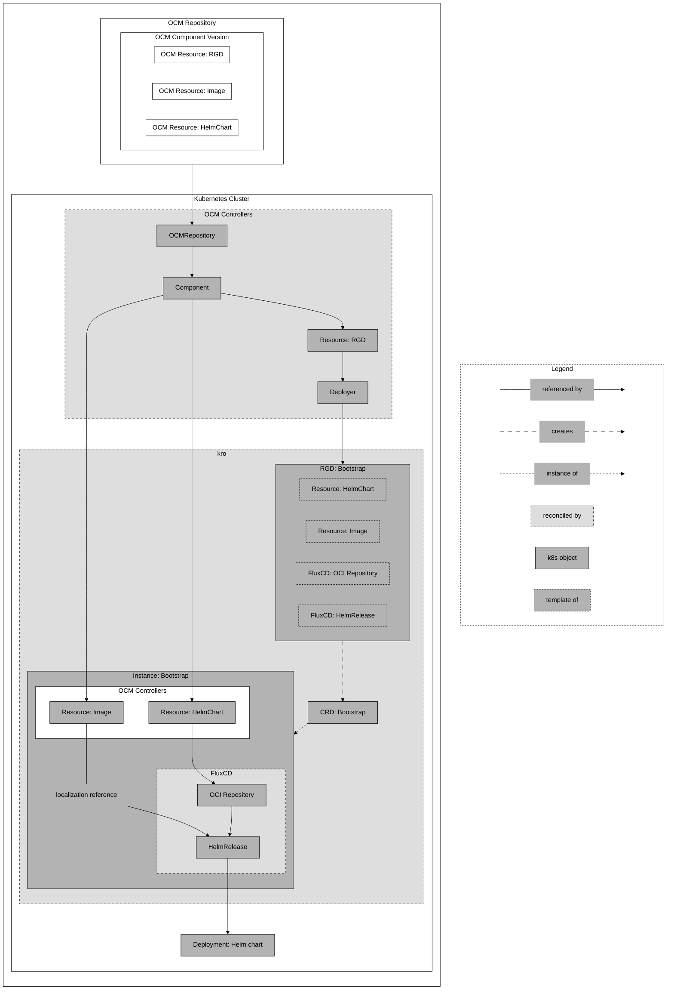

## What You'll Learn

In this tutorial, you'll learn how to package deployment instructions (a `ResourceGraphDefinition`) inside an OCM component, so operators can deploy your Helm chart without knowing the underlying resource structure. You'll also learn **localization**—how to automatically update image references when transferring components between registries.

By the end, you'll have:

- An OCM component containing a Helm chart, an image reference, and deployment instructions
- A running Podinfo application deployed via the bootstrap pattern
- Understanding of how localization keeps image references in sync after transfers

## Prerequisites


Before starting, make sure you have set up your environment as described in the [setup guide]().


- [Controller environment]() with OCM Controllers, kro, and Flux installed
- [OCM CLI]() installed
- Access to an OCI registry (e.g., [ghcr.io](https://docs.github.com/en/packages/learn-github-packages/introduction-to-github-packages))


If using a private registry, you'll need to configure credentials for both the OCM CLI and the controller resources. See [Configure Credentials for Controllers]() for details.


## Concepts

### The Bootstrap Pattern

In the [basic Helm deployment guide](), you manually created a `ResourceGraphDefinition` and applied it to the cluster. The **bootstrap pattern** improves on this by packaging the RGD inside the OCM component itself. The Deployer controller extracts and applies it automatically.

This means:

- Developers define deployment instructions once, alongside their application
- Operators only need to create bootstrap resources pointing to the component
- Deployment instructions travel securely with the software through OCM

### Localization

**Localization** keeps image references in sync when components move between registries:

1. **During transfer**: When you run `ocm transfer --copy-resources`, OCM copies artifacts to the new registry and updates references in the component descriptor
2. **During deployment**: The RGD reads the updated image reference from the component and injects it into Helm values

This ensures your deployment always uses images from the current registry, not hardcoded original locations.

## Architecture Overview

The following diagram shows the complete resource flow. You can refer back to it as you work through the steps.


```mermaid
flowchart TB
    classDef cluster fill:white,color:black,stroke:black;
    classDef reconciledBy fill:#dedede,stroke:black,stroke-dasharray: 5,color:black;
    classDef k8sObject fill:#b3b3b3,color:black,stroke:black;
    classDef information fill:#b3b3b3,color:black,stroke:none;
    classDef templateOf fill:#b3b3b3,color:black,stroke:black,stroke-dasharray: 2;
    classDef ocm fill:white,stroke:black,color:black;
    classDef legendStyle fill:white,stroke:black,color:black,stroke-dasharray: 2;
    classDef legendStartEnd height:0px;
    classDef legendItems fill:#b3b3b3,stroke:none,color:black;

    subgraph legend[Legend]
        start1[ ] ---references[referenced by] --> end1[ ]
        start2[ ] -.-creates -.-> end2[ ]
        start3[ ] ---instanceOf[instance of] --> end3[ ]
        start4[ ] ~~~reconciledBy[reconciled by] ~~~ end4[ ]
        start5[ ] ~~~k8sObject[k8s object] ~~~ end5[ ]
        start6[ ] ~~~templateOf[template of] ~~~ end6[ ]
    end

    subgraph background[ ]
        direction TB
        subgraph ocmRepo[OCM Repository]
            subgraph ocmCV[OCM Component Version]
                direction RL
                subgraph ocmResourceHelm[OCM Resource: HelmChart]
                end
                subgraph ocmResourceImage[OCM Resource: Image]
                end
                subgraph ocmResourceRGD[OCM Resource: RGD]
                end
            end
        end

        subgraph k8sCluster[Kubernetes Cluster]
            subgraph bootstrap[OCM Controllers]
                k8sRepo[OCMRepository]
                k8sComponent[Component]
                k8sResourceRGD[Resource: RGD]
                k8sDeployer[Deployer]
            end
            subgraph kro[kro]
                subgraph rgd[RGD: Bootstrap]
                    rgdResourceHelm[Resource: HelmChart]
                    rgdResourceImage[Resource: Image]
                    rgdSource[FluxCD: OCI Repository]
                    rgdHelmRelease[FluxCD: HelmRelease]
                end
                crdBootstrap[CRD: Bootstrap]
                subgraph instanceBootstrap[Instance: Bootstrap]
                    subgraph ocmControllers[OCM Controllers]
                        k8sResourceHelm[Resource: HelmChart]
                        k8sResourceImage[Resource: Image]
                    end
                    subgraph fluxCD[FluxCD]
                        source[OCI Repository]
                        helmRelease[HelmRelease]
                    end
                    k8sResourceImage ---info[localization reference] --> helmRelease
                end
            end
            helmRelease --> deployment[Deployment: Helm chart]
        end

        ocmRepo --> k8sRepo --> k8sComponent --> k8sResourceRGD --> k8sDeployer --> rgd --> crdBootstrap --> instanceBootstrap
        k8sComponent --> k8sResourceHelm & k8sResourceImage
        k8sResourceHelm --> source --> helmRelease
    end

    linkStyle default fill:none,stroke:black,color:black;
    linkStyle 2,3,20 stroke:black,fill:none,color:black,stroke-dasharray: 10;
    linkStyle 4,5,21 stroke:black,fill:none,color:black,stroke-dasharray: 4;

    class start1,end1,start2,end2,start3,end3,start4,end4,start5,end5,start6,end6 legendStartEnd;
    class references,creates,instanceOf legendItems;
    class templateOf,rgdResourceHelm,rgdResourceImage,rgdSource,rgdHelmRelease templateOf;
    class info information;
    class reconciledBy,ocmK8sToolkit,bootstrap,fluxCD,kro reconciledBy;
    class k8sObject,rgd,k8sRepo,k8sComponent,k8sResourceRGD,k8sDeployer,k8sResourceHelm,k8sResourceImage,source,helmRelease,deployment,crdBootstrap,instanceBootstrap k8sObject;
    class ocmRepo,ocmCV,ocmResourceHelm,ocmResourceRGD,ocmResourceImage ocm;
    class k8sCluster cluster;
    class legend legendStyle;
```

The diagram shows the complete flow: OCM component resources are fetched by the controllers, the Deployer applies the RGD, kro creates a CRD from it, and finally instantiating that CRD deploys the Helm chart with localized image references.

## Step 1: Create the OCM Component Version

First, create an OCM component version containing three resources:

- **helm-resource**: The Podinfo Helm chart
- **image-resource**: The Podinfo container image (for localization)
- **resource-graph-definition**: Deployment instructions

Create a working directory:

```shell
mkdir /tmp/bootstrap-deploy && cd /tmp/bootstrap-deploy
```

### Define the Component

Create a `component-constructor.yaml` file:

```yaml
components:
  - name: ocm.software/ocm-k8s-toolkit/bootstrap
    version: "1.0.0"
    provider:
      name: ocm.software
    resources:
      - name: helm-resource
        type: helmChart
        version: "1.0.0"
        access:
          type: ociArtifact
          imageReference: "ghcr.io/stefanprodan/charts/podinfo:6.9.1@sha256:565d310746f1fa4be7f93ba7965bb393153a2d57a15cfe5befc909b790a73f8a"
      - name: image-resource
        type: ociArtifact
        version: "1.0.0"
        access:
          type: ociRegistry
          imageReference: "ghcr.io/stefanprodan/podinfo:6.9.1@sha256:262578cde928d5c9eba3bce079976444f624c13ed0afb741d90d5423877496cb"
      - name: resource-graph-definition
        type: blob
        version: "1.0.0"
        input:
          type: file
          path: ./resourceGraphDefinition.yaml
```

As you can see, the resource `resource-graph-definition` is of type `blob` and contains the path to a file
`resourceGraphDefinition.yaml`. Before we can create the OCM component version, we need to create this file, with the
following content:


```yaml
apiVersion: kro.run/v1alpha1
kind: ResourceGraphDefinition
metadata:
  name: bootstrap
spec:
  schema:
    apiVersion: v1alpha1
    kind: Bootstrap
  resources:
    # In this guide, we will not create a "Repository" and "Component" resource in this ResourceGraphDefinition. Those
    # resources will be created to bootstrap the ResourceGraphDefinition itself and will be present in the Kubernetes
    # cluster to be referenced by the following resources (see the bootstrap resource in one of the following sections).

    # This resource refers to the resource "helm-resource" defined in the OCM component version. It will be downloaded,
    # verified, and its location is made available in the status of the resource.
    - id: resourceChart
      template:
        apiVersion: delivery.ocm.software/v1alpha1
        kind: Resource
        metadata:
          name: bootstrap-helm-resource
        spec:
          # This component will be part of the bootstrap resources that will be created later.
          componentRef:
            name: bootstrap-component
          resource:
            byReference:
              resource:
                name: helm-resource
          additionalStatusFields:
            # The additional status fields are useful for splitting the imageReference into its components, so that
            # they can be used in depending deployers
            # Example: ghcr.io/stefanprodan/charts/podinfo:6.7.1 would be
            # registry: ghcr.io
            # repository: stefanprodan/charts/podinfo
            # reference/tag: 6.7.1
            registry: resource.access.imageReference.toOCI().registry
            repository: resource.access.imageReference.toOCI().repository
            tag: resource.access.imageReference.toOCI().tag
          interval: 1m
          # ocmConfig is required, if the OCM repository requires credentials to access it.
          # ocmConfig:
    # This resource refers to the resource "image-resource" defined in the OCM component version. It will be downloaded,
    # verified, and its location is made available in the status of the resource.
    - id: resourceImage
      template:
        apiVersion: delivery.ocm.software/v1alpha1
        kind: Resource
        metadata:
          name: bootstrap-image-resource
        spec:
          # This component will be part of the bootstrap resources that will be created later.
          componentRef:
            name: bootstrap-component
          resource:
            byReference:
              resource:
                name: image-resource
          additionalStatusFields:
            registry: resource.access.imageReference.toOCI().registry
            repository: resource.access.imageReference.toOCI().repository
            tag: resource.access.imageReference.toOCI().tag
          interval: 1m
          # ocmConfig is required, if the OCM repository requires credentials to access it.
          # ocmConfig:
    # OCIRepository watches and downloads the resource from the location provided by the Resource status.
    # The Helm chart location (url) refers to the status of the resource helm-resource.
    - id: ocirepository
      template:
        apiVersion: source.toolkit.fluxcd.io/v1
        kind: OCIRepository
        metadata:
          name: bootstrap-ocirepository
        spec:
          interval: 1m0s
          insecure: true
          layerSelector:
            mediaType: "application/vnd.cncf.helm.chart.content.v1.tar+gzip"
            operation: copy
          url: oci://${resourceChart.status.additional.registry}/${resourceChart.status.additional.repository}
          ref:
            tag: ${resourceChart.status.additional.tag}
          # secretRef is required, if the OCI repository requires credentials to access it.
          # secretRef:
    # HelmRelease refers to the OCIRepository, lets you configure the helm chart and deploys the Helm Chart into the
    # Kubernetes cluster.
    - id: helmrelease
      template:
        apiVersion: helm.toolkit.fluxcd.io/v2
        kind: HelmRelease
        metadata:
          name: bootstrap-helmrelease
        spec:
          releaseName: bootstrap-release
          interval: 1m
          timeout: 5m
          chartRef:
            kind: OCIRepository
            name: ${ocirepository.metadata.name}
            namespace: default
          values:
            # This is the second step of the localization. We use the image reference from the resource "image-resource"
            # and insert it into the Helm chart values.
            image:
              repository: ${resourceImage.status.additional.registry}/${resourceImage.status.additional.repository}
              tag: ${resourceImage.status.additional.tag}
```


### Build and Transfer the Component

Build the component version locally:

```bash
ocm add componentversion --create --file ./ctf component-constructor.yaml
```

Transfer to your registry with `--copy-resources` to enable localization (this copies the Helm chart and image to your registry):

```bash
ocm transfer ctf --copy-resources ./ctf ghcr.io/<your-namespace>
```

### Verify the Transfer

Check that the component was transferred and resources were localized:

```bash
ocm get cv ghcr.io/<your-namespace>//ocm.software/ocm-k8s-toolkit/bootstrap:1.0.0 -o yaml | grep imageReference
```

You should see image references pointing to `ghcr.io/<your-namespace>/...` instead of the original locations—this confirms localization worked.

## Step 2: Deploy the Helm Chart

Now create the bootstrap resources that will fetch and apply the RGD from the component.

### Create Bootstrap Resources

The bootstrap resources form a chain: Repository → Component → Resource → Deployer. The Deployer extracts the RGD and applies it to the cluster.

Create `bootstrap.yaml` with the following content (replace `<your-namespace>`):


```yaml
apiVersion: delivery.ocm.software/v1alpha1
kind: Repository
metadata:
  name: bootstrap-repository
spec:
  repositorySpec:
    # Adjust to your OCM repository
    baseUrl: ghcr.io/<your-namespace>
    type: OCIRegistry
  interval: 1m
  # ocmConfig is required, if the OCM repository requires credentials to access it.
  # ocmConfig:
---
apiVersion: delivery.ocm.software/v1alpha1
kind: Component
metadata:
  name: bootstrap-component
spec:
  component: ocm.software/ocm-k8s-toolkit/bootstrap
  repositoryRef:
    name: bootstrap-repository
  semver: 1.0.0
  interval: 1m
  # ocmConfig is required, if the OCM repository requires credentials to access it.
  # ocmConfig:
---
apiVersion: delivery.ocm.software/v1alpha1
kind: Resource
metadata:
  name: bootstrap-rgd
  namespace: default
spec:
  componentRef:
    name: bootstrap-component
  resource:
    byReference:
      resource:
        name: resource-graph-definition
  interval: 1m
  # ocmConfig is required, if the OCM repository requires credentials to access it.
  # ocmConfig:
---
apiVersion: delivery.ocm.software/v1alpha1
kind: Deployer
metadata:
  name: bootstrap-deployer
spec:
  resourceRef:
    # Reference to the Kubernetes resource OCM resource that contains the ResourceGraphDefinition.
    name: bootstrap-rgd
    # As kro processes resources in cluster-scope*, the deployer must also be cluster-scoped. Accordingly, we have to
    # set the namespace of the resource here (usually, when the namespace is not specified, it is derived from the
    # referencing Kubernetes resource).
    # Check out the kro documentation for more details:
    # https://github.com/kro-run/kro/blob/8f53372bfde232db7ddd6809eebb6a1d69b34f2e/website/docs/docs/concepts/20-access-control.md
    namespace: default
  # ocmConfig is required, if the OCM repository requires credentials to access it.
  # (You also need to specify the namespace of the reference as the 'deployer' is cluster-scoped.)
  # ocmConfig:
```


### Apply the Bootstrap Resources

```bash
kubectl apply -f bootstrap.yaml
```

Wait for the RGD to become active (this may take 30-60 seconds):

```bash
kubectl get rgd -w
```

```console
NAME        APIVERSION   KIND        STATE    AGE
bootstrap   v1alpha1     Bootstrap   Active   2m56s
```

When the state shows `Active`, kro has processed the RGD and created a new CRD called `Bootstrap`.

### Step 3: Create an Instance

Now create an instance of the Bootstrap CRD to trigger the actual deployment. Create `instance.yaml`:

```yaml
apiVersion: kro.run/v1alpha1
kind: Bootstrap
metadata:
  name: bootstrap
```

Then, apply the instance to the cluster:

```bash
kubectl apply -f instance.yaml
```

If successful, you should see the following output:

```bash
kubectl get bootstrap
```

```console
NAME        STATE    SYNCED   AGE
bootstrap   ACTIVE   True     3m23s
```

If the instance is in the `ACTIVE` state, the deployment succeeded.

### Step 4: Verify Localization

Check that the deployed pod uses the localized image from your registry (not the original `ghcr.io/stefanprodan/...`):

```bash
kubectl get pods -l app.kubernetes.io/name=bootstrap-release-podinfo -o jsonpath='{.items[0].spec.containers[0].image}'
```

```console
ghcr.io/<your-namespace>/stefanprodan/podinfo:6.9.1
```

The image reference points to your registry—localization worked!

## Troubleshooting

### Authentication Errors (401 Unauthorized)

If you see `401: unauthorized` errors, your GitHub package is private. Either:

- Make the package public in GitHub Package settings
- [Configure credentials]() for the controller resources

### RGD Not Becoming Active

Check controller logs:

```bash
kubectl logs -n ocm-k8s-toolkit-system deployment/ocm-k8s-toolkit-controller-manager
```

Common causes: missing component, wrong repository URL, credential issues.

### Instance Not Syncing

If the Bootstrap instance stays in a non-ACTIVE state:

```bash
kubectl describe bootstrap bootstrap
```

Check the Events section for error messages.

## What You Learned

You've successfully:

- Created an OCM component with embedded deployment instructions (RGD)
- Used `--copy-resources` to enable localization during transfer
- Deployed the component using the bootstrap pattern
- Verified that localization kept image references in sync

This pattern allows developers to ship deployment instructions alongside their software, while operators only need to create simple bootstrap resources.

## Next Steps

- [How-to: Air-Gap Transfer]() — Transfer components to disconnected environments
- [How-to: Configure Credentials for Controllers]() — Set up private registry access
- [Concept: OCM Controllers]() — Understand the controller architecture
