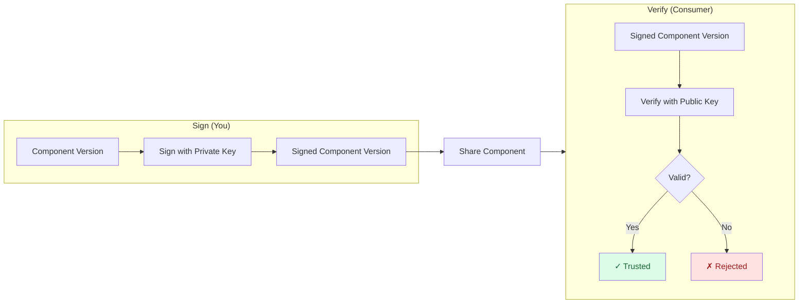

In this tutorial, you'll sign a component version with a private key and verify it with the corresponding public key.
By the end, you'll understand the complete signing and verification workflow that ensures component authenticity and integrity.

## What You'll Learn

- Create an RSA key pair for signing and verification
- Sign component version in a CTF archive
- Hands-on experience verifying the signature

**Estimated time:** ~15 minutes

## Scenario

You're a software engineer who has built a `helloworld` component and packaged it as an OCM component version. Before distributing it to your team, you need to sign it so consumers can verify that:

1. **The component is authentic** — it comes from you, not an imposter
2. **The component has integrity** — it hasn't been tampered with since signing

## How It Works



The producer signs the component version with a private key, creating a signed component. Consumers verify the signature using the corresponding public key to ensure authenticity and integrity.

## Prerequisites

- [OCM CLI installed]()
- A component version to sign (we'll create one if you don't have one)

## Steps




### Create a sample component (if needed)

If you already have a component version in a CTF archive, skip to the next step.

Create a simple helloworld component:

```bash
# Create a directory for the tutorial
mkdir -p ~/ocm-signing-tutorial && cd ~/ocm-signing-tutorial

# Create component archive
ocm create ca ./transport-archive

# Add a sample component version
ocm add cv ./transport-archive --create \
  --provider acme.org \
  --name github.com/acme.org/helloworld \
  --version 1.0.0
```

Verify the component was created:

```bash
ocm get cv ./transport-archive
```

<details>
<summary>Expected output</summary>

```text
COMPONENT                       VERSION PROVIDER
github.com/acme.org/helloworld  1.0.0   acme.org
```

</details>



### Generate an RSA key pair

Create a directory for your keys and generate a 4096-bit RSA key pair:

```bash
mkdir -p ~/.ocm/keys

# Generate private key
openssl genpkey -algorithm RSA -out ~/.ocm/keys/private.pem -pkeyopt rsa_keygen_bits:4096

# Extract public key
openssl rsa -in ~/.ocm/keys/private.pem -pubout -out ~/.ocm/keys/public.pem

# Secure the private key
chmod 600 ~/.ocm/keys/private.pem
```

Verify both files exist:

```bash
ls -la ~/.ocm/keys/*.pem
```

⚠️ **Keep your private key secure!** Never commit it to version control or share it.

For more details, see [How-to: Generate Signing Keys]().



### Configure signing credentials

Create or update your `~/.ocmconfig` file to tell OCM where to find your keys:

```bash
cat > ~/.ocmconfig << 'EOF'
type: generic.config.ocm.software/v1
configurations:
  - type: credentials.config.ocm.software
    consumers:
      - identity:
          type: RSA/v1alpha1
          signature: default
        credentials:
          - type: Credentials/v1
            properties:
              private_key_pem_file: ~/.ocm/keys/private.pem
              public_key_pem_file: ~/.ocm/keys/public.pem
EOF
```


The `signature: default` name is used when you don't specify `--signature` on the command line.


For more details, see [How-to: Configure Signing Credentials]().



### Sign the component version

Sign your component with the private key:

```bash
ocm sign cv ./transport-archive//github.com/acme.org/helloworld:1.0.0
```

<details>
<summary>Expected output</summary>

```text
time=... level=INFO msg="signing component version" name=default
time=... level=INFO msg="signature added" name=default
```

</details>

Verify the signature was added:

```bash
ocm get cv ./transport-archive//github.com/acme.org/helloworld:1.0.0 -o yaml | grep -A 10 signatures:
```

You should see a `signatures:` section with your signature.



### Verify the signature

Now verify the signature using the public key:

```bash
ocm verify cv ./transport-archive//github.com/acme.org/helloworld:1.0.0
```

<details>
<summary>Expected output</summary>

```text
time=... level=INFO msg="verifying signature" name=default
time=... level=INFO msg="signature verification completed" name=default duration=...
time=... level=INFO msg="SIGNATURE VERIFICATION SUCCESSFUL"
```

</details>

**Success!** The component version is verified as authentic and unmodified.



### Test tampering detection (optional)

To demonstrate that verification detects tampering, let's modify the component and try to verify again:

```bash
# Add a new resource (this changes the component descriptor)
echo "malicious content" > /tmp/evil.txt
ocm add resource ./transport-archive//github.com/acme.org/helloworld:1.0.0 \
  --name evil --type plainText --input-file /tmp/evil.txt 2>/dev/null || true

# Try to verify (should fail if the descriptor changed)
ocm verify cv ./transport-archive//github.com/acme.org/helloworld:1.0.0
```


If the component descriptor changed, verification will fail because the signature no longer matches the content.





## What You've Learned

Congratulations! You've successfully:

- ✅ Generated an RSA key pair for signing and verification
- ✅ Configured OCM to use your keys via `.ocmconfig`
- ✅ Signed a component version with your private key
- ✅ Verified the signature using the public key
- ✅ Understood how signatures detect tampering

## Check Your Understanding


OCM signs the component descriptor because it contains **digests** (cryptographic hashes) of all resources. This approach is:
- **Efficient**: Verification doesn't require downloading large artifacts
- **Complete**: Any change to any resource changes its digest, invalidating the signature
- **Portable**: The descriptor can be verified independently of artifact storage



- **Private key**: Used to create signatures. Keep it secret — anyone with this key can sign components as you.
- **Public key**: Used to verify signatures. Share it freely with anyone who needs to verify your components.



Yes! A component version can have multiple signatures from different parties. This enables:
- Different signing identities (dev, staging, prod)
- Multiple approval workflows
- Cross-organizational trust chains

Use `--signature <name>` to specify which signature to create or verify.


## Cleanup

Remove the tutorial artifacts:

```bash
rm -rf ~/ocm-signing-tutorial
# Optionally remove keys: rm -rf ~/.ocm/keys
# Optionally remove config: rm ~/.ocmconfig
```

## Next Steps








## Related Documentation

- [Concept: Signing and Verification]() - Understand the theory behind OCM signing
- [How-to: Generate Signing Keys]() - Detailed key generation guide
- [How-to: Configure Signing Credentials]() - Multi-environment and advanced configurations