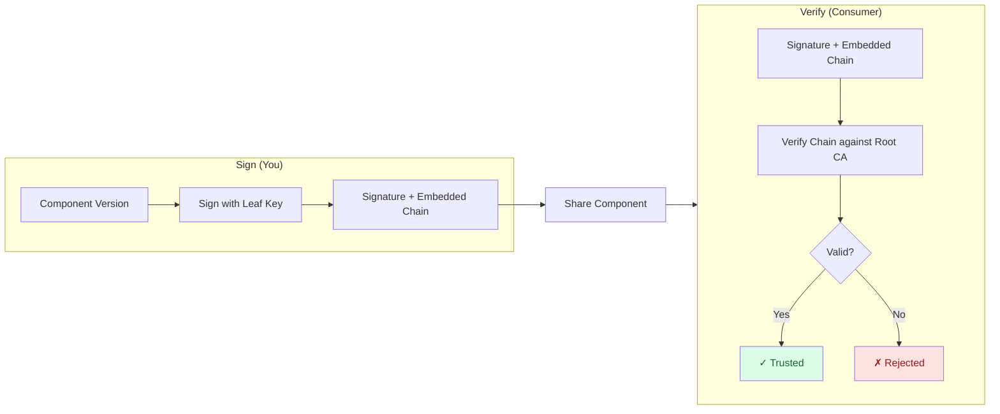

PEM signing embeds an X.509 certificate chain directly in the signature value, letting verifiers pin a root CA
rather than a bare public key. Use it when your organization has existing PKI infrastructure.

For the conceptual background on key pinning vs. certificate chain trust, see [Trust Models]().

## What You'll Learn

By the end of this tutorial, you will:

- Understand how PEM signing differs from Plain signing
- Generate (or supply) a certificate chain for signing
- Configure `.ocmconfig` for both signer and verifier roles
- Sign a component version with a PEM-encoded signature
- Verify the signature using only the root CA as a trust anchor

## How It Works



At signing time OCM embeds the leaf certificate (and any intermediates) into the signature value.
The root CA is **never** embedded — the verifier holds it as a trust anchor.

**How it differs from Plain signing:**

| Aspect | Plain (default) | PEM |
| ------ | --------------- | --- |
| Signature value | Hex-encoded bytes | PEM `SIGNATURE` block |
| Public key distribution | Verifier needs it in `.ocmconfig` | Embedded in signature |
| Trust anchor | Public key pinning | Root CA certificate pinning |
| Certificate chain | Not supported | Leaf required; intermediates optional |
| Use case | Simple setups, self-signed keys | PKI integration, enterprise environments |

**Estimated time:** ~20 minutes

## Prerequisites

- [OCM CLI]() installed
- A component version at `/tmp/helloworld/transport-archive` — follow [Create Component Versions]() to create one
- `openssl` available in your shell

## Scenario

- **Component:** `github.com/acme.org/helloworld:1.0.0` in a local CTF archive at `/tmp/helloworld/transport-archive`
  (created by the [Create Component Versions]() tutorial)
- **Working directory:** `~/.ocm/keys/pem-demo`
- **Signer files:** `leaf.key`, `chain.pem`
- **Verifier file:** `root.crt`


Never include the root CA in the certificate chain you supply to the signer.
OCM rejects any self-signed certificate found in the embedded chain to prevent
signers from asserting their own trust anchor.


## Steps

The following steps cover the required setup for two scenarios,
one with a simple Root CA directly signing the leaf certificate, and another with an intermediate CA between the Root and Leaf.







### Generate a certificate chain and prepare the chain file

If your organization already has a PKI, obtain a leaf certificate (and intermediate chain if applicable)
from your CA. Place the leaf certificate (and any intermediates, root excluded) into `chain.pem` and skip to the next step.

Otherwise, generate a chain locally with `openssl`. Choose the option that fits your setup and follow all commands within that tab — each tab is self-contained.

The root CA signs the leaf directly. No intermediate is needed.

```bash
mkdir -p ~/.ocm/keys/pem-demo && cd ~/.ocm/keys/pem-demo

# Root CA
openssl genrsa -out root.key 4096
openssl req -x509 -new -nodes \
  -key root.key -sha256 -days 3650 \
  -subj "/CN=OCM Demo Root CA" \
  -out root.crt

# Leaf certificate (signed directly by root)
openssl genrsa -out leaf.key 4096
openssl req -new -key leaf.key \
  -subj "/CN=OCM Demo Signer" \
  -out leaf.csr
openssl x509 -req \
  -in leaf.csr -CA root.crt -CAkey root.key -CAcreateserial \
  -sha256 -days 365 -out leaf.crt

chmod 600 root.key leaf.key
chmod 644 root.crt leaf.crt
```

**Files created:**

| File | Purpose |
| ---- | ------- |
| `root.key` / `root.crt` | Root CA — the verifier's trust anchor |
| `leaf.key` / `leaf.crt` | Leaf — the private key used for signing |

**Prepare the chain file** — chain contains only the leaf:

```bash
cd ~/.ocm/keys/pem-demo
cp leaf.crt chain.pem
chmod 644 chain.pem
```


The chain file must start with the **leaf** certificate. The root CA is always omitted.


**Summary of files per role:**

| Role | Files needed |
| ---- | ------------ |
| Signer | `leaf.key` (private key), `chain.pem` (leaf + any intermediates) |
| Verifier | `root.crt` (trust anchor only) |





### Configure `.ocmconfig`

Create separate credential entries for the signer and verifier roles.
The file paths must be **absolute** — `~` and `$HOME` are not expanded in YAML values.
Use the shell commands below to generate the files with the correct paths automatically:

```bash
# Signer configuration
cat > ~/.ocmconfig-pem-sign <<EOF
type: generic.config.ocm.software/v1
configurations:
  - type: credentials.config.ocm.software
    consumers:
      - identity:
          type: RSA/v1alpha1
          algorithm: RSASSA-PSS
          signature: default
        credentials:
          - type: Credentials/v1
            properties:
              private_key_pem_file: $(realpath ~/.ocm/keys/pem-demo/leaf.key)
              public_key_pem_file: $(realpath ~/.ocm/keys/pem-demo/chain.pem)
EOF

# Verifier configuration
cat > ~/.ocmconfig-pem-verify <<EOF
type: generic.config.ocm.software/v1
configurations:
  - type: credentials.config.ocm.software
    consumers:
      - identity:
          type: RSA/v1alpha1
          algorithm: RSASSA-PSS
          signature: default
        credentials:
          - type: Credentials/v1
            properties:
              public_key_pem_file: $(realpath ~/.ocm/keys/pem-demo/root.crt)
EOF
```


When a self-signed certificate is supplied as `public_key_pem_file` for verification,
OCM uses it as an **isolated trust anchor** and bypasses the system root store entirely.
Only signatures rooted in that specific CA will verify successfully.


For the full credential property and consumer identity reference, see [Credential Consumer Identities — RSA/v1alpha1]().





### Create a signer spec file

The `--signer-spec` flag enables the PEM encoding policy. Create the spec file:

```bash
cat > ~/.ocm/keys/pem-demo/pem-signer.yaml <<EOF
type: RSASigningConfiguration/v1alpha1
signatureAlgorithm: RSASSA-PSS
signatureEncodingPolicy: PEM
EOF
```

This controls **how** the signature is encoded. It does **not** contain credentials —
those are always resolved from `.ocmconfig`.





### Sign the component version

Use `--dry-run` first to compute and print the signature without writing it to the repository:

```bash
ocm sign cv \
  --config ~/.ocmconfig-pem-sign \
  --signer-spec ~/.ocm/keys/pem-demo/pem-signer.yaml \
  --dry-run \
  /tmp/helloworld/transport-archive//github.com/acme.org/helloworld:1.0.0
```

Once satisfied, sign for real:

```bash
ocm sign cv \
  --config ~/.ocmconfig-pem-sign \
  --signer-spec ~/.ocm/keys/pem-demo/pem-signer.yaml \
  /tmp/helloworld/transport-archive//github.com/acme.org/helloworld:1.0.0
```


PEM signing is an early access feature. The OCM CLI prints an `experimental` notice during signing and verification — this is expected and does not indicate a failure. We are awaiting feedback and the interface may evolve.



```text
-----BEGIN SIGNATURE-----
Signature Algorithm: RSASSA-PSS
<base64-encoded signature bytes>
-----END SIGNATURE-----
-----BEGIN CERTIFICATE-----
<leaf certificate DER>
-----END CERTIFICATE-----
-----BEGIN CERTIFICATE-----
<intermediate CA DER>  ← only present if intermediates were included in chain.pem
-----END CERTIFICATE-----
```






### Verify the signature

```bash
ocm verify cv \
  --config ~/.ocmconfig-pem-verify \
  /tmp/helloworld/transport-archive//github.com/acme.org/helloworld:1.0.0
```

No `--verifier-spec` is needed — OCM infers the PEM encoding from the `application/x-pem-file`
media type stored alongside the signature and selects the correct handler automatically.

<details>
<summary>Expected output</summary>

```text
time=2026-04-01T10:00:00.000+02:00 level=INFO msg="verifying signature" name=default
time=2026-04-01T10:00:00.001+02:00 level=INFO msg="signature verification completed" name=default duration=1.2ms
time=2026-04-01T10:00:00.001+02:00 level=INFO msg="SIGNATURE VERIFICATION SUCCESSFUL"
```

</details>

> ✅ **Success!** ✅  
> The component version is verified as authentic and unmodified.

If verification fails, see the troubleshooting section below.











### Generate a certificate chain and prepare the chain file

If your organization already has a PKI, obtain a leaf certificate (and intermediate chain if applicable)
from your CA. Place the leaf certificate (and any intermediates, root excluded) into `chain.pem` and skip to the next step.

Otherwise, generate a chain locally with `openssl`. Choose the option that fits your setup and follow all commands within that tab — each tab is self-contained.

Add an intermediate CA to keep the root CA key offline or to delegate signing authority.

```bash
mkdir -p ~/.ocm/keys/pem-demo && cd ~/.ocm/keys/pem-demo

# Root CA
openssl genrsa -out root.key 4096
openssl req -x509 -new -nodes \
  -key root.key -sha256 -days 3650 \
  -subj "/CN=OCM Demo Root CA" \
  -out root.crt

# Intermediate CA
openssl genrsa -out intermediate.key 4096
openssl req -new -key intermediate.key \
  -subj "/CN=OCM Demo Intermediate CA" \
  -out intermediate.csr
cat > intermediate-ext.cnf <<'EOF'
basicConstraints = CA:TRUE
keyUsage = digitalSignature, keyCertSign, cRLSign
EOF
openssl x509 -req \
  -in intermediate.csr -CA root.crt -CAkey root.key -CAcreateserial \
  -sha256 -days 1825 -extfile intermediate-ext.cnf \
  -out intermediate.crt

# Leaf certificate
openssl genrsa -out leaf.key 4096
openssl req -new -key leaf.key \
  -subj "/CN=OCM Demo Signer" \
  -out leaf.csr
openssl x509 -req \
  -in leaf.csr -CA intermediate.crt -CAkey intermediate.key -CAcreateserial \
  -sha256 -days 365 -out leaf.crt

chmod 600 root.key intermediate.key leaf.key
chmod 644 root.crt intermediate.crt leaf.crt
```

**Files created:**

| File | Purpose |
| ---- | ------- |
| `root.key` / `root.crt` | Root CA — keep the key offline in production |
| `intermediate.key` / `intermediate.crt` | Intermediate CA |
| `leaf.key` / `leaf.crt` | Leaf — the private key used for signing |

**Prepare the chain file** — leaf first, then intermediate (root excluded):

```bash
cd ~/.ocm/keys/pem-demo
cat leaf.crt intermediate.crt > chain.pem
chmod 644 chain.pem
```


The chain file must start with the **leaf** certificate, followed by any intermediates in order toward the root.
The root CA is always omitted.


**Summary of files per role:**

| Role | Files needed |
| ---- | ------------ |
| Signer | `leaf.key` (private key), `chain.pem` (leaf + any intermediates) |
| Verifier | `root.crt` (trust anchor only) |





### Configure `.ocmconfig`

Create separate credential entries for the signer and verifier roles.
The file paths must be **absolute** — `~` and `$HOME` are not expanded in YAML values.
Use the shell commands below to generate the files with the correct paths automatically:

```bash
# Signer configuration
cat > ~/.ocmconfig-pem-sign <<EOF
type: generic.config.ocm.software/v1
configurations:
  - type: credentials.config.ocm.software
    consumers:
      - identity:
          type: RSA/v1alpha1
          algorithm: RSASSA-PSS
          signature: default
        credentials:
          - type: Credentials/v1
            properties:
              private_key_pem_file: $(realpath ~/.ocm/keys/pem-demo/leaf.key)
              public_key_pem_file: $(realpath ~/.ocm/keys/pem-demo/chain.pem)
EOF

# Verifier configuration
cat > ~/.ocmconfig-pem-verify <<EOF
type: generic.config.ocm.software/v1
configurations:
  - type: credentials.config.ocm.software
    consumers:
      - identity:
          type: RSA/v1alpha1
          algorithm: RSASSA-PSS
          signature: default
        credentials:
          - type: Credentials/v1
            properties:
              public_key_pem_file: $(realpath ~/.ocm/keys/pem-demo/root.crt)
EOF
```


When a self-signed certificate is supplied as `public_key_pem_file` for verification,
OCM uses it as an **isolated trust anchor** and bypasses the system root store entirely.
Only signatures rooted in that specific CA will verify successfully.


For the full credential property and consumer identity reference, see [Credential Consumer Identities — RSA/v1alpha1]().





### Create a signer spec file

The `--signer-spec` flag enables the PEM encoding policy. Create the spec file:

```bash
cat > ~/.ocm/keys/pem-demo/pem-signer.yaml <<EOF
type: RSASigningConfiguration/v1alpha1
signatureAlgorithm: RSASSA-PSS
signatureEncodingPolicy: PEM
EOF
```

This controls **how** the signature is encoded. It does **not** contain credentials —
those are always resolved from `.ocmconfig`.





### Sign the component version

Use `--dry-run` first to compute and print the signature without writing it to the repository:

```bash
ocm sign cv \
  --config ~/.ocmconfig-pem-sign \
  --signer-spec ~/.ocm/keys/pem-demo/pem-signer.yaml \
  --dry-run \
  /tmp/helloworld/transport-archive//github.com/acme.org/helloworld:1.0.0
```

Once satisfied, sign for real:

```bash
ocm sign cv \
  --config ~/.ocmconfig-pem-sign \
  --signer-spec ~/.ocm/keys/pem-demo/pem-signer.yaml \
  /tmp/helloworld/transport-archive//github.com/acme.org/helloworld:1.0.0
```


PEM signing is an early access feature. The OCM CLI prints an `experimental` notice during signing and verification — this is expected and does not indicate a failure. We are awaiting feedback and the interface may evolve.



```text
-----BEGIN SIGNATURE-----
Signature Algorithm: RSASSA-PSS
<base64-encoded signature bytes>
-----END SIGNATURE-----
-----BEGIN CERTIFICATE-----
<leaf certificate DER>
-----END CERTIFICATE-----
-----BEGIN CERTIFICATE-----
<intermediate CA DER>  ← only present if intermediates were included in chain.pem
-----END CERTIFICATE-----
```






### Verify the signature

```bash
ocm verify cv \
  --config ~/.ocmconfig-pem-verify \
  /tmp/helloworld/transport-archive//github.com/acme.org/helloworld:1.0.0
```

No `--verifier-spec` is needed — OCM infers the PEM encoding from the `application/x-pem-file`
media type stored alongside the signature and selects the correct handler automatically.

<details>
<summary>Expected output</summary>

```text
time=2026-04-01T10:00:00.000+02:00 level=INFO msg="verifying signature" name=default
time=2026-04-01T10:00:00.001+02:00 level=INFO msg="signature verification completed" name=default duration=1.2ms
time=2026-04-01T10:00:00.001+02:00 level=INFO msg="SIGNATURE VERIFICATION SUCCESSFUL"
```

</details>

> ✅ **Success!** ✅  
> The component version is verified as authentic and unmodified.

If verification fails, see the troubleshooting section below.







## Troubleshooting

### "must not be embedded in the signature"

The chain file contains a self-signed (root CA) certificate. Remove the root CA from `chain.pem`.

```bash
# Check which certificates are in chain.pem
openssl crl2pkcs7 -nocrl -certfile chain.pem | openssl pkcs7 -print_certs -noout

# Verify the leaf is correctly signed
openssl verify -CAfile root.crt leaf.crt
openssl verify -CAfile root.crt -untrusted intermediate.crt leaf.crt
```

### "certificate signed by unknown authority"

The root CA in the verification config doesn't match the root that signed the embedded chain.
Check that `public_key_pem_file` points to the correct root CA.

```bash
openssl verify -CAfile root.crt leaf.crt
openssl verify -CAfile root.crt -untrusted intermediate.crt leaf.crt
```

### "could not resolve credentials for identity"

The consumer identity in `.ocmconfig` doesn't match what OCM looks up. Confirm:

- `type: RSA/v1alpha1` is spelled correctly
- `algorithm` matches the value in the signer spec (`RSASSA-PSS`)
- `signature` matches the `--signature` flag value (default: `default`)

### "signature already exists"

Use `--force` to overwrite or choose a different name with `--signature`.

## Related Documentation

- [Plain Signatures]() — Basic key-pair signing without certificate chains
- [Configure Credentials for Signing]() — Full credential configuration reference
