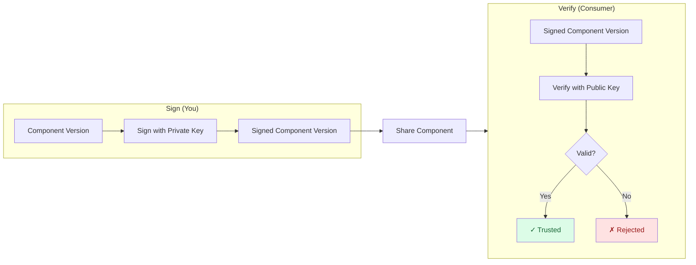

In this tutorial, you'll sign a component version with a private key and verify it with the corresponding public key.
By the end, you'll understand the complete signing and verification workflow that ensures component authenticity and integrity.

## What You'll Learn

- Create an RSA key pair for signing and verification
- Sign component version in a CTF archive
- Hands-on experience verifying the signature

**Estimated time:** ~15 minutes

## Scenario

You're a software engineer who has built a `helloworld` component and packaged it as an OCM component version. Before distributing it to your team, you need to sign it so consumers can verify that:

1. **The component is authentic** — it comes from you, not an imposter
2. **The component has integrity** — it hasn't been tampered with since signing

## How It Works



The producer signs the component version with a private key, creating a signed component. Consumers verify the signature using the corresponding public key to ensure authenticity and integrity.

## Prerequisites

- [OCM CLI installed]()
- A component version to sign (we'll create one if you don't have one)

## Steps





### Create a sample component (if needed)

If you already have a component version in a CTF archive,
e.g, by following our [Create a Component Version]() guide, skip to the next step.

Create a simple helloworld component:

```bash
# Create a directory for the tutorial
mkdir -p /tmp/ocm-signing-tutorial && cd /tmp/ocm-signing-tutorial

# Create a basic `component-constructor.yaml` without any resources:
cat > component-constructor.yaml << 'EOF'
components:
- name: github.com/acme.org/helloworld
  version: 1.0.0
  provider:
    name: acme.org
EOF

# Create component version in a CTF archive located at ./transport-archive
ocm add cv 

```

You should see that the component version was created successfully.

<details>
<summary>Expected output</summary>

```text
 COMPONENT                      │ VERSION │ PROVIDER
────────────────────────────────┼─────────┼──────────
 github.com/acme.org/helloworld │ 1.0.0   │ acme.org
```

</details>




### Generate an RSA key pair

Create a directory for your keys and generate a 4096-bit RSA key pair:

```bash
# Create a directory for the generated keys
mkdir keys

# Generate private key
openssl genpkey -algorithm RSA -out ./keys/private-key.pem -pkeyopt rsa_keygen_bits:4096

# Extract public key
openssl rsa -in ./keys/private-key.pem -pubout -out ./keys/public-key.pem

# Secure the private key
chmod 600 ./keys/private-key.pem
```

Verify both files exist:

```bash
ls -la ./keys/*.pem
```


Never commit it to version control or share it.


For more details, see [How-to: Generate Signing Keys]().




### Configure signing credentials

Create a new `.ocmconfig` in the current directory and copy the content below to it, to tell OCM where to find your keys.
If you already have a `$HOME/.ocmconfig` file you can skip creating a new one and just add the credential configuration to your existing file.

A detailed How-To guide is available here: [How-to: Configure Signing Credentials]().

```bash
touch .ocmconfig

cat > .ocmconfig << 'EOF'
type: generic.config.ocm.software/v1
configurations:
  - type: credentials.config.ocm.software
    consumers:
      - identity:
          type: RSA/v1alpha1
          algorithm: RSASSA-PSS
          signature: default
        credentials:
          - type: Credentials/v1
            properties:
              private_key_pem_file: /tmp/ocm-signing-tutorial/keys/private-key.pem
              public_key_pem_file: /tmp/ocm-signing-tutorial/keys/public-key.pem  
EOF
```

> 👉 The `signature: default` name is used when you don't specify `--signature` on the command line.

For more details, see [How-to: Configure Signing Credentials]().




### Sign the component version

Sign your component with the private key:

```bash
ocm sign cv ./transport-archive//github.com/acme.org/helloworld:1.0.0
```

<details>
<summary>Expected output</summary>

```text
time=2026-03-17T15:32:55.707+01:00 level=INFO msg="no signer spec file provided, using default" algorithm=RSASSA-PSS encodingPolicy=Plain
digest:
  hashAlgorithm: SHA-256
  normalisationAlgorithm: jsonNormalisation/v4alpha1
  value: 4e376182b3d535143e8e009b1e467df3a5b0c1f912c71ae432200654c355606f
name: default
signature:
  algorithm: RSASSA-PSS
  mediaType: application/vnd.ocm.signature.rsa.pss
  value: 9cafe48d6633b3889c445ac06e6b9d1e108126de28ea8e8c33a0821907f3933bba74a0dd33a7451912edd19ca79a49a6c5d21c7528a65182a827f14d6a79d3fcf0bf2e2d239e39a0421d283d74929abdb227a50010fda4791eb14f2abd55453b8de738312a6cd42cbb58c98ccc056aa0c4fefd39a6156370545befef3322974e321bc1b516d3cfc03bfa94a63c6f619cdf050ae08972e908bf91ccd62884c7540e27df492ebc8774cabbc565e47b39f73ab09c41c4750d3d8afdd6e619a3e92b7a85f84fb4e8574f79015a048f777d43d6eb9fd8ce7950f9b1e3e7a92641d6457cfc0c5b0e0eedcf0ac43e6f547452acd714e6d7629698de4529fb4b326a5813a711bcac6ca120e70a2bca0bb6fac4ba669f06694dd346f220dbbd6116bd5316ed104f630eeb84d2512beca587e0b9c7ba6d5e318ff14e1cda8f4eae05c55758018a57a5d1c8773c137c6edaeb9a817c8e305c62dfe82d3f76244b13481450e25674345481c61efdf9f97b73aa29579a133551163f5d82f2370897042a2c86a25f3a5a071b598e0032bc2395f63fced400c677901e5bd4826f83af3a0fdc5de9066684758f05c4900c25bc8898d0f0cd6b82075eac6df946b12b0f76cb59addfa8acbcdfe8ccb371ca80c792424f7e5a9ef85f6b33c11e243c424af2e90c5f725e337ed11539b8ccca9868c1ac4b6977e71c3b2901b68feb7480e6fbe08db8e8

time=2026-03-17T15:32:55.725+01:00 level=INFO msg="signed successfully" name=default digest=4e376182b3d535143e8e009b1e467df3a5b0c1f912c71ae432200654c355606f hashAlgorithm=SHA-256 normalisationAlgorithm=jsonNormalisation/v4alpha1
```

</details>

Verify the signature was added:

```bash
ocm get cv ./transport-archive//github.com/acme.org/helloworld:1.0.0 -o yaml | grep -A 10 signatures:
```

You should see a `signatures:` section with your signature.

<details>
<summary>Expected output</summary>

```bash
  signatures:
  - digest:
      hashAlgorithm: SHA-256
      normalisationAlgorithm: jsonNormalisation/v4alpha1
      value: 4e376182b3d535143e8e009b1e467df3a5b0c1f912c71ae432200654c355606f
    name: default
    signature:
      algorithm: RSASSA-PSS
      mediaType: application/vnd.ocm.signature.rsa.pss
      value: 9cafe48d6633b3889c445ac06e6b9d1e108126de28ea8e8c33a0821907f3933bba74a0dd33a7451912edd19ca79a49a6c5d21c7528a65182a827f14d6a79d3fcf0bf2e2d239e39a0421d283d74929abdb227a50010fda4791eb14f2abd55453b8de738312a6cd42cbb58c98ccc056aa0c4fefd39a6156370545befef3322974e321bc1b516d3cfc03bfa94a63c6f619cdf050ae08972e908bf91ccd62884c7540e27df492ebc8774cabbc565e47b39f73ab09c41c4750d3d8afdd6e619a3e92b7a85f84fb4e8574f79015a048f777d43d6eb9fd8ce7950f9b1e3e7a92641d6457cfc0c5b0e0eedcf0ac43e6f547452acd714e6d7629698de4529fb4b326a5813a711bcac6ca120e70a2bca0bb6fac4ba669f06694dd346f220dbbd6116bd5316ed104f630eeb84d2512beca587e0b9c7ba6d5e318ff14e1cda8f4eae05c55758018a57a5d1c8773c137c6edaeb9a817c8e305c62dfe82d3f76244b13481450e25674345481c61efdf9f97b73aa29579a133551163f5d82f2370897042a2c86a25f3a5a071b598e0032bc2395f63fced400c677901e5bd4826f83af3a0fdc5de9066684758f05c4900c25bc8898d0f0cd6b82075eac6df946b12b0f76cb59addfa8acbcdfe8ccb371ca80c792424f7e5a9ef85f6b33c11e243c424af2e90c5f725e337ed11539b8ccca9868c1ac4b6977e71c3b2901b68feb7480e6fbe08db8e8
```
</details>




### Verify the signature

Now verify the signature using the public key:

```bash
ocm verify cv ./transport-archive//github.com/acme.org/helloworld:1.0.0
```

<details>
<summary>Expected output</summary>

```text
time=2026-03-12T22:06:37.357+01:00 level=INFO msg="no verifier specification file given, using default RSASSA-PSS"
time=2026-03-12T22:06:37.357+01:00 level=INFO msg="verifying signature" name=default
time=2026-03-12T22:06:37.358+01:00 level=INFO msg="signature verification completed" name=default duration=798.25µs
time=2026-03-12T22:06:37.358+01:00 level=INFO msg="SIGNATURE VERIFICATION SUCCESSFUL"
```

</details>

> ✅ **Success!** ✅  
> The component version is verified as authentic and unmodified.




## What You've Learned

Congratulations! You've successfully:

- ✅ Generated an RSA key pair for signing and verification
- ✅ Configured OCM to use your keys via `.ocmconfig`
- ✅ Signed a component version with your private key
- ✅ Verified the signature using the public key
- ✅ Understood how signatures detect tampering

## Best Practices for Production

Now that you understand the workflow, here are key practices for production environments:

- **Protect private keys** — Use hardware security modules (HSMs) or secrets managers instead of local PEM files
- **Rotate keys periodically** — Have a key rotation strategy; OCM supports multiple signatures to ease transitions
- **Sign at the right time** — Sign after all resources are finalized; re-signing is possible but creates audit complexity
- **Distribute public keys securely** — Document how consumers should obtain and verify public keys
- **Verify before deployment** — Make signature verification a mandatory step in your deployment pipeline

## Check Your Understanding


OCM signs the component descriptor because it contains **digests** (cryptographic hashes) of all resources.
This approach is:

- **Efficient**: Verification doesn't require downloading large artifacts
- **Complete**: Any change to any resource changes its digest, invalidating the signature
- **Portable**: The descriptor can be verified independently of artifact storage





- **Private key**: Used to create signatures. Keep it secret — anyone with this key can sign components as you.
- **Public key**: Used to verify signatures. Share it freely with anyone who needs to verify your components.




Yes! A component version can have multiple signatures from different parties. This enables:

- Different signing identities (dev, staging, prod)
- Multiple approval workflows
- Cross-organizational trust chains

Use `--signature <name>` to specify which signature to create or verify.


## Cleanup

Remove the tutorial artifacts:

```bash
rm -rf /tmp/ocm-signing-tutorial
```

## Next Steps

- [How-to: Generate Signing Keys]() - Step-by-step creating RSA key pairs.
- [How-to: Configure Signing Credentials]() - Set up OCM to use your keys for signing and verification.

## Related Documentation

- [Concept: Signing and Verification]() - Understand the theory behind OCM signing
