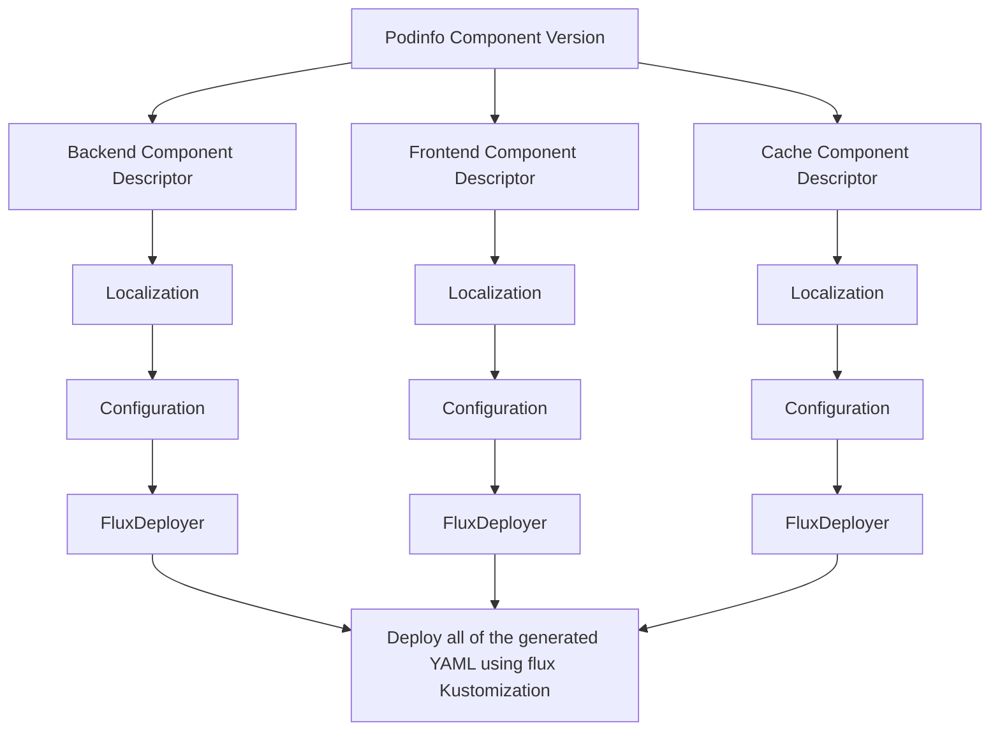

## Prerequisite

We assume that the reader has already read all the previous guides in the component area. This guide discusses a more
complex scenario using plain Localizations and Configurations without the use of Unpacker.

## Constructing the Component

We are going to use [podinfo](https://github.com/stefanprodan/podinfo) in microservices mode. This enables us to deploy several components and configure them
individually.

Podinfo has three components which we are going to put into individual component descriptors.
- backend
- frontend
- cache (redis)

We will use the following example application to demonstrate multi-component structure: [Podinfo Component](https://github.com/open-component-model/podinfo).

This repository contains the following items:

### Makefile

A `Makefile` that can be used to build the component and push it to a user repository.
To build the component, edit the `PROVIDER` and the `OCI_REPO` in the Makefile and run `make ca`.

```
make ca
ocm create ca -f github.com/skarlso/podify v1.0.2 --provider skarlso -F gen/ca --scheme ocm.software/v3alpha1
ocm add references gen/ca references.yaml
processing references.yaml...
  processing document 1...
    processing index 1
  processing document 2...
    processing index 1
  processing document 3...
    processing index 1
found 3 references
adding reference github.com/weaveworks/backend: "name"="backend","version"="v1.0.2"...
adding reference github.com/weaveworks/frontend: "name"="frontend","version"="v1.0.1"...
adding reference github.com/weaveworks/cache: "name"="cache","version"="v1.0.0"...

```

Then, to push it to the repository, run `make push`.

```
make push
ocm create ca -f github.com/skarlso/podify v1.0.2 --provider skarlso -F gen/ca --scheme ocm.software/v3alpha1
ocm add references gen/ca references.yaml
processing references.yaml...
  processing document 1...
    processing index 1
  processing document 2...
    processing index 1
  processing document 3...
    processing index 1
found 3 references
adding reference github.com/weaveworks/backend: "name"="backend","version"="v1.0.2"...
adding reference github.com/weaveworks/frontend: "name"="frontend","version"="v1.0.1"...
adding reference github.com/weaveworks/cache: "name"="cache","version"="v1.0.0"...
ocm transfer component -f gen/ca ghcr.io/skarlso
transferring version "github.com/skarlso/podify:v1.0.2"...
...adding component version...
1 versions transferred
```

### Backend

The backend resources contain the following relevant data:

- manifests
    - `configmap.yaml`
        - contains configuration options such as `PODINFO_UI_COLOR`
    - `deploy.yaml`
        - the deployment configuration. _note_ that this deployment yaml contains an image setting that will be configured.
        ```yaml
            spec:
            containers:
            - name: backend
                image: not-an-image
        ```
    - `kustomization.yaml` makes sure only the relevant files are applied
    - `service.yaml` to expose the communication between services
- `configdata.yaml`
    - contains the configuration and localization rules which will be applied to the deployment file.
        - Localization
            - will use an `image` resource to replace the above image value with the correct one
        - Configuration
            - will use the config information to configure some default values for those values such as color and message.
- `resource.yaml`
    - contains the resources which point to the above elements
    - _note_ that manifests _MUST_ be a directory


### Frontend

Frontend contains the same resources as backend. The only differences are the values of those deployments.

### Cache

The cache contains the same resources as backend. The only differences are the values of those deployments.

## Constructing the Localizations and Configurations

Normally, these objects would be created for use. But once we have the component, let's create the localization and
configuration objects by hand. We will need to apply these objects, like the component version, to the cluster. This
can be done either by hand or by using flux.

We have to create three of each of these components. Localization, Configuration and a FluxDeployer. One for each
component version.

### Backend

We don't have the backend configuration but our localization rules are also inside the same ConfigData object. So we'll
point at that. And we'll use the `image` resource for localizing the deployment.

```yaml
# Localization
apiVersion: delivery.ocm.software/v1alpha1
kind: Localization
metadata:
  name: backend-localization
  namespace: ocm-system
spec:
  configRef:
    kind: ComponentVersion
    name: podinfocomponent-version
    namespace: ocm-system
    resourceRef:
      name: config
      referencePath:
      - name: backend
      version: 1.0.0
  interval: 10m0s
  sourceRef:
    kind: ComponentVersion
    name: podinfocomponent-version
    namespace: ocm-system
    resourceRef:
      name: manifests
      referencePath:
      - name: backend
      version: 1.0.0
```

```yaml
# Configuration
apiVersion: delivery.ocm.software/v1alpha1
kind: Configuration
metadata:
  name: backend-configuration
  namespace: ocm-system
spec:
  configRef:
    kind: ComponentVersion
    name: podinfocomponent-version
    namespace: ocm-system
    resourceRef:
      name: config
      referencePath:
      - name: backend
      version: 1.0.0
  interval: 10m0s
  sourceRef:
    apiVersion: delivery.ocm.software/v1alpha1
    kind: Localization
    name: backend-localization
    namespace: ocm-system
```

```yaml
# FluxDeployment
apiVersion: delivery.ocm.software/v1alpha1
kind: FluxDeployer
metadata:
  name: backend-kustomization
  namespace: ocm-system
spec:
  kustomizationTemplate:
    prune: true
    targetNamespace: default
  sourceRef:
    apiVersion: delivery.ocm.software/v1alpha1
    kind: Configuration
    name: backend-configuration
    namespace: ocm-system
```

And that's it.

### Frontend

Same for the Frontend

```yaml
apiVersion: delivery.ocm.software/v1alpha1
kind: Localization
metadata:
  name: frontend-localization
  namespace: ocm-system
spec:
  configRef:
    kind: ComponentVersion
    name: podinfocomponent-version
    namespace: ocm-system
    resourceRef:
      name: config
      referencePath:
      - name: frontend
      version: 1.0.0
  interval: 10m0s
  sourceRef:
    kind: ComponentVersion
    name: podinfocomponent-version
    namespace: ocm-system
    resourceRef:
      name: manifests
      referencePath:
      - name: frontend
      version: 1.0.0
```

```yaml
apiVersion: delivery.ocm.software/v1alpha1
kind: Configuration
metadata:
  name: frontend-configuration
  namespace: ocm-system
spec:
  configRef:
    kind: ComponentVersion
    name: podinfocomponent-version
    namespace: ocm-system
    resourceRef:
      name: config
      referencePath:
      - name: frontend
      version: 1.0.0
  interval: 10m0s
  sourceRef:
    apiVersion: delivery.ocm.software/v1alpha1
    kind: Localization
    name: frontend-localization
    namespace: ocm-system
```

```yaml
apiVersion: delivery.ocm.software/v1alpha1
kind: FluxDeployer
metadata:
  name: frontend-kustomization
  namespace: ocm-system
spec:
  kustomizationTemplate:
    prune: true
    targetNamespace: default
  sourceRef:
    apiVersion: delivery.ocm.software/v1alpha1
    kind: Configuration
    name: frontend-configuration
    namespace: ocm-system
```

### Redis

Redis is exactly the same as the above two. Just with different names and pointing to the redis resource. Try creating
these.

## Understanding the moving parts

How does the whole flow work?



`ocm-controller` creates `ComponentDescriptor` objects for each referenced component version. Those component descriptors
will contain all the resources that those versions have such as the manifest files, configuration, deployment files, etc.

It will use this dependency graph to lookup resource data in the right component version.

Let's take a look at each object in the cluster next.

```
k get localizations -A
NAMESPACE    NAME                    READY   SOURCE VERSION   CONFIG VERSION   AGE
ocm-system   backend-localization    True    1.0.16           1.0.16           5m
ocm-system   cache-localization      True    1.0.16           1.0.16           5m
ocm-system   frontend-localization   True    1.0.16           1.0.16           5m
➜  k get configuration -A
NAMESPACE    NAME                     READY   SOURCE VERSION   CONFIG VERSION   AGE
ocm-system   backend-configuration    True    1.0.16           1.0.16           4m25s
ocm-system   cache-configuration      True    1.0.16           1.0.16           4m25s
ocm-system   frontend-configuration   True    1.0.16           1.0.16           4m25s
➜  k get fluxdeployer -A
NAMESPACE    NAME                     READY   AGE
ocm-system   backend-kustomization    True    3m55s
ocm-system   cache-kustomization      True    3m45s
ocm-system   frontend-kustomization   True    3m35s
➜  k get snapshot -A
NAMESPACE    NAME                             READY   STATUS
ocm-system   backend-configuration-v5l2oag    True    Snapshot with name 'backend-configuration-v5l2oag' is ready
ocm-system   backend-localization-uvnrzql     True    Snapshot with name 'backend-localization-uvnrzql' is ready
ocm-system   cache-configuration-kcjiqzy      True    Snapshot with name 'cache-configuration-kcjiqzy' is ready
ocm-system   cache-localization-u2h3old       True    Snapshot with name 'cache-localization-u2h3old' is ready
ocm-system   frontend-configuration-ut3u6pm   True    Snapshot with name 'frontend-configuration-ut3u6pm' is ready
ocm-system   frontend-localization-tgqfwwk    True    Snapshot with name 'frontend-localization-tgqfwwk' is ready
➜  k get componentversion -A
NAMESPACE    NAME                       READY   VERSION   AGE    STATUS
ocm-system   podinfocomponent-version   True    1.0.16    9m8s   Applied version: 1.0.16
➜  k get componentdescriptor -A
NAMESPACE    NAME                                                       AGE
ocm-system   ocm.software-podinfo-1.0.16-2456627037531301773            9m27s
ocm-system   ocm.software-podinfo-backend-1.0.0-3945706267509967991     9m25s
ocm-system   ocm.software-podinfo-frontend-1.0.8-11612684200430752646   9m23s
ocm-system   ocm.software-redis-1.0.0-6199010409340612397               9m21s
```

All of the components should have their localization, configuration, and fluxdeployer.

### Localization

A localization should look something like this:

```yaml
apiVersion: delivery.ocm.software/v1alpha1
kind: Localization
metadata:
  name: backend-localization
  namespace: ocm-system
spec:
  configRef:
    kind: ComponentVersion
    name: podinfocomponent-version
    namespace: ocm-system
    resourceRef:
      name: config
      referencePath:
      - name: backend
      version: 1.0.0
  interval: 10m0s
  sourceRef:
    kind: ComponentVersion
    name: podinfocomponent-version
    namespace: ocm-system
    resourceRef:
      name: manifests
      referencePath:
      - name: backend
      version: 1.0.0
status:
  conditions:
  - lastTransitionTime: "2023-06-20T12:28:47Z"
    message: Reconciliation success
    observedGeneration: 1
    reason: Succeeded
    status: "True"
    type: Ready
  latestConfigVersion: 1.0.16
  latestSourceVersion: 1.0.16
  observedGeneration: 1
  snapshotName: backend-localization-uvnrzql
```

The important fields are `configRef` and `sourceRef`. The `configRef` will point to the resource that contains our
localization rules. Something like this:

```yaml
localization:
- resource:
    name: image
  file: deploy.yaml
  image: spec.template.spec.containers[0].image
```

This will change the image in our deployment in the file `deploy.yaml` to the `image` resource we have in the podinfo
example.

The `sourceRef` is pointing to the component version to fetch the manifests from.

### Configuration

Let's take a look at the configuration object next (very similar to localization):

```yaml
apiVersion: delivery.ocm.software/v1alpha1
kind: Configuration
metadata:
  name: backend-configuration
  namespace: ocm-system
spec:
  configRef:
    kind: ComponentVersion
    name: podinfocomponent-version
    namespace: ocm-system
    resourceRef:
      name: config
      referencePath:
      - name: backend
      version: 1.0.0
  interval: 10m0s
  sourceRef:
    apiVersion: delivery.ocm.software/v1alpha1
    kind: Localization
    name: backend-localization
    namespace: ocm-system
status:
  conditions:
  - lastTransitionTime: "2023-06-20T12:28:47Z"
    message: Reconciliation success
    observedGeneration: 2
    reason: Succeeded
    status: "True"
    type: Ready
  latestConfigVersion: 1.0.16
  latestSourceVersion: 1.0.16
  observedGeneration: 2
  snapshotName: backend-configuration-v5l2oag
```

The important details here are the `configRef` field and the `sourceRef` field. The `configRef` field defines where the
configuration values are located at. Something like:

```yaml
configuration:
  defaults:
    message: "Welcome to the backend service"
  schema:
    type: object
    additionalProperties: false
    properties:
      replicas:
        type: string
      message:
        type: string
  rules:
  - value: (( message ))
    file: configmap.yaml
    path: data.PODINFO_UI_MESSAGE
```

Now, note. This configuration has a source that is pointing at the `Localization` resource that we created. This is
important because the configuration needs to work on the localized entities. Once it's reconciled, it will create a
Snapshot. That snapshot contains the created resources that have been configured.

### FluxDeployment

Next, comes the `FluxDeployment`. The `FluxDeployment` will point to the last item in the change of transformations
which is the `Configuration`. It looks something like this:

```yaml
apiVersion: delivery.ocm.software/v1alpha1
kind: FluxDeployer
metadata:
  name: backend-kustomization
  namespace: ocm-system
spec:
  kustomizationTemplate:
    prune: true
    targetNamespace: default
  sourceRef:
    apiVersion: delivery.ocm.software/v1alpha1
    kind: Configuration
    name: backend-configuration
    namespace: ocm-system
status:
  conditions:
  - lastTransitionTime: "2023-06-20T12:29:23Z"
    message: FluxDeployer 'backend-kustomization' is ready
    observedGeneration: 2
    reason: Succeeded
    status: "True"
    type: Ready
  kustomization: ocm-system/backend-kustomization
  observedGeneration: 2
```

This creates a [Kustomization](https://fluxcd.io/flux/components/kustomize/kustomization/) object. The Kustomization
object is used to reconcile the created component into the target namespace. We have three of these for each component
for which we would like to apply the results.

## Troubleshooting

Once all objects are applied, we should see `podinfo` deployed in the `default` namespace:

```
k get pods
NAME                        READY   STATUS    RESTARTS   AGE
backend-6dd8f5fbf8-xfdmq    1/1     Running   0          54m
frontend-56ff5b9864-h8fgh   1/1     Running   0          54m
redis-7475dd84c4-hzp2b      1/1     Running   0          54m
```

_Note_: pod count might vary based on the default settings in the configuration data.

If the deployment isn't appearing, there are several places to check for errors:

### Controller Logs

### Object statuses

### Flux components

### Common issues

**tar header invalid**:

## Conclusion

We saw how to deploy a complex, multi-service architecture using the podinfo application.
