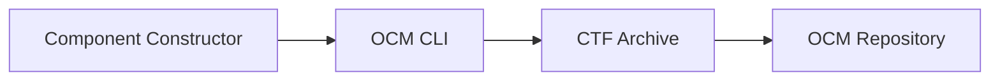


If your tutorial includes Mermaid diagrams, add this to the frontmatter:
```yaml
---
hasMermaid: true
---
```


## Overview

Write 2–4 sentences that set the scene and explain *why* you would do this.
Avoid deep background. Link to the relevant concept(s) instead.

**Estimated time:** ~X minutes


**What you'll learn**

- What you can do by the end (outcome #1)
- One key concept you will understand (outcome #2)
- How to validate your success (outcome #3)



**Audience & assumptions**

- Who this tutorial is for (e.g., "You're an OCM CLI user who has already created a component version")
- What we assume you already know


## How It Works

Use a Mermaid diagram to visualize the workflow or architecture you'll be working with:



This gives learners a mental model before diving into steps.

## Prerequisites

- [OCM CLI]() installed
- Access to required repositories/services (example: `ghcr.io`)
- Any required credentials (example: GitHub token with package write access)

## Scenario

Describe the concrete scenario you'll use throughout. Use specific values consistently—readers will copy/paste these.

- **Component:** `github.com/acme.org/helloworld:1.0.0`
- **Repository:** `ghcr.io/acme-ocm`
- **Working directory:** `/tmp/ocm-tutorial`


**Handling variations:** If your tutorial covers multiple paths (e.g., different resource types or deployment targets), use tabs to keep the learning flow clear:



```yaml
type: helmChart
input:
  type: helm
  path: ./chart
```


```yaml
type: ociImage
input:
  type: dockermulti
  repository: ghcr.io/myorg/myimage
```




## Tutorial Steps




**Create the component constructor file**

Explain *what* you're doing and *why* in 1–2 sentences.

```bash
touch component-constructor.yaml
```

Create and save this content to `component-constructor.yaml`:

```yaml
# yaml-language-server: $schema=https://ocm.software/schemas/configuration-schema.yaml
components:
- name: github.com/acme.org/helloworld
  version: 1.0.0
  provider:
    name: acme.org
  resources:
    - name: mylocalfile
      type: blob
      input:
        type: file
        path: ./my-resource.txt
```



**Build the component version**

Run the OCM CLI to create a CTF archive:

```bash
ocm add cv
```

You should see:

<details>
  <summary>Expected output</summary>

```text
component github.com/acme.org/helloworld/1.0.0 constructed ... done!
```
</details>

This indicates your component version was successfully created.


**Adding optional details:** Use the `` shortcode to provide technical deep-dives without disrupting the learning flow:


The CTF archive uses OCI artifact format internally. Each component version
is stored as an OCI manifest with the component descriptor as a layer.

```shell
tree transport-archive
```

This allows CTF archives to be compatible with OCI registries and tools.



<details>
  <summary>What happened?</summary>

Optional: Explain *how* OCM processed your command.

The command created a CTF archive and added the component with its resources. The archive is now ready for transfer to any OCM repository.
</details>




**Verify the result**

Check that your component was created correctly:

```bash
ocm get cv ./transport-archive//github.com/acme.org/helloworld:1.0.0
```

You should see your component listed with version 1.0.0.

<details>
  <summary>Expected output</summary>

```text
COMPONENT                      │ VERSION │ PROVIDER
───────────────────────────────┼─────────┼──────────
github.com/acme.org/helloworld │ 1.0.0   │ acme.org
```
</details>





## What you've learned

Summarize key learning points in 3–6 bullets:

- You created a component constructor file that defines metadata and resources
- You used `ocm add cv` to build a transportable CTF archive
- You verified your component structure using `ocm get cv`

**For deeper understanding:**

- [Concept: Component Descriptors]()
- [Concept: Common Transfer Format]()

## Check your understanding

Before moving on:

- [ ] What is the purpose of a component constructor file?
- [ ] Why do we store component versions in CTF archives?
- [ ] How would you add a second resource?

<details>
  <summary>Answers & Explanations</summary>

- **Question 1:** Brief answer with explanation
- **Question 2:** Brief answer with explanation  
- **Question 3:** Brief answer with explanation

</details>

## Troubleshooting

Common issues in *this tutorial*:

### Problem: Command fails with "component constructor not found"

**Cause:** The `ocm` CLI looks for `component-constructor.yaml` in your current directory.

**Fix:**

```bash
ocm add cv --file /path/to/component-constructor.yaml
```

### Problem: "Invalid version format" error

**Cause:** OCM requires semantic versioning (e.g., `1.0.0`).

**Fix:** Update your `version` field to `MAJOR.MINOR.PATCH` format.

### Getting help

If these solutions don't work:

- [OCM Troubleshooting Guide]()
- [Community Support]()
- [Open an Issue](https://github.com/open-component-model/ocm/issues)

## Cleanup

Remove the resources created in this tutorial:

```bash
rm -rf transport-archive
rm -rf /tmp/ocm-tutorial
rm component-constructor.yaml
```


⚠️ This will permanently delete your CTF archive and all component versions it contains.


## Next steps



Learn how to transfer your component to remote repositories


Understand OCM's versioning strategy


See how to add Helm charts, images, and more



## Related documentation

- [Concept: <name>]()
- [How-to: <name>]()
- [Reference: <command>]()

---

## ✓ Before publishing

Make sure to comply to our [CONTRIBUTING guide](../CONTRIBUTING.md),
check the [Tutorial Writing Checklist](../CONTRIBUTING.md/turorial-guide-checklist),
and ensure the following:

- [ ] Title describes what learner will accomplish
- [ ] Consistent "you" voice throughout
- [ ] Realistic time estimate
- [ ] Prerequisites section lists all requirements
- [ ] Sequential `` using `` shortcodes
- [ ] Use `` for variants (resource types, platforms, options)
- [ ] Every command can be copy-pasted and works
- [ ] Expected output shown after commands hidden in `<details>` blocks
- [ ] Success indicators after major steps
- [ ] "What you've learned" summary
- [ ] Troubleshooting for tutorial-specific issues
- [ ] `` for "Next steps" navigation
- [ ] Working `relref` links to Concepts for "why" questions
